# Cahier des Charges — PID (Photographie — Devis & Squelette Sécurisé)
> mentalyas · Full-Stack Dev
> Date : 2026-09-12
> Statut : Brainstorm niveaux 1+2+3+4
> Niveaux exécutés : L1-fondation.md, L2-auth-comptes.md, L2-vitrine-portfolio.md, L2-generateur-devis.md, L2-devis-contrat.md, L2-administration-comptes.md, L3-auth-comptes.md, L3-generateur-devis.md, L3-devis-contrat.md, L4-parcours.md

---

## 1. Concept Global

Site personnel de photographe (vitrine + portfolio) construit dans le cadre du cours PID (Projet d'Intégration et Développement), avec double finalité assumée : livrable d'examen **et** outil professionnel réel. Le squelette imposé par le cours (comptes utilisateurs sécurisés, multi-rôles, accès restreints) sert de fondation ; le "plus" spécifique au thème est un **générateur de devis à la carte** permettant à un client potentiel de composer une prestation multi-segments (plusieurs lieux/horaires/nombre de personnes dans une même journée — ex. mariage : mairie → église → salle), avec calcul automatique du prix (distance, durée, forfait selon le type de prestation). Le document généré fait office de devis **et** de contrat de référence, servant de preuve en cas de litige sur ce qui a été convenu verbalement le jour de la prestation. Les paiements restent en cash/Smart (pas de facturation intégrée) — le document sert de base pour transcrire manuellement la facture côté Smart.

Examen oral prévu fin de cursus (30/01, probablement 2027) — ~4,5 mois de développement en parallèle des séances hebdomadaires du samedi, pendant lesquelles le professeur code en direct le squelette sécurisé (auth, autoloader maison, POO) : ce contenu est capturé séance par séance dans `docs/academique/` (voir `## Suivi academique` du CLAUDE.md) pour servir de référence de défense orale.

## 2. Fonctionnalités

### Fonctionnalités core (MVP — à livrer pour l'examen)
- [ ] Squelette sécurisé complet : inscription/connexion, validation d'email, mot de passe oublié, anti brute-force, gestion des états de compte, navigation filtrée par rôle
- [ ] 3 rôles distincts : Client / Photographe (gérant) / Administrateur (technique)
- [ ] Vitrine : accueil, portfolio, présentation des services
- [ ] Générateur de devis à la carte : ajout de segments (adresse, heure début/fin, nombre de personnes), calcul distance/durée, calcul prix selon type de prestation + paramètres tarifaires
- [ ] Génération du document devis = contrat (téléchargeable/imprimable, détail complet)
- [ ] Espace Client : historique de ses devis/contrats
- [ ] Espace Photographe : configuration des types de prestation et paramètres tarifaires, vue globale des devis clients
- [ ] Espace Administrateur : gestion des comptes (états, blocage/déblocage)

### Fonctionnalités secondaires (v2+ — pas prioritaire, pertinent seulement en cas de passage indépendant complet)
- [ ] Paiement en ligne / acompte
- [ ] Signature électronique du contrat
- [ ] Notifications email automatiques (suivi de devis, rappels)
- [ ] Galerie photo avancée, SEO, blog

### Hors scope (explicitement exclu)
- Facturation intégrée (gérée manuellement via Smart)
- Multi-langue

## 3. Structure de Base de Données

### Entités principales
| Entité | Champs clés | Relations |
|--------|-------------|-----------|
| `utilisateurs` | id, email, mot_de_passe_hash, role, statut_compte, token_verification_email | 1-N vers `devis` (en tant que client) |
| `types_prestation` | id, nom (mariage / portrait / événementiel / ...), forfait_base, description | 1-N vers `devis` |
| `devis` | id, client_id, type_prestation_id, statut, prix_total, date_creation, chemin_document, donnees_figees | N-1 `utilisateurs`, N-1 `types_prestation`, 1-N `devis_segments` |
| `devis_segments` | id, devis_id, adresse, latitude, longitude, heure_debut, heure_fin, nb_personnes, distance_km, ordre | N-1 `devis` |
| `parametres_tarifaires` | id, cle (prix/km, prix/heure sup., supplément weekend, ...), valeur | transversal, pas de FK directe |
| `login_attempts` | id, email, ip_address, reussite, created_at | journal auth (voir section 10.1) |

> Schéma détaillé (contraintes, index) par fonctionnalité en section 10.

### Diagramme ERD (Mermaid)
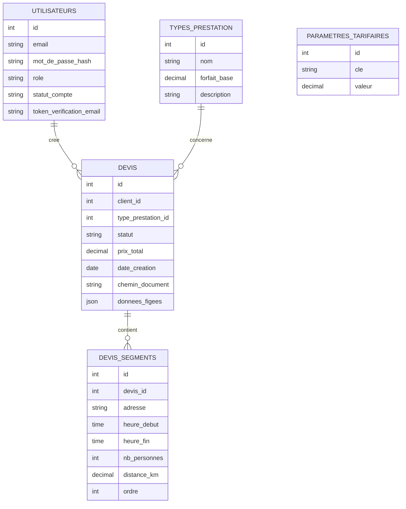

## 4. Diagrammes Use Cases — Vue d'ensemble (Mermaid)
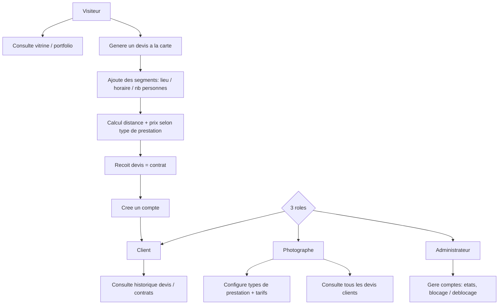

## 5. Stack Technologique

| Couche | Technologie | Justification |
|--------|-------------|---------------|
| Frontend | HTML5, CSS3, JS + jQuery, AJAX | Imposé par le cours |
| Backend | PHP + Laravel | Autorisé explicitement par le professeur ; déjà maîtrisé (CharlesNadejda-Project) ; couvre nativement une grande partie du squelette sécurisé (hash, CSRF, requêtes paramétrées) |
| Base de données | MySQL | Imposé par le cours |
| Auth | Laravel natif (Breeze/Fortify à évaluer en implémentation) + logique de rôles maison | Squelette exigé : email, mot de passe oublié, anti brute-force, états de compte |
| Hébergement | À définir | Ouvert — pas de contrainte du cours |
| CI/CD | À définir | Pas prioritaire pour un projet d'examen solo |

**Pont pédagogique explicite** : le cours enseigne le mécanisme brut (PDO, autoloader maison, POO) que Laravel automatise. `docs/academique/` doit systématiquement relier "ce que Laravel fait pour moi" à "le mécanisme équivalent vu en cours" — indispensable pour la défense orale sur les critères Sécurité PHP (/20) et Traitement PHP (/20).

## 6. Algorithmes & Patterns Techniques

- **Calcul de distance/géocodage** — pattern déjà résolu dans un projet antérieur du même auteur (PortfolioPhotographe : calcul km via Nominatim/Haversine). Réutilisable comme référence d'implémentation, réadapté en Laravel (détail technique en section 10.2).
- **Moteur de tarification** — Prix = forfait_base(type_prestation) + Σ(distance_km × prix/km) + Σ(heures_supplémentaires × prix/heure) + suppléments éventuels, par segment, agrégé sur le devis complet (détail en section 10.2).
- **Génération de document devis=contrat** — snapshot JSON figé (`donnees_figees`) au moment de la validation, document généré et stocké hors répertoire public, jamais régénéré depuis les données courantes (détail en section 10.3).

## 7. Sécurité — Bloc Dédié

### Niveau de sensibilité des données
Moyen — comptes utilisateurs (emails, mots de passe), adresses de prestation (données personnelles clients), pas de données bancaires/paiement stockées (paiement hors ligne).

### Vulnérabilités à anticiper
| Risque | Vecteur | Mitigation |
|--------|---------|------------|
| Injection SQL | Formulaires devis, recherche admin | Eloquent ORM (requêtes paramétrées) |
| XSS | Champs adresse, commentaires devis | Échappement Blade natif, sanitization |
| CSRF | Tous les formulaires | Protection CSRF native Laravel |
| Auth faible | Brute-force sur connexion | Rate limiting Laravel, verrouillage après N tentatives (détail section 10.1) |
| Élévation de privilèges | Accès direct à des routes admin/photographe | Middleware de rôle + Policies sur chaque route, jamais de contrôle uniquement côté vue |
| Fuite de données personnelles clients | Accès non autorisé aux devis d'autrui | Policy Laravel (un client ne voit que ses propres devis, détail section 10.3) |

### Exceptions & Gestion d'erreurs
- Ne jamais exposer les stack traces en production (`APP_DEBUG=false`).
- Messages d'erreur génériques pour l'utilisateur final.
- Logging structuré côté serveur (sans mot de passe ni token en clair).

### Checklist sécurité minimale
- [ ] Authentification sécurisée (hash bcrypt via Laravel, jamais MD5/SHA1)
- [ ] HTTPS obligatoire (à voir selon hébergement choisi)
- [ ] Variables d'env pour tous les secrets (`.env`, jamais commité)
- [ ] Rate limiting sur connexion/inscription/mot de passe oublié
- [ ] Validation des entrées côté serveur (Form Requests Laravel)
- [ ] Policies Laravel pour isoler les données par rôle/propriétaire

## 8. Références

| Référence | Ce qui est inspirant | Ce qu'on fait différemment |
|-----------|---------------------|---------------------------|
| PortfolioPhotographe (projet antérieur, même auteur) | Module Devis déjà pensé, calcul distance via Nominatim/Haversine | Reconstruit en Laravel/MySQL (contrainte du cours), enrichi du multi-segments et du volet contrat |
| Claude Design — "Ernest H Photography.dc.html" (`https://claude.ai/design/p/2300b657-e8df-473b-b3d1-8c938410c29b`, pack récupéré dans `Design/`) | Direction visuelle déjà maquettée pour ce même profil photographe — palette (crème `#EFE7D8`, encre `#2B2521`, bronze `#8A5A2F`, or `#C9A46B`), typographie (Cormorant Garamond + Manrope), motifs (cadran circulaire, cercles de prix, coins d'angle, labels Nº0XX) | **Réconcilié le 2026-09-12** avec `docs/PALETTE.md` et `docs/UI-DESIGN.md` (Phase 1 pipeline) — tokens réels intégrés, écrans vitrine alignés sur le mockup, motifs adaptés aux écrans applicatifs |

Aucune référence externe (outils de devis type HoneyBook/Hectic) identifiée — le générateur à la carte multi-segments est une conception originale, pas copiée d'un outil existant.

---

## 9. Détail par Fonctionnalité (Niveau 2)

### 9.1 Authentification & gestion de comptes multi-rôles

**Objectif** : Permettre à un visiteur de créer un compte, se connecter en sécurité et gérer son profil, tout en garantissant que chaque rôle (Client / Photographe / Administrateur) n'accède qu'à ce qui lui est autorisé.

**Use Cases** :
- **UC-1 Inscription** — le visiteur saisit email/mot de passe, le compte est créé en `en_attente_verification`, un email de vérification est envoyé ; email déjà utilisé ou mot de passe trop faible → erreurs explicites ; lien expiré → renvoi possible.
- **UC-2 Connexion** — identifiants + statut du compte vérifiés, session ouverte et redirection selon rôle ; échec → incrémente le compteur de tentatives ; compte bloqué/désactivé → message explicite sans détail.
- **UC-3 Mot de passe oublié** — lien de réinitialisation à usage unique et durée limitée ; email inconnu → même message générique (anti-énumération).
- **UC-4 Anti brute-force** — verrouillage temporaire après N tentatives échouées sur un compte/IP, déverrouillage automatique ou manuel par l'Administrateur.
- **UC-5 Modification du profil** — tout rôle peut modifier ses informations ; changement d'email redéclenche une vérification.

**Workflow** :
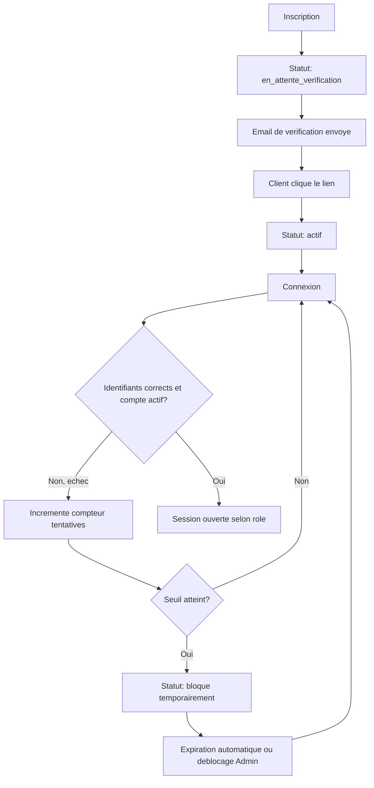

**Règles métier** :
1. Statut de compte parmi `en_attente_verification`, `actif`, `bloque`, `desactive`
2. Mot de passe haché (bcrypt), jamais stocké en clair
3. Verrouillage temporaire après 5 échecs / 15 min
4. Aucun message ne révèle l'existence d'un email en base (hors inscription)
5. Changement d'email redéclenche une vérification
6. Réinitialisation de mot de passe invalide toutes les sessions actives

**Critères d'acceptation** :
- [ ] Inscription + vérification email obligatoire avant connexion
- [ ] Lien de reset à usage unique et durée de vie limitée
- [ ] 5 échecs verrouillent temporairement le compte
- [ ] Aucun message n'expose l'existence d'un compte
- [ ] 3 rôles redirigent vers 3 espaces distincts
- [ ] Toute route protégée rejette côté serveur un accès non autorisé

### 9.2 Vitrine / Portfolio

**Objectif** : Présenter le travail et les services du photographe à un visiteur non connecté, orienter vers le générateur de devis.

**Use Cases** : consultation de l'accueil, du portfolio (filtrable par type de prestation), de la présentation des services ; gestion du contenu (photos, textes) réservée au Photographe.

**Workflow** :
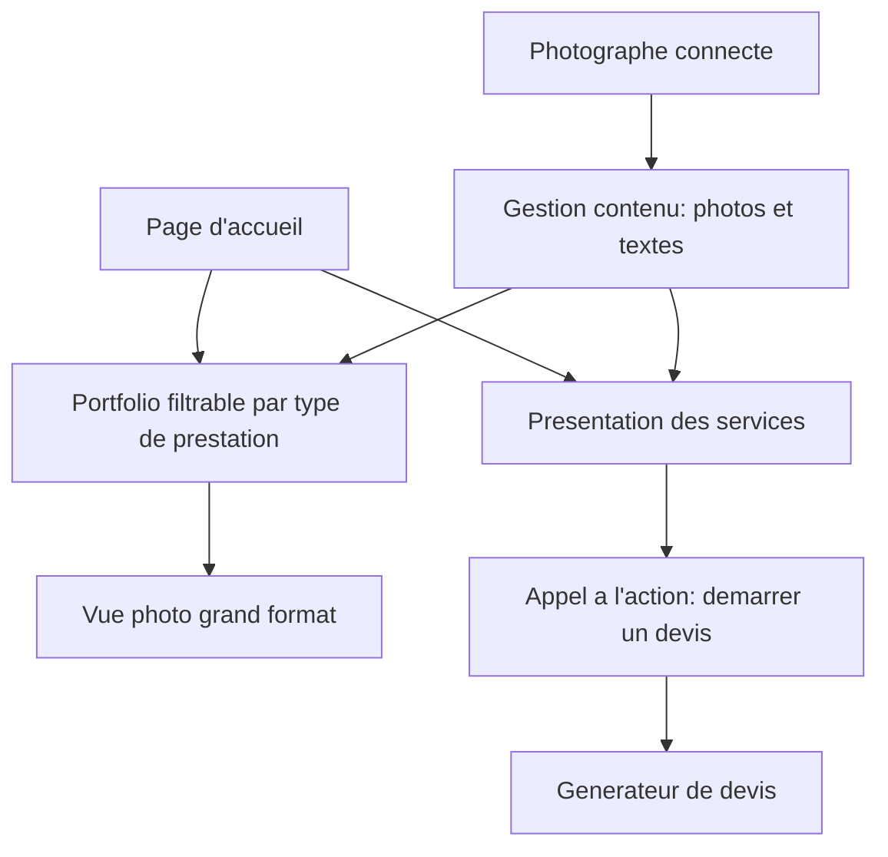

**Règles métier** : catégories du portfolio alignées sur `types_prestation` ; seul le Photographe modifie le contenu ; fichiers uploadés validés en type/taille.

**Critères d'acceptation** :
- [ ] Portfolio consultable sans compte, filtrable par type de prestation
- [ ] Le Photographe voit ses modifications immédiatement en public
- [ ] Chaque page vitrine propose un appel à l'action vers le devis

### 9.3 Générateur de devis à la carte

**Objectif** : Permettre à un visiteur de composer précisément sa prestation (un ou plusieurs segments) et d'obtenir un prix exact calculé automatiquement.

**Use Cases** :
- **UC-1** Sélection du type de prestation (forfait de base affiché)
- **UC-2/UC-3** Ajout d'un ou plusieurs segments (adresse, horaires, nb personnes), géocodés, ordonnés chronologiquement
- **UC-4** Calcul automatique de la distance cumulée entre segments successifs
- **UC-5** Calcul du prix total détaillé (forfait + distance + heures sup. + suppléments)
- **UC-6** Récapitulatif complet avant validation
- **UC-7** Validation — redirection vers inscription si non connecté, devis conservé, enregistré en base au final

**Workflow** :
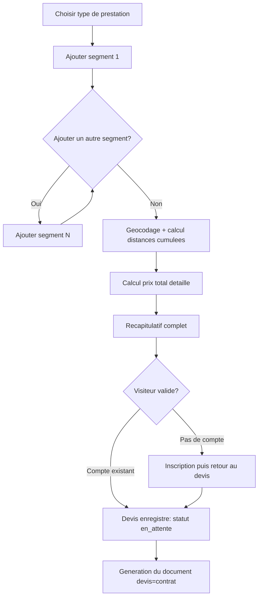

**Règles métier** :
1. Un devis contient au moins 1 segment
2. Segments ordonnés par heure de début croissante
3. Distance = distance géodésique depuis le segment précédent (0 pour le premier)
4. Prix = forfait_base + Σ(distance × prix_km) + Σ(heures_sup × prix_heure) + suppléments — paramètres configurables en base, jamais en dur dans le code
5. Le devis en cours est conservé si une inscription est nécessaire en cours de route
6. Prix recalculé côté serveur à la validation, jamais fait confiance au client

**Critères d'acceptation** :
- [ ] Composition multi-segments sans compte
- [ ] Distance calculée automatiquement via géocodage
- [ ] Prix décomposé ligne par ligne
- [ ] Devis conservé à travers une inscription en cours de route
- [ ] Prix final vérifié côté serveur

### 9.4 Devis = contrat (génération & consultation)

**Objectif** : Transformer un devis validé en document de référence exploitable par le Client (preuve) et le Photographe (suivi + base de facturation manuelle Smart).

**Use Cases** : génération automatique du document à la validation ; consultation/téléchargement de l'historique côté Client (isolation stricte par propriétaire) ; vue globale filtrable et changement de statut côté Photographe.

**Workflow** :
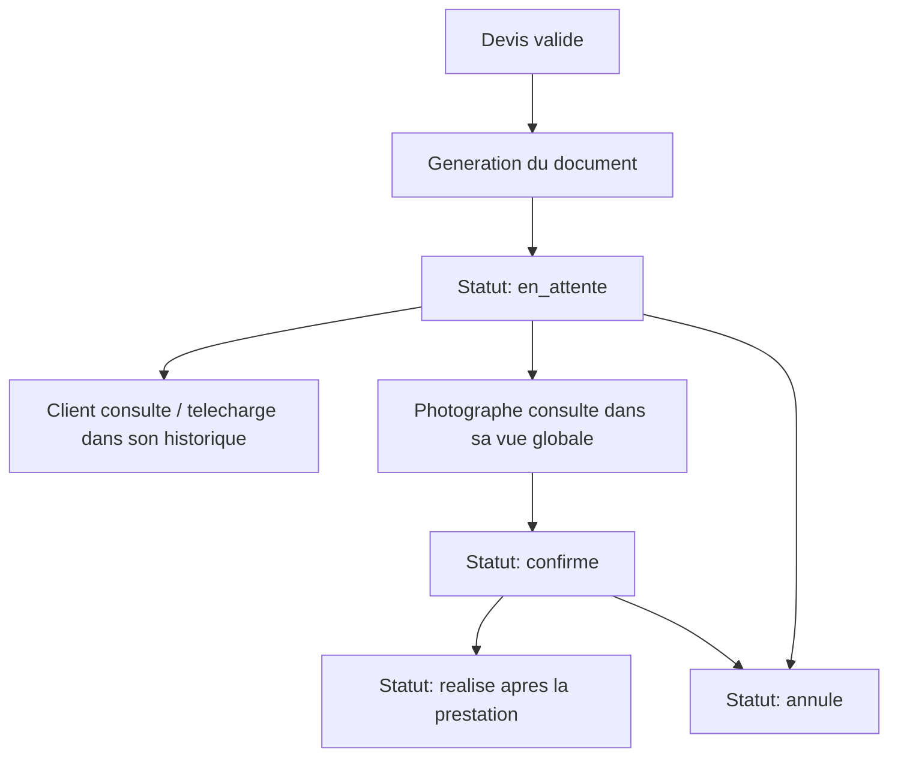

**Règles métier** :
1. Un Client ne consulte/télécharge que ses propres devis
2. Le Photographe a un accès global en lecture, écriture limitée au statut
3. Un devis `realise` ne change plus de statut
4. Le document ne recalcule jamais le prix après coup — valeurs figées à la validation

**Critères d'acceptation** :
- [ ] Document généré automatiquement à la validation
- [ ] Détail complet dans le document (segments, distances, prix)
- [ ] Isolation stricte entre clients, même par manipulation d'URL
- [ ] Cycle de statut respecté par le Photographe
- [ ] Valeurs figées immuables

### 9.5 Administration des comptes

**Objectif** : Donner à l'Administrateur les outils de supervision des comptes (déblocage, reset à la demande, journal des tentatives suspectes).

**Use Cases** : liste des comptes, blocage/déblocage manuel, réinitialisation de mot de passe à la demande, consultation du journal des tentatives de connexion échouées.

**Workflow** :
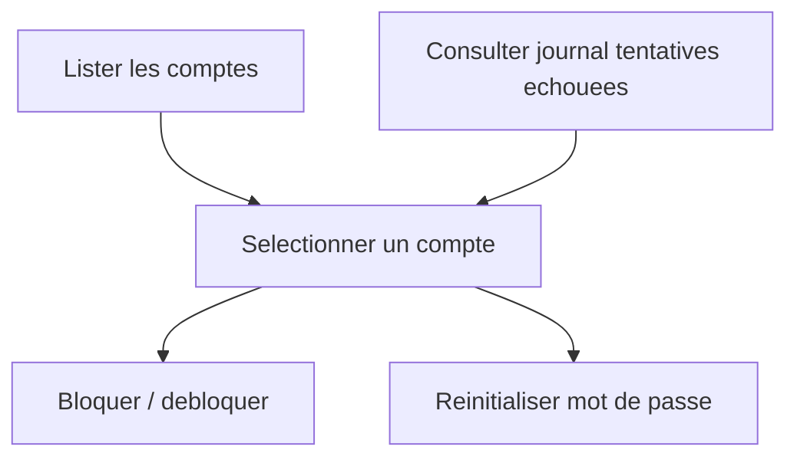

**Règles métier** : accès exclusif au rôle Administrateur ; chaque action journalisée (qui, quand, sur quel compte) ; impossible de se bloquer soi-même accidentellement.

**Critères d'acceptation** :
- [ ] Accès exclusif Administrateur vérifié côté serveur
- [ ] Blocage effectif immédiatement
- [ ] Chaque action tracée (auteur, horodatage)

---

## 10. Conception Technique (Niveau 3)

### 10.1 Authentification & gestion de comptes multi-rôles

**Contrat API** :
| Endpoint | Méthode | Entrée | Sortie | Erreurs |
|----------|---------|--------|--------|---------|
| `/register` | POST | name, email, password, password_confirmation | Compte créé (`en_attente_verification`) | 422 |
| `/login` | POST | email, password | Session + redirection selon rôle | 422 / 429 |
| `/logout` | POST | — | Session détruite | — |
| `/email/verify/{id}/{hash}` | GET | Signed URL | Statut → `actif` | 403 |
| `/email/verification-notification` | POST | — | Nouvel email, ancien token invalidé | 429 |
| `/password/forgot` | POST | email | Email de reset (message générique) | 429 |
| `/password/reset` | POST | token, email, password, password_confirmation | Mot de passe mis à jour, sessions invalidées | 422 |
| `/ajax/check-email` | GET (AJAX) | email | `{available: bool}` | 422 |

**Schéma de données** :
| Table | Colonnes | Contraintes | Index |
|-------|----------|-------------|-------|
| `users` | id, name, email, email_verified_at, password, role, statut_compte, remember_token, timestamps | `email` UNIQUE | `email`, `statut_compte` |
| `login_attempts` | id, email, ip_address, reussite, timestamps | — | `(email, created_at)` |
| `password_reset_tokens` | email, token (hashé), created_at | — | PK `email` |

**Séquence** :
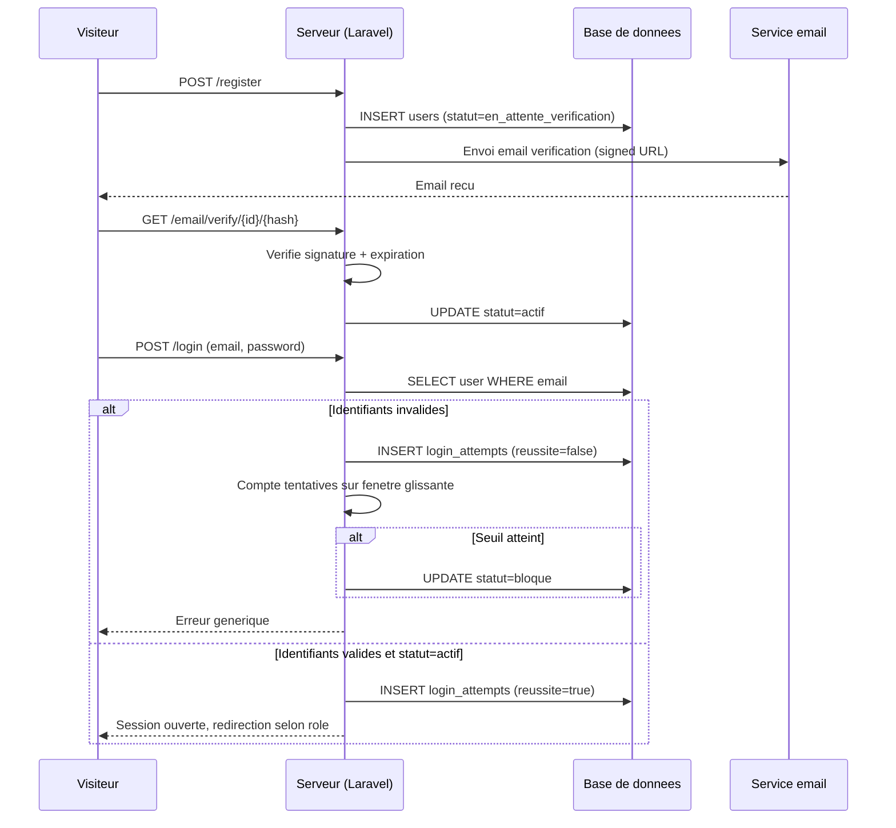

**Cas limites** : double inscription simultanée → contrainte UNIQUE, erreur 422 propre ; renvoi de vérification → invalide l'ancien token ; échec d'envoi email → pas de rollback du compte, renvoi possible ; purge de `login_attempts` au-delà de 90 jours.

**Sécurité spécifique** : rate limiting IP + email sur `/login` ; messages génériques anti-énumération ; Signed URLs pour vérif/reset ; invalidation des sessions au reset ; règles de complexité de mot de passe.

### 10.2 Générateur de devis à la carte

**Contrat API** :
| Endpoint | Méthode | Entrée | Sortie | Erreurs |
|----------|---------|--------|--------|---------|
| `/devis/type` | POST | type_prestation_id | Devis en cours initialisé (session) | 422 |
| `/ajax/devis/segments` | POST (AJAX) | adresse, heure_debut, heure_fin, nb_personnes | `{distance_km, sous_total}` | 422 / 502 |
| `/ajax/devis/segments/{ordre}` | DELETE (AJAX) | — | Recalcul renvoyé | 404 |
| `/ajax/devis/recapitulatif` | GET (AJAX) | — | Détail complet | — |
| `/devis` | POST | (confirmation) | Devis + segments enregistrés, document généré | 422 / 409 |

**Schéma de données** :
| Table | Colonnes | Contraintes | Index |
|-------|----------|-------------|-------|
| `types_prestation` | id, nom, forfait_base, description | `nom` UNIQUE | — |
| `devis` | id, client_id (nullable), type_prestation_id, statut, prix_total, created_at | FK client_id/type_prestation_id | `(client_id, statut)` |
| `devis_segments` | id, devis_id, adresse, latitude, longitude, heure_debut, heure_fin, nb_personnes, distance_km, ordre | FK devis_id (cascade) | `(devis_id, ordre)` |
| `parametres_tarifaires` | id, cle, valeur | `cle` UNIQUE | — |

**Séquence** :
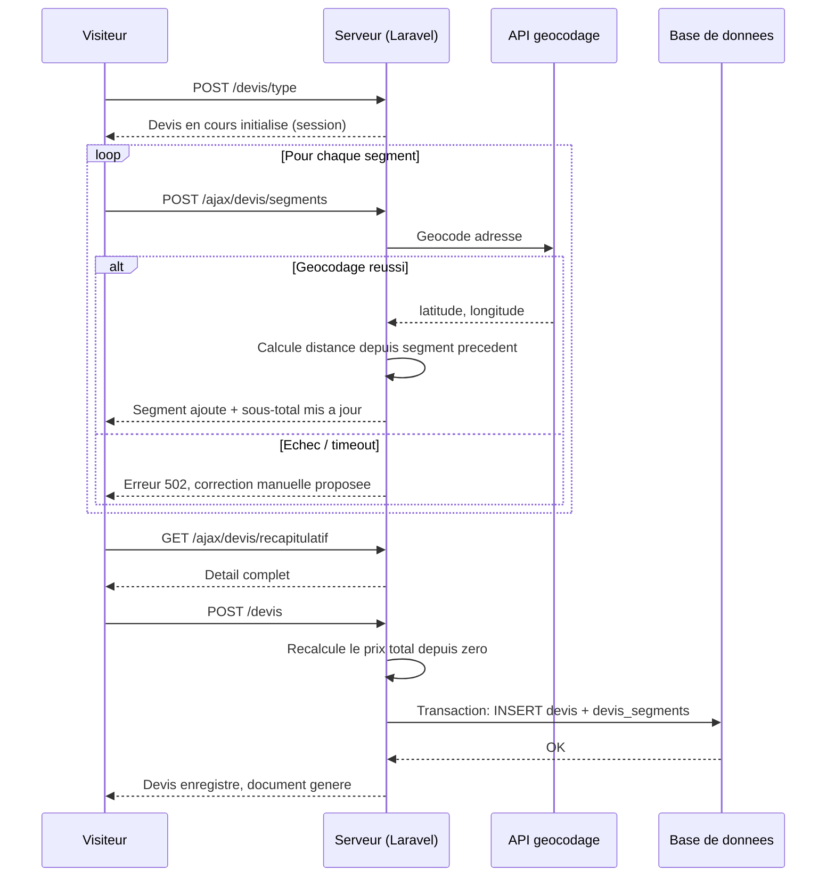

**Cas limites** : composition en session (pas de concurrence) ; token de soumission unique anti-double-clic ; transaction atomique devis+segments ; pagination si historique volumineux ; résilience au géocodage indisponible + rate limiting dédié.

**Sécurité spécifique** : prix toujours recalculé serveur ; validation stricte + échappement des champs adresse ; rate limiting dédié au géocodage distinct de celui du login ; rien persisté avant validation finale.

### 10.3 Devis = contrat (génération & consultation)

**Contrat API** :
| Endpoint | Méthode | Entrée | Sortie | Erreurs |
|----------|---------|--------|--------|---------|
| `/mes-devis` | GET | — (Client) | Liste des devis du client | — |
| `/mes-devis/{id}/telecharger` | GET | — | Stream du document | 403 |
| `/admin/devis` | GET | filtres (AJAX) | Liste paginée, tous devis | 403 |
| `/admin/devis/{id}/statut` | PATCH (AJAX) | nouveau_statut | Statut mis à jour | 403 / 422 |

**Schéma de données** : `devis` complété de `chemin_document` (stockage privé) et `donnees_figees` (JSON snapshot des segments + décomposition du prix au moment de la génération) — clé technique de l'immuabilité du document face à un changement ultérieur des `parametres_tarifaires`.

**Séquence** :
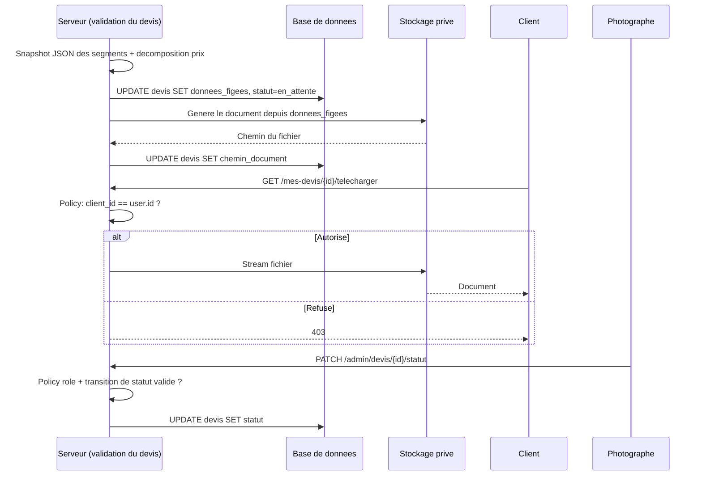

**Cas limites** : changement de statut pendant consultation → non critique ; téléchargement multiple → sert toujours le même fichier déjà généré ; génération + snapshot en transaction ; pagination sur la vue globale Photographe.

**Sécurité spécifique** : Policy `view` stricte (client_id == user.id, ou rôle photographe/admin) ; fichiers hors répertoire public, servis via route contrôlée ; Policy `update` distincte réservée au Photographe/Admin ; document toujours issu de `donnees_figees`, jamais recalculé rétroactivement.

---

## 11. Parcours Utilisateur (Niveau 4)

### 11.1 Parcours principaux

**Parcours A — Première visite → Devis → Inscription → Client** : Accueil → Portfolio (optionnel) → Tunnel de devis (choix type de prestation, ajout d'un ou plusieurs segments avec sous-total live) → Récapitulatif → Inscription (devis conservé) → Vérification email → Devis validé et document généré → Espace Client (historique).

**Parcours B — Photographe : configuration et suivi** : Connexion → Tableau de bord → Configuration tarifaire (types de prestation, paramètres) → Vue globale des devis (filtrable) → Détail d'un devis (changement de statut) → Gestion du contenu vitrine.

**Parcours C — Administrateur : supervision des comptes** : Connexion → Liste des comptes → Détail d'un compte (blocage/déblocage, reset à la demande) → Journal des tentatives de connexion échouées.

### 11.2 Inventaire des écrans

| Écran | Rôle | Fonctionnalités présentes |
|-------|------|----------------------------|
| Accueil | Public | Vitrine, appel à l'action devis |
| Portfolio | Public | Vitrine (filtrable par type de prestation) |
| Présentation des services | Public | Vitrine |
| Tunnel de devis (étapes) | Public → Client | Générateur de devis |
| Récapitulatif du devis | Public → Client | Générateur de devis |
| Inscription / Connexion / Vérification email / Mot de passe oublié | Public | Auth & comptes |
| Tableau de bord + Historique + Détail devis (lecture seule) | Client | Devis = contrat |
| Profil utilisateur | Client / Photographe / Administrateur | Auth & comptes |
| Tableau de bord + Configuration tarifaire + Vue globale + Détail devis (statut) + CMS vitrine | Photographe | Générateur de devis, Devis = contrat, Vitrine |
| Liste des comptes + Détail compte + Journal des tentatives | Administrateur | Administration des comptes |

### 11.3 Diagramme de parcours (Mermaid)
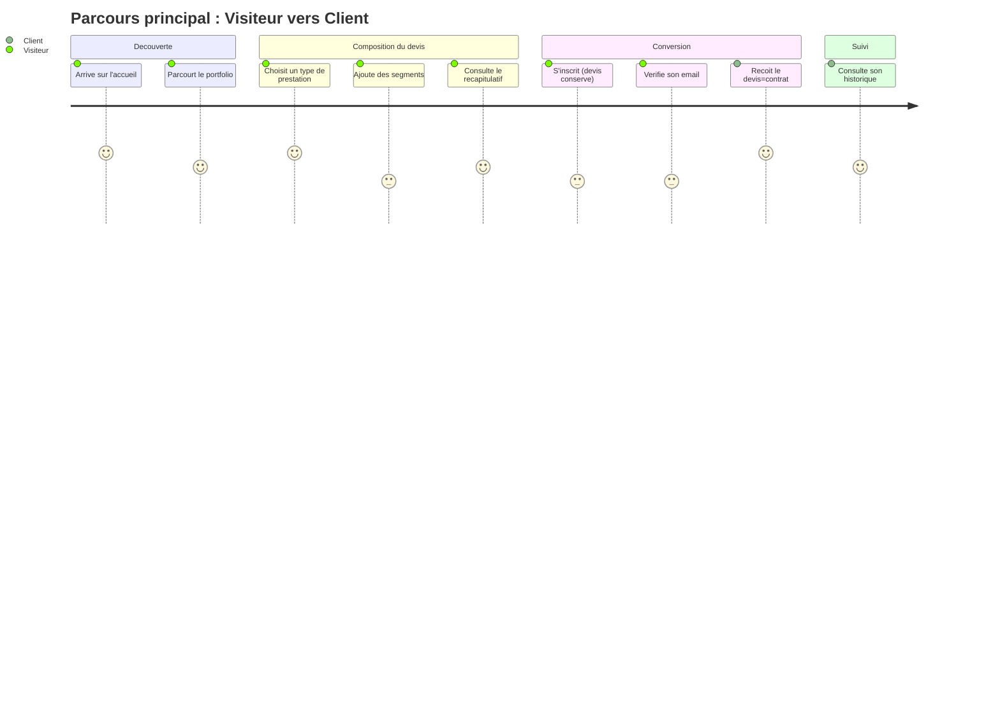

### 11.4 Points de friction identifiés
- Perte perçue (pas réelle) du devis en cours lors de l'inscription obligatoire → message explicite de réassurance
- Erreurs de géocodage sur adresse mal saisie → autocomplétion d'adresse à l'implémentation
- Tunnel de devis perçu comme long sur un mariage multi-segments → sous-total live + barre de progression
- Confusion "devis" vs "contrat" → clarifier le statut du document dès le récapitulatif (référence d'accord, pas un contrat juridique formel)
- Photographe face à des paramètres tarifaires vides à la première connexion → valeurs par défaut ou onboarding court

## 12. Résumé exécutif & Statut

### Résumé exécutif (pour business plan)
Les clients potentiels d'un photographe événementiel (mariages, portraits, événementiel) n'ont aujourd'hui accès qu'à des devis approximatifs négociés verbalement, source de litiges le jour de la prestation. PID propose un générateur de devis à la carte qui décompose précisément chaque segment de la journée (lieu, horaire, effectif) et calcule un prix transparent, débouchant sur un document unique qui fait office de devis ET de contrat de référence. Cible : clientèle événementielle du photographe (marché personnel, pas de commercialisation prévue au stade MVP). Modèle économique : outil interne, pas de monétisation directe — le paiement réel reste géré hors plateforme (cash/Smart).

### Points ouverts / décisions restantes
- [ ] Hébergement et CI/CD à définir (pas de contrainte du cours)
- [ ] Format du document devis=contrat : PDF vs HTML imprimable (à trancher en implémentation)
- [ ] Choix Breeze vs Fortify pour l'auth Laravel (à trancher en implémentation)
- [ ] Sort du projet `PortfolioPhotographe` existant (abandon, fusion, ou statu quo) — non bloquant pour PID

### Prochaines étapes
1. Passe Spec Kit optionnelle (`specify init`, une fois par projet, puis constitution/specify/plan/tasks/analyze par feature)
2. Activation du pipeline agents IT (`/pipeline init it`) — Phase 1 : PO (user stories), Architect (architecture + endpoints), UI/UX (import du design Claude "Ernest H Photography" en référence)
