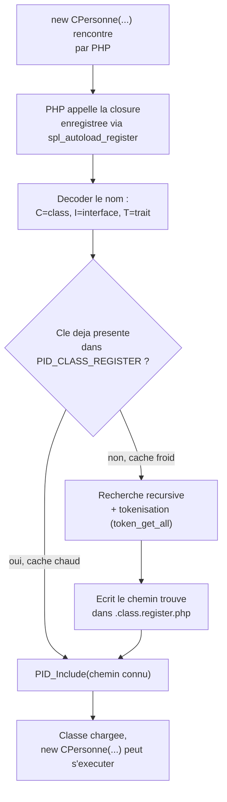

# Autoloading PID — spl_autoload_register et le cache .class.register.php

> Imagine une usine Satisfactory : dès qu'une commande arrive pour une pièce ("j'ai besoin de la classe CPersonne"), un convoyeur rapide vérifie d'abord un entrepôt de pièces déjà répertoriées (`.class.register.php`) — trouvé, livraison immédiate. Sinon, un robot d'exploration part fouiller **tout l'entrepôt** pièce par pièce jusqu'à trouver la bonne, puis met à jour le registre pour que la prochaine commande soit instantanée.

## En une phrase simple

L'autoloading (chargement automatique) est un mécanisme qui dit à PHP : "si tu rencontres un nom de classe que tu ne connais pas encore, appelle cette fonction — elle va trouver et charger le bon fichier toute seule", pour ne plus jamais écrire une longue liste de `require` en haut de chaque fichier.

## Pourquoi ça existe ?

Sans autoloading, chaque script qui utilise `CPersonne` devrait faire `require("dir1/truc/machin/personne.php")` avant de pouvoir écrire `new CPersonne(...)`. Multiplié par des dizaines de classes et de fichiers, c'est fragile (un chemin change, tout casse) et répétitif. `spl_autoload_register()` (une fonction native de PHP, SPL = *Standard PHP Library*) permet d'enregistrer **une fonction de secours** que PHP appelle automatiquement, une seule fois, exactement au moment où il rencontre un nom de classe inconnu — ni avant, ni "juste au cas où".

## Comment ça fonctionne ? (version du 05/09)

### 1. Le déclenchement paresseux ("lazy loading")

```php
spl_autoload_register(function($className) { ... });
```

Cette fonction ne s'exécute **jamais** tant que le code n'écrit pas quelque chose comme `new CPersonne(...)`. À cet instant précis, PHP réalise qu'il ne connaît pas `CPersonne`, et appelle automatiquement la closure enregistrée avec `$className = "CPersonne"`.

### 2. Le décodage du nom : type + convention de préfixe

```php
$kindIndex = strpos("CIT", $className[0]);
$kindName = ["class", "interface", "trait"][$kindIndex];
$typeName = substr($className, 1);
```

Convention imposée par le prof : un nom de classe commence par `C`, une interface par `I`, un trait par `T` (d'où `"CIT"`). `CPersonne` → type = `class`, nom réel = `Personne`. Si le premier caractère n'est aucun des trois, `die()` immédiat — erreur de nommage détectée tout de suite.

### 3. Le cache — `$PID_CLASS_REGISTER` / `.class.register.php`

Avant de fouiller quoi que ce soit, l'autoloader vérifie si `$className` est déjà une clé connue dans le tableau `$PID_CLASS_REGISTER` (chargé au démarrage depuis `.class.register.php`, via `PID_Include`, voir [[PID_PathTo, PID_Include et PID_IncludeOnce]]). Si oui : on saute directement à l'étape 5. C'est l'équivalent du convoyeur rapide de l'entrepôt déjà répertorié.

### 4. La recherche à froid (si pas en cache)

Une fonction récursive `$exploreToFind` parcourt **récursivement** tous les sous-dossiers depuis la racine, teste dans chacun deux noms de fichiers possibles (`"class.Personne.php"` puis `"Personne.php"`), et si le fichier existe, **tokenise** son contenu avec `token_get_all()` (découpe le code PHP en unités lexicales : mots-clés, identifiants, espaces...) pour vérifier qu'il contient bien littéralement `class Personne` (pas juste un nom de fichier qui y ressemble). Si trouvé : le chemin est ajouté à `$PID_CLASS_REGISTER`, et **tout le tableau** est réécrit dans `.class.register.php` — le cache grandit à chaque nouvelle classe découverte.

### 5. Le chargement final

```php
PID_Include($filePath);
```

Une fois le chemin connu (via le cache ou via la recherche), l'autoloader délègue le chargement réel à `PID_Include` — pas de duplication de logique, il réutilise l'outil déjà vu.

## Schéma



## Exemple concret

Premier appel de `new CPersonne("Duchemin", "Robert")` dans `test_poo.php` : le cache ne contient rien (ou une entrée obsolète) → recherche récursive dans toute l'arborescence → trouve `dir1/dir2/personne.php` (depuis le 12/09 — ce fichier contient en réalité **deux** classes, `CAutre` puis `CPersonne`, voir [[Structure POO — CPersonne, CPersonne2 et CAutre]]), vérifie par tokenisation que `class CPersonne` y est bien déclarée → écrit ce chemin dans `.class.register.php` → inclut le fichier. Au prochain appel de `new CPersonne(...)` (même dans une autre requête HTTP), l'entrée est déjà en cache : chargement instantané, pas de nouvelle exploration de dossiers.

> ⚠️ **Correction (12/09, publication post-cours)** : la première version de ce cahier avait été rédigée sur la base du matériel publié *avant* le cours du 12/09, qui plaçait encore `CPersonne` dans `dir1/truc/machin/personne.php` (chemin utilisé le 05/09). La version réellement publiée après le cours déplace/renomme cette classe vers `dir1/dir2/personne.php` — c'est ce chemin qui est aujourd'hui dans `.class.register.php`. `dir1/truc/machin/personne.php` n'existe plus.

## Connexions

- [[Glossaire PHP — Closures et fonctions anonymes]] — toute la logique de l'autoloader est écrite dans la fonction anonyme passée à `spl_autoload_register()`.
- [[Glossaire PHP — Tokenisation (token_get_all)]] — le détail complet de comment `token_get_all()` isole une déclaration de classe dans un fichier.
- [[PID_PathTo, PID_Include et PID_IncludeOnce]] — l'autoloader s'appuie entièrement sur `PID_Include` pour le chargement final et sur `PID_PathTo(..., false)` pour localiser où écrire le cache.
- [[Evolution de l'Autoloader — Boucle de Retry (0509 vers 1209)]] — la suite logique : que faire si le cache pointe vers un chemin qui ne contient *plus* la bonne classe ?
- [[Structure POO — CPersonne, CPersonne2 et CAutre]] — ce sont précisément les classes que cet autoloader charge à la demande.

## Questions de rappel actif

> **Q :** Pourquoi l'autoloader ne se déclenche-t-il jamais si le code n'utilise aucune classe ?
> **R :** Parce que `spl_autoload_register` enregistre une fonction de *secours*, appelée par PHP uniquement au moment précis où il rencontre un nom de classe non encore déclarée — c'est un mécanisme "à la demande" (lazy), pas un chargement systématique au démarrage.

> **Q :** À quoi sert le premier caractère (`C`, `I` ou `T`) dans le nom d'une classe comme `CPersonne` ?
> **R :** C'est une convention du framework qui indique le *type* d'élément à chercher (classe, interface ou trait) — cela permet de savoir quel mot-clé chercher (`class`, `interface`, `trait`) lors de la tokenisation du fichier candidat, et quel nom de fichier de base utiliser (`Personne` sans le préfixe).

> **Q :** Pourquoi utiliser `token_get_all()` plutôt que simplement vérifier que le fichier s'appelle `Personne.php` ?
> **R :** Pour être sûr que le fichier contient réellement la déclaration `class Personne` dans son code, et pas seulement un nom de fichier qui y ressemble par coïncidence — la tokenisation lit la structure réelle du code PHP, pas juste son nom.

> **Q :** Que se passe-t-il concrètement dans `.class.register.php` la première fois qu'une nouvelle classe est découverte ?
> **R :** Le fichier entier est réécrit avec `file_put_contents` : il contient un `define("PID_CLASS_REGISTER", [...])` listant **toutes** les classes déjà connues, l'ancienne liste plus la nouvelle entrée ajoutée.

## Pièges fréquents

- ⚠️ **Croire que l'autoloader "scanne tout à chaque fois"** — non, c'est justement le rôle du cache `.class.register.php` d'éviter de refaire une recherche récursive coûteuse à chaque requête, une fois qu'une classe a déjà été localisée une première fois.
- ⚠️ **Oublier que le cache peut devenir obsolète** — si on déplace le fichier d'une classe sans mettre à jour `.class.register.php`, la version du 05/09 n'a **aucun garde-fou** : elle fait confiance aveuglément au chemin en cache et l'inclut tel quel, même s'il ne contient plus la bonne classe (voir la faille corrigée le 12/09).
- ⚠️ **Confondre `$PID_CLASS_REGISTER` (variable en mémoire) et `PID_CLASS_REGISTER` (constante définie dans le fichier de cache)** — la variable globale est initialisée une fois à partir de la constante, puis c'est elle qui est modifiée en mémoire pendant la requête ; la constante, elle, ne change plus une fois définie.

## À retenir absolument
- Autoloading = chargement à la demande, pas au démarrage.
- Le cache (`.class.register.php`) transforme une recherche coûteuse (récursive + tokenisation) en simple lecture de tableau.
- La version du 05/09 fait confiance au cache sans jamais le vérifier après coup — c'est exactement ce que corrige la version du 12/09.

## Explorer ensuite
- [[Evolution de l'Autoloader — Boucle de Retry (0509 vers 1209)]] — comment le prof a durci ce mécanisme une semaine plus tard.
