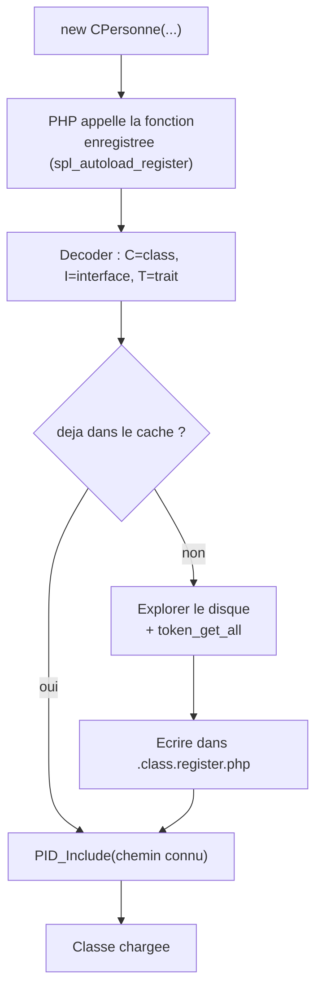

# Autoloading PID — `spl_autoload_register` et le cache `.class.register.php`

> **En 30 secondes** — L'autoloader dit à PHP : « si tu rencontres un nom de classe inconnu, appelle **cette fonction** — elle trouve et charge le bon fichier toute seule ». Elle consulte d'abord un **cache** (`.class.register.php`) ; s'il ne connaît pas la classe, elle **explore le disque**, vérifie par tokenisation, puis **mémorise** le résultat.



![[attachments/schema-bootstrap-autoloader-avant-apres.png]]
*Même schéma que [[Bootstrap PID — Detection de la Racine du Site]] — bloc « AUTOLOADER » : déclenchement paresseux, recherche, mise en cache.*

---

## 1. Vue Macro & Utilité (le « Pourquoi »)

- **Problématique** — Sans autoloading, chaque script qui utilise `CPersonne` devrait écrire `require("dir1/dir2/personne.php")` avant d'écrire `new CPersonne(...)`. Multiplié par des dizaines de classes, c'est **répétitif et fragile** (un chemin change, tout casse). Il faut que PHP aille chercher la classe **quand il en a besoin**, et seulement à ce moment.
- **Emplacement dans la carte globale** : troisième maillon — Bootstrap (trouver la racine) → `PID_PathTo` (adresser un fichier) → **autoloader (charger les classes)** → objets (`CApplication`, `CPage`…). C'est ce que **Composer / PSR-4** fait dans un projet Laravel ([[Laravel ↔ framework PID — Correspondances]]).
- **Analogie (Satisfactory)** : une commande arrive pour une pièce. Un **convoyeur rapide** consulte d'abord l'**entrepôt répertorié** (le cache). Introuvable ? Un **robot d'exploration** fouille tout l'entrepôt, trouve la pièce, puis **met à jour le registre** : la prochaine commande sera instantanée.

## 2. Le Pont Systémique (sous le capot)

- **Table interne des classes** : PHP tient, pour la durée de la requête, une table des classes déjà déclarées. Quand il exécute `new CPersonne`, il la consulte ; en cas d'absence, il appelle **une à une les fonctions enregistrées** par `spl_autoload_register`, puis **consulte à nouveau** la table ; toujours absente → erreur fatale « Class not found ».
- **Le cache est un fichier PHP** : `.class.register.php` est **lu, compilé et exécuté** à chaque requête (il contient un `define("PID_CLASS_REGISTER", [...])`), ce qui remplit un tableau en RAM. Sa **réécriture**, elle, est une **écriture disque** (`file_put_contents`).
- **Coût de la recherche à froid** : `glob()` lit des répertoires, `file_get_contents()` lit des fichiers, `token_get_all()` fait tourner l'**analyseur lexical de PHP** sur le texte — en mémoire, **sans rien exécuter** ([[Glossaire PHP — Tokenisation (token_get_all)]]). C'est exactement ce que le cache évite : un parcours du disque devient une recherche dans un tableau.
- **Restauration depuis la session** : quand `session_start()` reconstruit un objet dont la classe est inconnue, PHP appelle l'autoloader — qui doit donc être enregistré **avant** ([[Glossaire PHP — Superglobales et sessions]]). C'est le cas : il est enregistré dès le bootstrap.

## 3. Analyse du Code & Logique

**Étape 1 — Déclenchement paresseux (*lazy*)**

```php
spl_autoload_register(function($className) { /* ... */ });
```
La fonction ([[Glossaire PHP — Closures et fonctions anonymes]]) ne s'exécute **que** quand PHP rencontre un nom inconnu — ni avant, ni « au cas où ».

**Étape 2 — Décoder le nom**

```php
$kindIndex = strpos("CIT", $className[0]);
$kindName = ["class", "interface", "trait"][$kindIndex];
$typeName = substr($className, 1);
```
Convention du prof : `C` = classe, `I` = interface, `T` = trait. `CPersonne` → type `class`, nom `Personne`. Premier caractère inconnu → `die()` immédiat.

**Étape 3 — Le cache**

`$PID_CLASS_REGISTER` (variable globale) est initialisée **une fois** depuis la constante `PID_CLASS_REGISTER` du fichier de cache, puis c'est elle qui est modifiée en mémoire. Clé présente → on saute à l'étape 5.

**Étape 4 — La recherche à froid**

`$exploreToFind` parcourt **récursivement** les sous-dossiers ; dans chacun elle teste deux noms de fichier (`class.Personne.php` puis `Personne.php`), et **tokenise** le contenu pour vérifier qu'il déclare bien `class Personne` (et non un simple nom de fichier ressemblant). Depuis le 19/09 elle explore aussi les dossiers cachés (`glob("*")` **plus** `glob(".*")`) : voir [[Dossier .pid et préfixe étoile — Séparer le framework du site]]. Trouvé → le chemin est ajouté au tableau et **tout** le fichier de cache est réécrit.

> ⚠️ **À confirmer au prochain cours (casse)** — le registre enregistre le nom de fichier **cherché**, pas le nom réel du fichier. C'est visible dans le code du 19/09 : le registre contient `"CPersonne" => "dir1/dir2/Personne.php"` alors que le fichier s'appelle `personne.php`, et `".pid/Application.php"` pour `application.php`. Sous **Windows** la casse est ignorée, ça fonctionne ; sous **Linux**, `file_exists` distingue majuscules et minuscules — ce serait un point à surveiller à l'hébergement. *Probable : lu dans le code, non exécuté.*

**Étape 5 — Le chargement final**

```php
PID_Include($filePath);
```
L'autoloader **réutilise** `PID_Include` ([[PID_PathTo, PID_Include et PID_IncludeOnce]]) : pas de logique dupliquée. Depuis le 12/09, une vérification `class_exists(…, false)` suit l'inclusion : [[Evolution de l'Autoloader — Boucle de Retry (0509 vers 1209)]].

**Bonnes pratiques** : chargement à la demande ; convention de nommage qui permet de deviner le type ; cache pour transformer une recherche coûteuse en simple lecture.

> ⚠️ **À confirmer au prochain cours (concurrence)** — la réécriture du cache n'est protégée par aucun verrou dans le code lu : deux requêtes simultanées qui découvrent des classes différentes pourraient s'écraser mutuellement. *Probable : lu, non exécuté.*

## 4. Synthèse & Prochaine Étape

**À retenir (3 puces max)**
- Autoloading = chargement **à la demande**, déclenché par PHP quand une classe est inconnue.
- Le cache `.class.register.php` remplace un parcours du disque par la lecture d'un tableau.
- La version du 05/09 fait **confiance aveugle** au cache ; celle du 12/09 vérifie après coup.

**Lien avec la suite** : que faire si le cache pointe vers un fichier qui ne contient plus la classe ? → [[Evolution de l'Autoloader — Boucle de Retry (0509 vers 1209)]].

**Rappel actif**
> **Q :** Pourquoi l'autoloader ne se déclenche-t-il jamais si le code n'utilise aucune classe ?
> **R :** `spl_autoload_register` enregistre une fonction de secours que PHP n'appelle qu'au moment où il rencontre un nom de classe inconnu (chargement paresseux).

> **Q :** À quoi sert le premier caractère (`C`, `I`, `T`) du nom d'une classe ?
> **R :** C'est la convention du framework qui indique le type à chercher (classe, interface, trait) — donc le mot-clé à repérer par tokenisation et le préfixe à retirer du nom de fichier.

> **Q :** Pourquoi tokeniser plutôt que vérifier le nom du fichier ?
> **R :** Pour s'assurer que le fichier **déclare réellement** la classe — un commentaire, une chaîne ou une mise en forme inhabituelle tromperaient une recherche de texte.

> **Q :** Que devient `.class.register.php` quand une nouvelle classe est découverte ?
> **R :** Le fichier entier est réécrit avec `file_put_contents` : l'ancienne liste plus la nouvelle entrée.

**Pièges fréquents**
- ⚠️ **Croire que l'autoloader scanne le disque à chaque requête** — c'est justement le rôle du cache d'éviter ça.
- ⚠️ **Oublier que le cache peut devenir obsolète** — version du 05/09 : aucun garde-fou si un fichier est déplacé.
- ⚠️ **Confondre `$PID_CLASS_REGISTER` (variable en mémoire) et `PID_CLASS_REGISTER` (constante du fichier de cache)** — la variable est initialisée depuis la constante puis modifiée ; la constante ne change plus.

**Connexions**
- [[Glossaire PHP — Closures et fonctions anonymes]] — toute la logique tient dans une fonction anonyme.
- [[Glossaire PHP — Tokenisation (token_get_all)]] — comment une déclaration de classe est isolée dans un fichier.
- [[Structure POO — CPersonne et CAutre]] — les classes que cet autoloader charge (et le commentaire piégé du 12/09).
- [[PID_PathTo, PID_Include et PID_IncludeOnce]] — brique de chargement.
