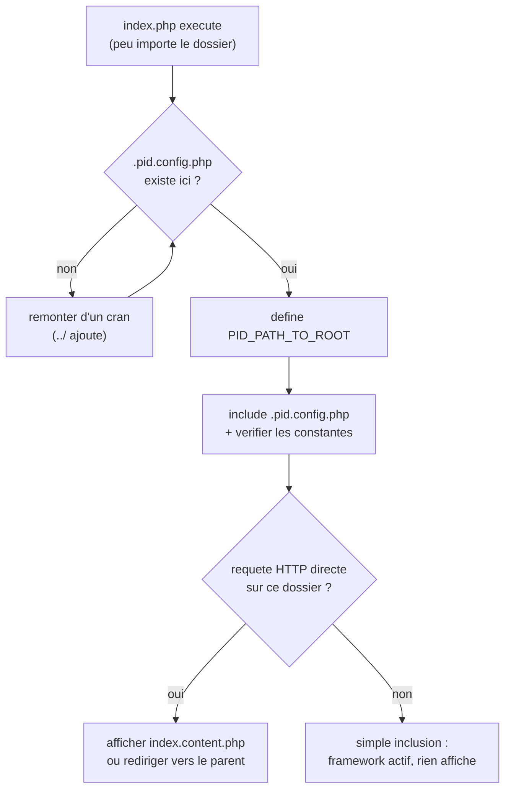

# Bootstrap PID — détection de la racine du site

> **En 30 secondes** — Un `index.php` identique est placé dans **chaque dossier** du site : il empêche le navigateur de lister le contenu des dossiers, et il sait retrouver tout seul la racine du site (en remontant jusqu'au fichier-marqueur `.pid.config.php`) pour activer le framework, quelle que soit sa profondeur.



![[attachments/schema-bootstrap-autoloader-avant-apres.png]]
*Schéma avant/après (index.php dupliqué + chemins en dur → Bootstrap + PID_PathTo/Include + Autoloader) — vérifié fidèle au code du cours le 2026-09-18.*

---

## 1. Vue Macro & Utilité (le « Pourquoi »)

- **Problématique** — Deux problèmes, résolus par le même fichier :
  1. **Sécurité** : si un dossier n'a pas de fichier d'accueil, le serveur web peut en afficher la **liste des fichiers**. Le cours du 29/08 pose l'objectif dès le départ : *« interdiction de l'exploration des répertoires via le navigateur par l'ajout de fichier `index.php` dans chaque répertoire »*. C'est une mesure contre l'exposition d'informations (catégorie de failles répertoriée par l'OWASP — *Open Web Application Security Project*, référence de la sécurité web).
  2. **Localisation** : cet `index.php`, **strictement identique** partout, ne sait pas à quelle profondeur il se trouve. Un chemin en dur (`"../../.pid.config.php"`) casserait dès qu'on déplace un dossier. Il doit **s'auto-localiser**.
- **Emplacement dans la carte globale** : c'est le **tout premier maillon** de la chaîne : requête HTTP → serveur web → `index.php` (bootstrap) → adressage des fichiers (`PID_PathTo`) → chargement des classes (autoloader) → application (`CApplication`, `CPage`).
- **Analogie (multiprise)** : chaque `index.php` est une **rallonge** qu'on peut brancher dans n'importe quelle pièce : avant de faire quoi que ce soit, elle remonte les prises une à une jusqu'au **tableau électrique** (la racine), sans faire confiance à aucune prise locale.

## 2. Le Pont Systémique (sous le capot)

1. **Le serveur web** (Apache) reçoit l'URL, la traduit en chemin de fichier, et **lance PHP** sur ce fichier. Si le dossier demandé n'a pas de fichier d'index, Apache peut en afficher la liste — d'où l'`index.php` partout.
2. **PHP redémarre de zéro à chaque requête** : aucune variable, aucune constante ne survit d'une requête à l'autre. Le bootstrap **se rejoue donc intégralement à chaque requête**. Son coût : quelques `file_exists`, chacun étant un **appel système au disque** (le système d'exploitation vérifie l'entrée dans le répertoire).
3. **`__FILE__`** est le chemin absolu du fichier en cours d'exécution ; **`define()`** inscrit une constante dans la mémoire du processus PHP pour la durée de la requête ; **`get_included_files()`** renvoie la liste que le moteur tient des fichiers déjà chargés.
4. **`die()`** arrête le script sur place : la réponse HTTP s'interrompt avec le message affiché — c'est le mécanisme d'erreur « défensive » du bootstrap.

## 3. Analyse du Code & Logique

**Étape 1 — Remonter jusqu'à la racine**

```php
$relativePathToRoot = "./";
for ($remainingUpSteps = substr_count(str_replace("\\", "/", __FILE__), "/"); $remainingUpSteps > 0; $remainingUpSteps--)
{
    if (file_exists($relativePathToRoot . PID_CONFIG_FILENAME)) { define("PID_PATH_TO_ROOT", $relativePathToRoot); break; }
    $relativePathToRoot = ($relativePathToRoot == "./") ? "../" : $relativePathToRoot . "../";
}
```
`substr_count(..., "/")` compte **tous** les `/` du chemin **absolu** du fichier (par exemple 7 pour `C:/xampp/htdocs/site/dir1/truc/machin/index.php`) : c'est un **majorant** du nombre de dossiers à remonter, qui sert de garde-fou (la boucle ne tourne jamais indéfiniment). Depuis `dir1/truc/machin/`, on essaie `./`, `../`, `../../`, puis `../../../` : trouvé au 4ᵉ tour → `PID_PATH_TO_ROOT = "../../../"`. S'il n'est trouvé nulle part, `die("PID error : missing .pid.config.php…")`.

**Étape 2 — Le fichier-marqueur et ses constantes obligatoires**

`.pid.config.php` a un seul rôle : **exister à la racine** et définir la configuration. Juste après l'avoir inclus, `index.php` vérifie que toutes les constantes attendues existent (sinon `die()`), et que la **valeur** de `PID_CHARSET` est `PID_ANSI` ou `PID_UTF8` (deux constantes techniques définies dans `index.php` lui-même).

| Séance | Constantes exigées | Ajout |
|--------|-------------------|-------|
| 05/09 | 5 | `PID_SETUP_ACTION_NAME`, `PID_SETUP_INDEX_FILES`, `PID_INDEX_CONTENT_FILENAME`, `PID_DEFAULT_INDEX_CONTENT`, `PID_CLASS_REGISTER_FILENAME` |
| 12/09 | 7 | `PID_CHARSET`, `PID_APPLICATION_SESSION_ITEM_NAME` ([[CApplication, CMonApp et CPage — Singleton applicatif et charset]]) |
| 19/09 | 8 | `PID_FOLDER_PATH` ([[Dossier .pid et préfixe étoile — Séparer le framework du site]]) |

**Étape 3 — Requête HTTP directe ou simple inclusion ?**

```php
$httpRequestOfIndexFile = (count(get_included_files()) == 1);
```
Si `index.php` est le **seul** fichier chargé, c'est le navigateur qui l'a demandé (requête directe). Sinon un autre script (ex. `test_poo.php`) l'a inclus juste pour **activer le framework** : rien ne doit s'afficher.

**Étape 4 — Que faire d'une requête directe ?** (c'est ici que se joue l'interdiction du listing)

```php
if (file_exists(PID_INDEX_CONTENT_FILENAME))      { @include_once(PID_INDEX_CONTENT_FILENAME); }   // 1. contenu d'accueil du dossier
else if (!file_exists(PID_CONFIG_FILENAME))       { header("location:../"); die(); }              // 2. pas la racine : on remonte
else { /* racine sans contenu : crée index.content.php par défaut, puis die(message) */ }          // 3. racine
```
1. Le dossier a un `index.content.php` → il est affiché. 2. Il n'en a pas et ce **n'est pas la racine** (pas de `.pid.config.php` ici) → redirection HTTP vers le dossier parent ([[Glossaire — En-têtes HTTP et header()]]) : **jamais de liste de fichiers**. 3. À la racine sans contenu → le framework **crée** un `index.content.php` par défaut et s'arrête avec un message.

**Étape 5 — L'action de maintenance `updateIndexes`**

`?pidAction=updateIndexes` recopie l'`index.php` de la racine dans **tous** les sous-dossiers (y compris `.pid/` depuis le 19/09). Ça garantit un `index.php` partout après l'ajout d'un dossier.

**Bonnes pratiques** : validation défensive dès le départ avec un message d'erreur explicite ; constantes immuables plutôt que variables ; un même fichier, une seule source de vérité (copiée mécaniquement).

> ⚠️ **À confirmer au prochain cours** — l'action `updateIndexes` est déclenchée par une simple **URL** et écrit des fichiers sur le serveur, sans contrôle d'accès dans le code lu. Ce serait un point sensible en production ; le prof la restreindra peut-être plus tard. *Probable : lu dans le code, non exécuté.*

## 4. Synthèse & Prochaine Étape

**À retenir (3 puces max)**
- Un `index.php` partout = pas de listing des dossiers **et** amorçage du framework de n'importe quelle profondeur.
- `PID_PATH_TO_ROOT` (calculé en remontant jusqu'à `.pid.config.php`) est le point de référence de tout le framework.
- Le bootstrap **se rejoue à chaque requête** : PHP ne garde rien en mémoire d'une requête à l'autre.

**Lien avec la suite** : avec la racine connue, on peut adresser n'importe quel fichier depuis n'importe où → [[PID_PathTo, PID_Include et PID_IncludeOnce]].

**Rappel actif**
> **Q :** Pourquoi le prof place-t-il un `index.php` dans chaque dossier ?
> **R :** Pour interdire l'exploration des répertoires depuis le navigateur (un dossier sans index pourrait afficher la liste de ses fichiers) ; chaque `index.php` redirige vers le parent ou affiche le contenu d'accueil du dossier.

> **Q :** Que compte `substr_count(__FILE__, "/")` et pourquoi ce chiffre est-il « trop grand » ?
> **R :** Tous les `/` du chemin absolu du fichier ; c'est un majorant du nombre de dossiers à remonter, utilisé comme garde-fou pour que la boucle s'arrête toujours.

> **Q :** Que fait `index.php` quand il est inclus par un autre script plutôt que demandé par le navigateur ?
> **R :** Il active seulement le framework (constantes, autoloader) sans rien afficher : `count(get_included_files()) == 1` est faux dans ce cas.

> **Q :** Pourquoi le bootstrap est-il exécuté à chaque requête ?
> **R :** PHP n'a aucune mémoire entre deux requêtes : constantes et variables sont recréées à chaque fois.

**Pièges fréquents**
- ⚠️ **Confondre `PID_CONFIG_FILENAME` et `PID_PATH_TO_ROOT`** — le premier est le *nom* du fichier-marqueur (`.pid.config.php`), le second le *chemin relatif calculé* (change selon la profondeur).
- ⚠️ **Croire que `.pid.config.php` contient la logique** — il ne définit que des constantes ; la logique est dans `index.php`.
- ⚠️ **Croire que `index.php` est un fichier central inclus depuis chaque dossier** — c'est une **copie identique** dans chaque dossier (mise à jour par `updateIndexes`).

**Connexions**
- [[PID_PathTo, PID_Include et PID_IncludeOnce]] — utilisent `PID_PATH_TO_ROOT`.
- [[Autoloading PID — spl_autoload_register et le Cache]] — le registre de classes est cherché à partir de cette racine.
- [[Glossaire — En-têtes HTTP et header()]] — la redirection `location:../`.
- [[Glossaire — Encodage des caractères (windows-1252 vs UTF-8)]] — la valeur de `PID_CHARSET`.
- [[Introduction au PHP — Bases pour débutant]] — `define()`, boucles et constantes si ce concept semble encore flou.
