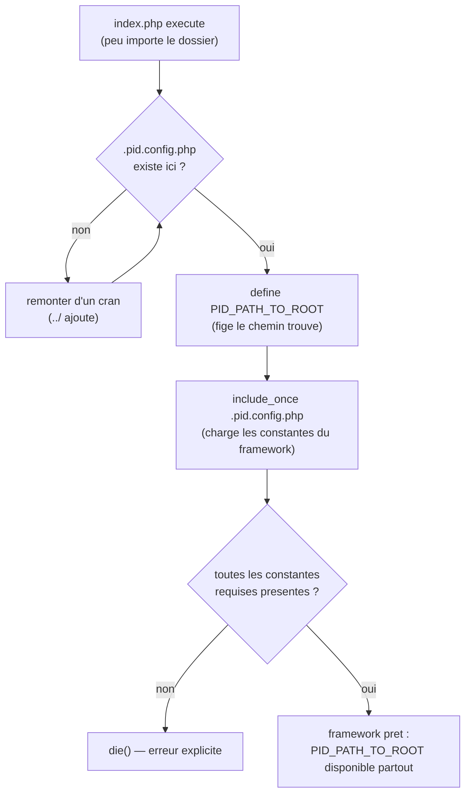

# Bootstrap PID — Détection de la racine du site

> Chaque `index.php` du site, où qu'il soit dans l'arborescence, se comporte comme une rallonge électrique qui remonte automatiquement jusqu'au tableau électrique principal avant de faire quoi que ce soit — il ne fait confiance à aucune prise locale, il vérifie toujours d'où vient le courant.

## En une phrase simple

Avant de faire quoi que ce soit, chaque `index.php` remonte l'arborescence de dossiers, un cran à la fois, jusqu'à trouver un fichier-marqueur (`.pid.config.php`) qui signale "ici, c'est la racine du site" — et il retient ce chemin dans une constante globale, `PID_PATH_TO_ROOT`, que tout le reste du framework va réutiliser.

## Pourquoi ça existe ?

Le prof a codé un `index.php` **identique**, copié-collé dans `dir1/`, `dir1/dir2/`, `dir1/truc/machin/`, etc. (il y a même une action `pidAction=updateIndexes` qui propage ce fichier dans tous les sous-dossiers automatiquement). Problème : un `index.php` dans `dir1/dir2/` n'est pas au même "étage" qu'un `index.php` à la racine. Si le code écrivait `"../../.pid.config.php"` en dur, il casserait dès qu'on déplace un dossier.

Il fallait un mécanisme qui **s'auto-localise**, peu importe sa profondeur dans l'arborescence — exactement comme une rallonge qu'on peut brancher n'importe où dans la maison, tant qu'elle finit par retrouver le tableau électrique.

## Comment ça fonctionne ?

### 1. Comptage de la profondeur

```php
$relativePathToRoot = "./";
for ($remainingUpSteps = substr_count(str_replace("\\", "/", __FILE__), "/"); $remainingUpSteps > 0; $remainingUpSteps--)
```

`__FILE__` donne le chemin absolu du fichier courant. Compter ses `/` donne une majoration du nombre de dossiers à remonter — la boucle ne peut pas tourner indéfiniment (garde-fou).

### 2. La remontée pas à pas

À chaque tour de boucle : est-ce que `.pid.config.php` existe dans `$relativePathToRoot` ? Si non, on ajoute un `"../"` et on réessaie. Dès qu'il est trouvé, `PID_PATH_TO_ROOT` est figé (via `define`, donc une **constante** — immuable pour le reste de la requête) et la boucle s'arrête (`break`).

### 3. Le fichier-marqueur `.pid.config.php`

Ce fichier n'a qu'un rôle : **exister à la racine** et définir les constantes de configuration du framework. Version du 05/09 : `PID_SETUP_ACTION_NAME`, `PID_INDEX_CONTENT_FILENAME`, `PID_DEFAULT_INDEX_CONTENT`, `PID_CLASS_REGISTER_FILENAME`. Depuis le 12/09, deux constantes obligatoires supplémentaires sont apparues — `PID_CHARSET` et `PID_APPLICATION_SESSION_ITEM_NAME` — qui configurent le nouveau singleton applicatif (voir [[CApplication, CMonApp et CPage — Singleton applicatif et charset]]). S'il manque une de ces constantes après son inclusion, `index.php` s'arrête net avec `die()` — validation défensive dès le bootstrap. `index.php` va même plus loin pour `PID_CHARSET` : après avoir vérifié sa présence, il vérifie aussi que sa **valeur** vaut bien `PID_ANSI` ou `PID_UTF8` (deux constantes techniques définies en tout début d'`index.php` lui-même, pas dans `.pid.config.php`) — sinon nouveau `die()`, distinct du premier.

### 4. Distinguer requête HTTP directe vs inclusion

```php
$httpRequestOfIndexFile = (count(get_included_files()) == 1);
```

Si ce `index.php` est le tout premier fichier chargé (aucun autre fichier PHP ne l'a inclus avant), c'est que le navigateur l'a demandé directement en HTTP. Sinon, c'est qu'un autre script (ex. `test_poo.php`) l'a inclus lui-même pour "activer" le framework sans vouloir afficher la page d'accueil du dossier. Cette distinction pilote la suite (afficher `index.content.php` ou ne rien afficher).

## Schéma



## Exemple concret

Tu es dans `dir1/truc/machin/index.php`. `__FILE__` contient 3 occurrences de `/` après le nom du site (approximativement — la boucle part large). Tour 1 : `./.pid.config.php` — absent. Tour 2 : `../.pid.config.php` — absent. Tour 3 : `../../.pid.config.php` — absent. Tour 4 : `../../../.pid.config.php` — trouvé ! `PID_PATH_TO_ROOT = "../../../"`. À partir de là, n'importe quelle fonction du framework appelée depuis ce fichier sait reconstruire un chemin absolu vers la racine.

## Connexions

- [[Introduction au PHP — Bases pour débutant]] — bases de syntaxe (variables, constantes `define()`, boucles) si ce concept semble encore flou.
- [[PID_PathTo, PID_Include et PID_IncludeOnce]] — utilisent directement `PID_PATH_TO_ROOT` pour construire des chemins fiables.
- [[Autoloading PID — spl_autoload_register et le Cache]] — le registre de classes est cherché et écrit à partir de cette même racine.
- [[CApplication, CMonApp et CPage — Singleton applicatif et charset]] — ses deux constantes de configuration (`PID_CHARSET`, `PID_APPLICATION_SESSION_ITEM_NAME`) sont désormais validées ici même, dès le bootstrap, avant que quoi que ce soit d'autre ne s'exécute.

## Questions de rappel actif

> **Q :** Pourquoi le framework ne peut-il pas simplement écrire `include("../../.pid.config.php")` en dur dans chaque `index.php` ?
> **R :** Parce que chaque copie d'`index.php` se trouve à une profondeur différente dans l'arborescence — un chemin en dur ne fonctionnerait que pour un seul niveau de profondeur et casserait partout ailleurs. Il faut une remontée dynamique qui s'adapte à la position réelle du fichier.

> **Q :** Que se passe-t-il si `.pid.config.php` n'existe nulle part en remontant jusqu'à la racine du disque (dans la limite du compteur) ?
> **R :** `PID_PATH_TO_ROOT` n'est jamais défini, la condition `!defined("PID_PATH_TO_ROOT")` est vraie, et le script s'arrête avec un `die()` explicite demandant d'ajouter le fichier manuellement.

> **Q :** À quoi sert la distinction entre "requête HTTP directe" et "inclusion par un autre script" ?
> **R :** Elle permet à `index.php` de savoir s'il doit afficher le contenu de la page (`index.content.php`) ou simplement "activer" le framework en arrière-plan pour un script comme `test_poo.php` qui l'inclut sans vouloir de sortie HTML de sa part.

> **Q :** Pourquoi utiliser `define()` plutôt qu'une simple variable `$pathToRoot` pour stocker le résultat ?
> **R :** Une constante ne peut plus être modifiée après sa définition — cela garantit que tout le reste du framework (fonctions globales, autoloader) lit toujours la même valeur figée pour cette requête, sans risque d'écrasement accidentel.

## Pièges fréquents

- ⚠️ **Confondre `PID_CONFIG_FILENAME` et `PID_PATH_TO_ROOT`** — le premier est le *nom* du fichier-marqueur (`.pid.config.php`, toujours le même), le second est le *chemin relatif calculé* pour l'atteindre (change selon la profondeur du fichier courant).
- ⚠️ **Penser que `.pid.config.php` contient la logique du framework** — non, il ne fait que *définir des constantes de configuration*. La logique (autoloading, inclusion) est dans `index.php` lui-même.
- ⚠️ **Oublier que `index.php` est dupliqué partout** — ce n'est pas un unique fichier central inclus depuis chaque dossier, mais bien une copie identique du même code présente physiquement dans chaque sous-dossier (mise à jour via l'action `pidAction=updateIndexes`).

## À retenir absolument
- `PID_PATH_TO_ROOT` = le point de référence absolu que tout le framework réutilise ensuite.
- La remontée s'arrête au premier `.pid.config.php` trouvé — c'est le marqueur physique de la racine du site.
- Sans ce bootstrap, aucune des fonctions `PID_*` ne pourrait localiser quoi que ce soit correctement.

## Explorer ensuite
- [[PID_PathTo, PID_Include et PID_IncludeOnce]] — la première chose que ce bootstrap rend possible.
