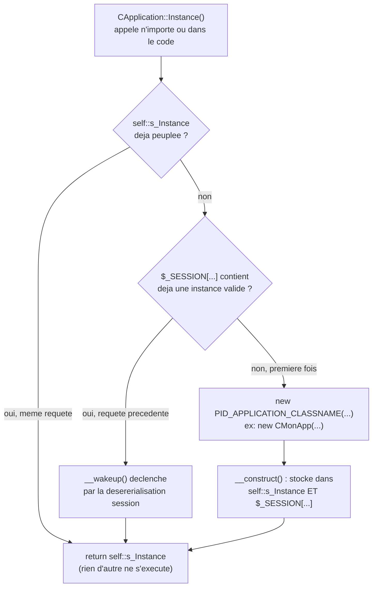

# CApplication, CMonApp et CPage — singleton applicatif et charset

> Un hôtel n'a qu'une seule réception, peu importe par quelle porte ou quel étage un client entre : tout le monde qui demande "la réception" tombe sur le même bureau, la même personne, les mêmes informations à jour. `CApplication::Instance()` joue ce rôle pour le framework — un seul point d'accès partagé par tout le code, jamais une nouvelle réception créée à chaque demande.

## En une phrase simple

`CApplication` est une classe de base qui garantit qu'**une seule instance** existe pour toute la durée d'une session utilisateur (motif **Singleton**), accessible partout via `CApplication::Instance()` ; `CMonApp` en est une implémentation concrète configurée par le site, et `CPage` s'appuie dessus pour générer le HTML avec le bon encodage de caractères.

## Pourquoi ça existe ?

Le 12/09 (version publiée après le cours), le prof introduit un besoin nouveau : certaines informations (le charset du site, des données applicatives partagées) doivent être **identiques et accessibles partout**, sans qu'aucun script n'ait besoin de les recréer ou de les recalculer à chaque fois. Une variable globale classique ne survivrait pas d'une requête HTTP à l'autre (PHP redémarre son état à chaque requête). Le prof combine donc deux mécanismes déjà vus :
1. Le motif **Singleton** (une seule instance, jamais deux) pour garantir l'unicité *pendant* une requête.
2. Le **stockage en session** (`$_SESSION`, déjà vu avec `CPersonne` dans [[Structure POO — CPersonne, CPersonne2 et CAutre]]) pour faire survivre cette instance unique *entre* les requêtes d'un même visiteur.

## Comment ça fonctionne ?

### 1. Le Singleton protégé — `Instance()` et un constructeur inaccessible de l'extérieur

```php
protected function __construct()
{
    self::$s_Instance = $this;
    $_SESSION[PID_APPLICATION_SESSION_ITEM_NAME] = $this;
}
```

Le constructeur de `CApplication` est `protected`, pas `public` — impossible d'écrire `new CApplication()` depuis l'extérieur de la hiérarchie de classes (`test_poo.php` le tente en commentaire : `//$app = new CApplication(); // Impossible`). La **seule** porte d'entrée est la méthode statique `CApplication::Instance()`, qui centralise toute la logique de création.

### 2. `Instance()` — cache mémoire d'abord, session ensuite, création en dernier recours

```php
public static function Instance()
{
    if (self::$s_Instance === null)
    {
        // ... vérifie $_SESSION[PID_APPLICATION_SESSION_ITEM_NAME], sinon crée via PID_APPLICATION_CLASSNAME
    }
    return self::$s_Instance;
}
```

Trois niveaux, du plus rapide au plus coûteux :
1. **Propriété statique `self::$s_Instance`** — si déjà peuplée (un appel précédent dans la *même* requête a déjà créé/récupéré l'instance), retour immédiat. C'est pour ça que le double appel `CApplication::Instance()->DoSomething();` de `test_poo.php` ne recrée rien la seconde fois : `self::$s_Instance` n'est déjà plus `null`.
2. **Session `$_SESSION[PID_APPLICATION_SESSION_ITEM_NAME]`** — si une requête *précédente* (même visiteur, même session PHP) a déjà créé l'instance, PHP l'a désérialisée automatiquement au démarrage de la session ; on la récupère telle quelle plutôt que d'en recréer une.
3. **Création via `PID_APPLICATION_CLASSNAME`** — si vraiment rien n'existe encore : instanciation dynamique de la classe dont le nom est donné par la constante de config `PID_APPLICATION_CLASSNAME` (ex. `"CMonApp"`), avec des arguments de constructeur eux aussi fournis par config (`PID_APPLICATION_INSTANCIATOR_ARGUMENTS`, tableau **ou** fonction qui en renvoie un — `new $className(...$arguments)` grâce à l'opérateur d'étalement `...`).

### 3. `__wakeup()` — le signal "je reviens d'une session, pas d'une création"

```php
protected function __wakeup()
{
    var_dump("RECUPERATION D'UN OBJET DE TYPE CApplication");
}
```

Méthode magique que PHP appelle automatiquement chaque fois qu'un objet est **désérialisé** — ce qui arrive précisément quand `$_SESSION[...]` est relue au démarrage d'une nouvelle requête HTTP. C'est le pendant de `__construct()`, mais pour "je reprends vie à partir d'un état sauvegardé" plutôt que "je nais pour la première fois". `CMonApp` surcharge les deux (`__construct`/`__wakeup`) et appelle systématiquement `parent::` pour ne pas casser la mécanique du singleton.

### 4. La conversion de charset — `PID_CHARSET`, `ToUtf8()`/`FromUtf8()`

```php
define("PID_ANSI", "windows-1252");
define("PID_UTF8", "utf-8");
// PID_CHARSET vaut PID_ANSI ou PID_UTF8, defini dans .pid.config.php, valide au bootstrap
```

`CApplication` sait dans quel encodage le site travaille (`Charset()`, `CharsetIsAnsi()`, `CharsetIsUtf8()`) et fournit deux méthodes de conversion récursives (`ToUtf8`/`FromUtf8`, via `mb_convert_encoding`) qui parcourent chaînes, tableaux et — partiellement, avec un `TODO` explicite du prof — objets. Le but : que le reste du code applicatif n'ait jamais besoin de choisir lui-même l'encodage, il délègue systématiquement à `CApplication::Instance()`.

### 5. `CPage` — consommateur de `CApplication` pour générer du HTML cohérent

```php
public static function DeclareContentType()
{
    header("content-type:text/html;charset=" . CApplication::Instance()->Charset(), true);
}
```

`CPage` est la classe de base de toute page HTML du framework. `WriteDocument()` génère un squelette HTML minimal (doctype, `<head>` avec `<meta charset>`, `<body>`) — et c'est elle qui est désormais appelée depuis `index.content.php` (`new CPage()->WriteDocument();`), remplaçant le HTML écrit à la main dans la version d'avant-cours. Le charset envoyé dans l'en-tête HTTP et dans le HTML provient toujours de `CApplication::Instance()->Charset()` — un seul endroit à changer (`PID_CHARSET` dans `.pid.config.php`) pour reconfigurer tout le site.

## Schéma



## Exemple concret

Tiré de `dir.0/test_poo.php` (12/09) :

```php
//$app = new CApplication(); // Impossible — constructeur protected

CApplication::Instance()->DoSomething(); // 1er appel : cree (ou recupere de session) l'instance
CApplication::Instance()->DoSomething(); // 2e appel : self::$s_Instance deja peuplee, retour immediat
```

Avec `.pid.config.php` configurant `PID_APPLICATION_CLASSNAME = "CMonApp"` et `PID_APPLICATION_INSTANCIATOR_ARGUMENTS = [ "Voici de l'information pour mon application" ]`, le premier appel crée effectivement un `CMonApp` (pas un `CApplication` nu) avec cette chaîne passée à son constructeur, stockée dans `$this->m_Information`. `DoSomething()` affiche ensuite cette information — la preuve que la configuration déclarative (juste des `define()` dans `.pid.config.php`) pilote quelle classe concrète est réellement instanciée, sans que `CApplication::Instance()` n'ait besoin de connaître `CMonApp` à l'avance.

## Évolution du 19/09 — la suite
- **Déménagement** : `CApplication` et `CPage` vivent maintenant dans `.pid/` (framework), `CMonApp` reste à la racine (site) — voir [[Dossier .pid et préfixe étoile — Séparer le framework du site]].
- **`CApplication` gagne** : le trait `TCssJsFiles` (listes de CSS/JS communs à tout le site, cf. [[TCssJsFiles et CFileCollection — Collections de fichiers CSS et JS]]) et deux méthodes d'échappement, `IntoHtml` et `IntoAttr` ([[Glossaire — Échappement HTML et faille XSS]]).
- **`CPage` devient une vraie classe de génération de page** (titre, contenu, points d'extension) — traitée à part : [[CPage — Générer une page HTML (WriteDocument et points d'extension)]]. La section 5 ci-dessous décrit son état au 12/09 (squelette minimal).

## Connexions

- [[Glossaire — Le motif de conception Singleton]] — le motif de conception général que `CApplication` implémente, indépendamment de PHP.
- [[Glossaire PHP — Propriétés et méthodes statiques]] — détail complet de `self::$s_Instance` et de sa portée limitée à une seule requête.
- [[Glossaire PHP — Méthodes magiques]] — détail complet de `__construct()`/`__wakeup()` et de la différence entre création et restauration.
- [[Glossaire PHP — Superglobales et sessions]] — détail complet de `$_SESSION` et de la sérialisation automatique des objets.
- [[Glossaire PHP — Visibilité et encapsulation]] — pourquoi un constructeur `protected` bloque `new CApplication()` depuis l'extérieur.
- [[Bootstrap PID — Detection de la Racine du Site]] — valide la présence de `PID_CHARSET` et `PID_APPLICATION_SESSION_ITEM_NAME` dès le bootstrap, avant que `CApplication` ne soit utilisable.
- [[Structure POO — CPersonne, CPersonne2 et CAutre]] — même principe de persistance en session (`$_SESSION[...]`) déjà vu avec `CPersonne`, ici formalisé en motif Singleton réutilisable.
- [[Autoloading PID — spl_autoload_register et le Cache]] — `CApplication`, `CMonApp`, `CPage` sont chargées comme n'importe quelle autre classe, via le même `.class.register.php`.

## Questions de rappel actif

> **Q :** Pourquoi le constructeur de `CApplication` est-il `protected` plutôt que `public` ?
> **R :** Pour empêcher `new CApplication()` depuis l'extérieur — la seule façon valide d'obtenir une instance est de passer par `CApplication::Instance()`, qui garantit qu'il n'en existe jamais qu'une seule. C'est la garde-fou standard du motif Singleton.

> **Q :** Si `CApplication::Instance()` est appelée deux fois dans le même script, la seconde fois recrée-t-elle un objet ou relit-elle la session ?
> **R :** Ni l'un ni l'autre : la propriété statique `self::$s_Instance` est déjà peuplée depuis le premier appel (dans la même requête PHP), donc la seconde fois retourne immédiatement cette valeur sans retoucher à `$_SESSION`.

> **Q :** À quel moment précis `__wakeup()` est-il appelé, et pourquoi pas `__construct()` dans ce cas ?
> **R :** `__wakeup()` est appelé automatiquement par PHP lors de la désérialisation d'un objet — ici, quand `$_SESSION[PID_APPLICATION_SESSION_ITEM_NAME]` est relue au démarrage d'une nouvelle requête. `__construct()` ne s'exécute que lors d'une création *initiale* avec `new`, pas lors d'une restauration depuis un état déjà sérialisé.

> **Q :** Comment le framework sait-il qu'il doit instancier `CMonApp` et pas `CApplication` directement ?
> **R :** Via la constante de config `PID_APPLICATION_CLASSNAME` (ex. `"CMonApp"`), lue par `Instance()` : `new $className(...$arguments)` où `$className` est cette chaîne — une instanciation dynamique pilotée entièrement par configuration, sans que le code de `CApplication` ne mentionne `CMonApp` en dur.

## Pièges fréquents

- ⚠️ **Essayer `new CApplication()` directement** — échoue silencieusement en erreur fatale PHP (constructeur `protected` non accessible) ; c'est volontaire, voir le commentaire `// Impossible` du prof lui-même dans `test_poo.php`.
- ⚠️ **Croire que `CApplication` "sait" que `CMonApp` existe** — faux, c'est l'inverse : `CMonApp` *hérite* de `CApplication`, et c'est la configuration (`PID_APPLICATION_CLASSNAME`) qui indique à `Instance()` quelle sous-classe instancier. La classe de base ne connaît jamais ses sous-classes à l'avance.
- ⚠️ **Confondre la portée de `self::$s_Instance` (le temps d'une requête PHP) et celle de `$_SESSION[...]` (plusieurs requêtes, tant que la session dure)** — la propriété statique est réinitialisée à `null` à chaque nouvelle requête, c'est justement pour ça que la relecture en session est nécessaire.

## À retenir absolument
- Singleton = un seul point d'entrée (`Instance()`), constructeur inaccessible de l'extérieur.
- Trois niveaux de coût croissant dans `Instance()` : mémoire (statique) → session → création complète.
- `CMonApp` et `CPage` ne réinventent rien : elles réutilisent respectivement l'unicité du singleton et le charset qu'il expose.

## Explorer ensuite
- Retour à [[Structure POO — CPersonne, CPersonne2 et CAutre]] pour comparer avec la persistance "manuelle" en session de `CPersonne`, moins formalisée que ce Singleton.
