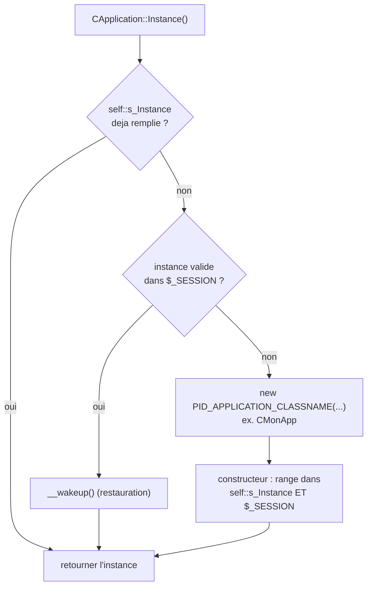

# `CApplication` et `CMonApp` — le singleton applicatif

> **En 30 secondes** — `CApplication` garantit qu'**une seule instance** existe pour toute la session d'un visiteur, accessible partout par `CApplication::Instance()`. `CMonApp` en est la version concrète, choisie par la configuration. L'instance est **rangée en session** pour survivre d'une requête à l'autre. Charset, échappement HTML, fichiers CSS/JS et `CPage` ont leurs propres notes.



---

## 1. Vue Macro & Utilité (le « Pourquoi »)

- **Problématique** — Certaines informations doivent être **identiques et accessibles partout** (le charset du site, des données applicatives), sans qu'aucun script n'ait à les recréer. Une variable globale ne convient pas : PHP **redémarre de zéro à chaque requête HTTP**, rien ne survit d'une page à la suivante. Il faut à la fois **l'unicité** (une seule instance) et la **persistance** (elle survit entre les requêtes).
- **Emplacement dans la carte globale** : quatrième maillon — Bootstrap → adressage → autoloader → **état applicatif partagé** → pages. C'est l'équivalent du **conteneur de services** de Laravel ([[Laravel ↔ framework PID — Correspondances]]).
- **Analogie (hôtellerie)** : un hôtel n'a qu'**une seule réception**, quelle que soit la porte par laquelle on entre : tout le monde tombe sur le même bureau, la même personne, les mêmes informations à jour. `CApplication::Instance()` est ce point d'accès unique — jamais une nouvelle réception créée à chaque demande.

## 2. Le Pont Systémique (sous le capot)

Trois mémoires, de la plus rapide à la plus coûteuse :

1. **Propriété statique `self::$s_Instance`** — vit dans la **RAM du processus PHP**, donc **le temps d'une seule requête**. À la requête suivante, elle est de nouveau `null` : PHP ne garde rien ([[Glossaire PHP — Propriétés et méthodes statiques]]).
2. **Session `$_SESSION[...]`** — à la **fin** de la requête, PHP **sérialise** l'objet (le convertit en texte) dans un **fichier de session sur le disque du serveur**, associé à un identifiant transmis par un cookie du navigateur ; au **début** de la requête suivante, `session_start()` relit ce fichier et **désérialise** l'objet — **sans** appeler `__construct`, mais **avec** `__wakeup()` ([[Glossaire PHP — Méthodes magiques]]). Si la classe n'est pas encore connue, PHP appelle l'autoloader pour la charger. *(Le dossier exact et le format dépendent de la configuration de PHP — ⚠️ Probable.)*
3. **Création** — en dernier recours : `new` sur la classe désignée par la configuration.

Seules les **propriétés** de l'objet sont sérialisées : les propriétés statiques ne le sont pas, d'où le double rangement (statique **et** session).

## 3. Analyse du Code & Logique

**Étape 1 — Un constructeur `protected` qui s'enregistre**

```php
protected function __construct($cssFiles = null, $jsFiles = null)
{
    self::$s_Instance = $this;
    $_SESSION[PID_APPLICATION_SESSION_ITEM_NAME] = $this;
    $this->TCssJsFiles_Initialize($cssFiles, $jsFiles);   // 19/09
}
```
`protected` interdit `new CApplication()` depuis l'extérieur ([[Glossaire PHP — Visibilité et encapsulation]]) — le prof le note lui-même : `//$app = new CApplication(); // Impossible`. Le constructeur range l'instance dans **les deux** mémoires.

**Étape 2 — `Instance()` : mémoire, session, création**

```php
if (self::$s_Instance === null)
{
    /* démarre la session si besoin ; lit PID_APPLICATION_CLASSNAME (sinon "CApplication") */
    /* si $_SESSION[...] contient une instance de cette classe → on la reprend, sinon on l'efface */
    /* si rien en session : $instance = @new $className(...$arguments); */
}
return self::$s_Instance;
```
- **Contrôle de cohérence** : une instance trouvée en session n'est reprise que si `is_a($instance, "CApplication")` **et** `get_class($instance) == $className` ; sinon elle est supprimée (la configuration a changé, par exemple).
- **Création pilotée par la configuration** : `PID_APPLICATION_CLASSNAME` (ex. `"CMonApp"`) désigne la classe ; `PID_APPLICATION_INSTANCIATOR_ARGUMENTS` fournit les arguments du constructeur — un **tableau** ou une **fonction** qui en renvoie un. `new $className(...$arguments)` ([[Glossaire PHP — Opérateur d'étalement (...)]]) permet d'instancier **n'importe quelle** classe fille sans que `CApplication` la connaisse à l'avance.

**Étape 3 — `CMonApp extends CApplication`**

```php
class CMonApp extends CApplication
{
    public function __construct($information = null) { parent::__construct(); $this->Information($information); }
    protected function __wakeup() { parent::__wakeup(); }
    public function DoSomething() { var_dump("Je fais quelque chose avec \"" . $this->m_Information . "\""); }
}
```
`parent::__construct()` est **obligatoire** : sans lui, l'instance n'est jamais rangée en statique ni en session ([[Glossaire PHP — Héritage (extends et parent)]]). `Information()` est un accesseur à double usage, comme `Nom()` dans [[Structure POO — CPersonne et CAutre]].

**Étape 4 — Ce que montre `test_poo.php`**

```php
CApplication::Instance()->DoSomething();   // 1er appel : crée (ou reprend de la session) l'instance
CApplication::Instance()->DoSomething();   // 2e appel : self::$s_Instance déjà remplie, retour immédiat
```
Le second appel ne recrée rien et ne relit pas la session. Au passage, c'est cet appel qui **démarre la session** utilisée ensuite par `$_SESSION["personne"]`.

**Étape 5 — Ce qui a changé le 19/09**

- Le prof a **retiré les `var_dump` de debug** du constructeur et de `__wakeup()` (dans `CApplication` **et** `CMonApp`) : `__wakeup()` est désormais vide. Le mécanisme est inchangé.
- `.pid.config.php` a `PID_APPLICATION_INSTANCIATOR_ARGUMENTS = [ /* to do */ ]` (vide) : `CMonApp` est créé **sans** information et `DoSomething()` afficherait probablement `Je fais quelque chose avec ""`. *(La version du 12/09 passait `"Voici de l'information pour mon application"`.)*
- La classe gagne le trait `TCssJsFiles` et les méthodes `IntoHtml`/`IntoAttr` ; le charset (`PID_CHARSET`, `ToUtf8`/`FromUtf8`) et `CPage` ont leurs notes : [[TCssJsFiles et CFileCollection — Collections de fichiers CSS et JS]], [[Glossaire — Échappement HTML et faille XSS]], [[Glossaire — Encodage des caractères (windows-1252 vs UTF-8)]], [[CPage — Générer une page HTML (WriteDocument et points d'extension)]]. Les deux classes ont aussi déménagé dans `.pid/` ([[Dossier .pid et préfixe étoile — Séparer le framework du site]]).

**Bonnes pratiques** : point d'accès unique ; création pilotée par la configuration plutôt que codée en dur ; contrôle de cohérence de ce qui vient de la session.

> ⚠️ **À confirmer au prochain cours** — `__wakeup()` est déclarée `protected`. Sous PHP 8, une méthode magique non publique provoque probablement un **avertissement** (« must have public visibility »). *Probable : lu dans le code, non exécuté.* Et, faute d'argument dans la configuration, le comportement exact de `DoSomething()` au 19/09 reste à vérifier.

## 4. Synthèse & Prochaine Étape

**À retenir (3 puces max)**
- Singleton = un seul point d'entrée (`Instance()`) et un constructeur inaccessible de l'extérieur.
- Trois niveaux de coût croissant : statique (RAM, une requête) → session (disque, plusieurs requêtes) → création.
- `CMonApp` ne réinvente rien : la **configuration** désigne la classe concrète ; la classe de base ne connaît jamais ses filles.

**Lien avec la suite** : où vit désormais ce code, et comment on l'adresse → [[Dossier .pid et préfixe étoile — Séparer le framework du site]].

**Rappel actif**
> **Q :** Pourquoi le constructeur de `CApplication` est-il `protected` ?
> **R :** Pour interdire `new CApplication()` depuis l'extérieur : la seule voie est `Instance()`, qui garantit l'unicité.

> **Q :** Si `Instance()` est appelée deux fois dans le même script, le second appel recrée-t-il l'objet ou relit-il la session ?
> **R :** Ni l'un ni l'autre : `self::$s_Instance` est déjà remplie, retour immédiat.

> **Q :** Quand `__wakeup()` est-elle appelée, et pas `__construct()` ?
> **R :** À la **désérialisation**, quand `$_SESSION[...]` est relue au début d'une nouvelle requête ; `__construct()` ne s'exécute que pour une création initiale avec `new`.

> **Q :** Comment le framework sait-il qu'il doit instancier `CMonApp` et pas `CApplication` ?
> **R :** Par la constante `PID_APPLICATION_CLASSNAME` lue dans `Instance()` : `new $className(...$arguments)`, sans que le code de `CApplication` ne mentionne `CMonApp`.

**Pièges fréquents**
- ⚠️ **Croire que `CApplication` connaît `CMonApp`** — c'est l'inverse : `CMonApp` hérite, et c'est la configuration qui désigne la classe.
- ⚠️ **Confondre la portée de `self::$s_Instance` (une requête) et celle de `$_SESSION[...]` (plusieurs requêtes)** — la statique est remise à `null` à chaque requête, d'où la relecture en session.
- ⚠️ **Oublier `parent::__construct()` dans une classe fille** — le singleton ne s'enregistre pas.

**Connexions**
- [[Glossaire — Le motif de conception Singleton]] — le motif général.
- [[Glossaire PHP — Superglobales et sessions]] — `$_SESSION` et la sérialisation automatique.
- [[Glossaire PHP — Héritage (extends et parent)]] — `CMonApp extends CApplication`.
- [[Glossaire PHP — Visibilité et encapsulation]] — pourquoi un constructeur `protected`.
- [[Bootstrap PID — Detection de la Racine du Site]] — valide `PID_CHARSET` et `PID_APPLICATION_SESSION_ITEM_NAME` dès le départ.
- [[Autoloading PID — spl_autoload_register et le Cache]] — `CApplication`, `CMonApp` et `CPage` sont chargées comme n'importe quelle classe.
