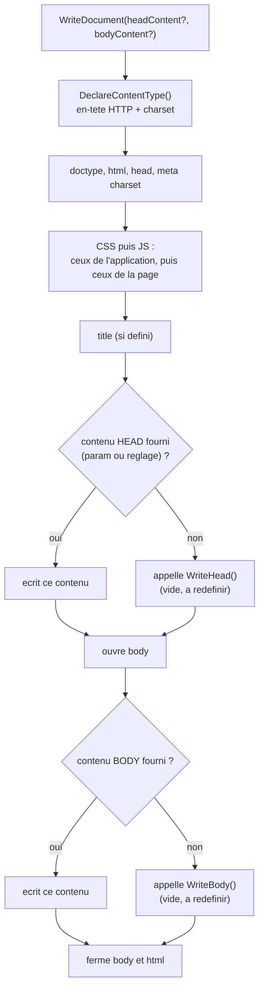

# `CPage` — générer une page HTML (`WriteDocument` et points d'extension)

> `CPage` est une **recette de base** imprimée dans le livre de cuisine : entrée, plat, dessert, dans cet ordre, toujours. La recette a deux **étapes laissées en blanc** ("ici, le chef ajoute sa touche"). Tu peux soit suivre la recette telle quelle en donnant des ingrédients (le contenu passé au constructeur), soit **réécrire les étapes en blanc** dans ta propre version de la recette (une classe fille). Dans les deux cas, l'ordre du menu ne change jamais.

## En une phrase simple

`CPage` produit un document HTML complet (`<!doctype>`, `<head>`, `<body>`) avec l'encodage et les fichiers CSS/JS corrects, et te laisse fournir le titre et le contenu soit **comme paramètres**, soit en **écrivant une classe fille** qui redéfinit `WriteHead`/`WriteBody`.

## Pourquoi ça existe ?

Le 12/09, `CPage` n'était qu'un squelette vide qu'on appelait avec `new CPage()->WriteDocument();`. Le 19/09, elle devient utilisable pour de vrai : chaque page du site n'a plus à réécrire le HTML de base (encodage, balises, liens CSS/JS) — elle ne fournit que **ce qui est spécifique** (son titre, son contenu). Le HTML répétitif est écrit **une seule fois**, dans `CPage`.

## Comment ça fonctionne ?

### 1. `WriteDocument()` — la séquence fixe

Dans cet ordre, toujours :
1. `DeclareContentType()` — envoie l'en-tête HTTP `content-type:text/html;charset=...` (charset lu via `CApplication::Instance()->Charset()`, cf. [[CApplication, CMonApp et CPage — Singleton applicatif et charset]]).
2. Écrit `<!doctype html><html><head><meta charset=...>`.
3. Ajoute les balises `<link>` CSS puis `<script>` JS — d'abord ceux **de l'application** (`CApplication::Instance()->Css()`), ensuite ceux **de la page** (`$this->Css()`). Chaque URL passe par `PID_PathTo` ; si le fichier n'existe pas, il est silencieusement ignoré (`continue`). Voir [[TCssJsFiles et CFileCollection — Collections de fichiers CSS et JS]].
4. Écrit `<title>` si un titre existe.
5. Écrit le contenu additionnel de `<head>`, puis ouvre `<body>` et écrit son contenu.

### 2. Trois réglages qui acceptent **trois formes** de valeur

`Title()`, `HeadContent()`, `BodyContent()` acceptent :
- **une chaîne** → utilisée telle quelle ;
- **`false`** → "rien" (pas de titre / pas de contenu) ;
- **une fonction** (closure — [[Glossaire PHP — Closures et fonctions anonymes]]) → appelée au moment d'écrire, pour calculer la valeur dynamiquement. Pour le titre, la fonction reçoit la page (`$this`) et doit renvoyer une chaîne ; pour le contenu, elle reçoit l'indentation `$tabs` et la page, et **imprime** elle-même avec `print`.

Ces réglages sont des **accesseurs à double usage** : `Title("x")` écrit (renvoie `true`/`false` selon la validité), `Title()` sans argument lit — le même style que `Information()` dans `CMonApp`.

### 3. Deux façons de fournir le contenu

**(a) Par paramètres** — sans écrire de classe :
```php
new CPage("Titre", null, null, null, "<p>Corps</p>")->WriteDocument();
$p->WriteDocument(null, "<p>Contenu de remplacement</p>"); // les params de WriteDocument passent AVANT ceux du constructeur
```
`WriteContent(...$contents)` prend le **premier contenu utilisable** dans l'ordre de la liste : d'abord celui passé à `WriteDocument`, sinon celui du constructeur/setter. D'où l'exemple `"OUPS LE CONTENU"` du prof : le second appel `$p->WriteDocument()` sans argument ressort ce contenu du constructeur.

**(b) Par héritage** — le prof le montre en dernier, avec `CettePage` :
```php
class CettePage extends CPage
{
    protected function WriteBody($tabs) { /* print(...) le corps */ }
    public function __construct() { parent::__construct("Liste de <fruits> & légumes"); }
}
new CettePage()->WriteDocument();
```
`WriteHead($tabs)` et `WriteBody($tabs)` sont **vides** dans `CPage` — ce sont les "étapes en blanc". `WriteDocument` les appelle **seulement si aucun contenu n'a été fourni par paramètre** (`if (!$this->WriteContent(...)) $this->WriteBody(...)`). Ce mécanisme — la classe de base impose l'ordre, la fille remplit les trous — s'appelle le patron **Template Method** (méthode-modèle).

### 4. La sécurité au passage : `IntoHtml()`

Dans `CettePage`, le titre est `"Liste de <fruits> & légumes"` — volontairement piégé avec `<` et `&`. Chaque fois qu'il est affiché, il passe par `CApplication::Instance()->IntoHtml(...)` qui remplace `& < >` par `&amp; &lt; &gt;`. Sans ça, `<fruits>` serait interprété comme une balise HTML (et un vrai visiteur malveillant pourrait injecter un `<script>`). C'est l'exemple vivant de la protection contre la **faille XSS** — voir [[Glossaire — Échappement HTML et faille XSS]] (dossier "sécurité PHP /20" de l'examen).

## Schéma



## Exemple concret

`index.content.php` du 19/09 contient **quatre variantes** en commentaire (chacune montre une forme de contenu : chaîne, chaîne passée à `WriteDocument`, closures, etc.) et une **cinquième active** : `CettePage`. Résultat dans le navigateur : un `<h1>` "Liste de <fruits> & légumes" (affiché littéralement, sans être interprété), suivi d'une liste ordonnée Pomme / Poire / Raisin / **Tomate & cerise** — le `&` de "Tomate & cerise" est lui aussi échappé.

## Connexions

- [[Dossier .pid et préfixe étoile — Séparer le framework du site]] — `CPage` vit maintenant dans `.pid/`.
- [[TCssJsFiles et CFileCollection — Collections de fichiers CSS et JS]] — fournit `Css()` et `Js()` à `CPage` (et à `CApplication`).
- [[CApplication, CMonApp et CPage — Singleton applicatif et charset]] — la source du charset, de `IntoHtml` et des fichiers CSS/JS communs.
- [[Glossaire PHP — Visibilité et encapsulation]] — pourquoi `WriteHead`/`WriteBody` sont `protected` : redéfinissables par les filles, invisibles de l'extérieur.
- [[Glossaire PHP — Closures et fonctions anonymes]] — les valeurs "fonction" acceptées par les réglages.
- [[Glossaire — Échappement HTML et faille XSS]] — pourquoi `IntoHtml`.

## Questions de rappel actif

> **Q :** Que se passe-t-il si tu fournis un contenu de body à la fois au constructeur **et** à `WriteDocument` ?
> **R :** Celui de `WriteDocument` gagne : `WriteContent` prend le premier contenu utilisable dans l'ordre `[paramètre de WriteDocument, contenu du constructeur]`. Le contenu du constructeur ne ressort que si on rappelle `WriteDocument()` sans argument.

> **Q :** `WriteBody()` est vide dans `CPage`. À quoi sert-elle alors ?
> **R :** C'est un point d'extension : une classe fille la redéfinit pour générer son corps de page avec `print`. `WriteDocument` ne l'appelle que si aucun contenu n'a été fourni par paramètre/réglage.

> **Q :** Pourquoi passer le titre par `IntoHtml()` avant de l'afficher ?
> **R :** Pour que `<`, `>` et `&` soient affichés comme du texte et non interprétés comme du HTML — sinon un titre contenant du code (ou une saisie de visiteur) pourrait injecter du HTML/JavaScript (XSS).

> **Q :** Quelles trois formes de valeur acceptent `Title`, `HeadContent`, `BodyContent` ?
> **R :** Une chaîne non vide, `false` (= rien), ou une fonction appelable (évaluée au moment de l'écriture).

## Pièges fréquents

- ⚠️ **Écrire du contenu dans `WriteBody` ET passer un contenu par paramètre** — le contenu par paramètre l'emporte, `WriteBody` n'est alors jamais appelée.
- ⚠️ **Oublier `IntoHtml`** en affichant une donnée qui ne vient pas de toi — c'est la porte d'entrée XSS classique. Le framework fournit l'outil, mais **c'est à celui qui écrit `WriteBody` de l'utiliser**.
- ⚠️ **Version de PHP** — `new CettePage()->WriteDocument();` (appel de méthode directement sur `new ...()` **sans** parenthèses autour) n'est accepté qu'à partir de **PHP 8.4**. Sur une version antérieure il faut écrire `(new CettePage())->WriteDocument();`. *(⚠️ Probable : lu dans le code, non exécuté — aucun PHP n'est installé sur cette machine pour tester.)*
- ⚠️ **`IntoHtml` n'échappe pas les guillemets** (`"`) — suffisant pour du contenu **entre balises**, insuffisant dans un **attribut** : c'est le rôle de `IntoAttr` (qui traite aussi `"` et les retours à la ligne).

## À retenir absolument
- `WriteDocument` impose l'ordre ; le titre et le contenu se fournissent par paramètre **ou** par classe fille.
- Trois formes de valeur : chaîne, `false`, fonction.
- Toute donnée affichée passe par `IntoHtml` (texte) ou `IntoAttr` (attribut).

## Explorer ensuite
- [[TCssJsFiles et CFileCollection — Collections de fichiers CSS et JS]] — d'où viennent `Css()` et `Js()`.
