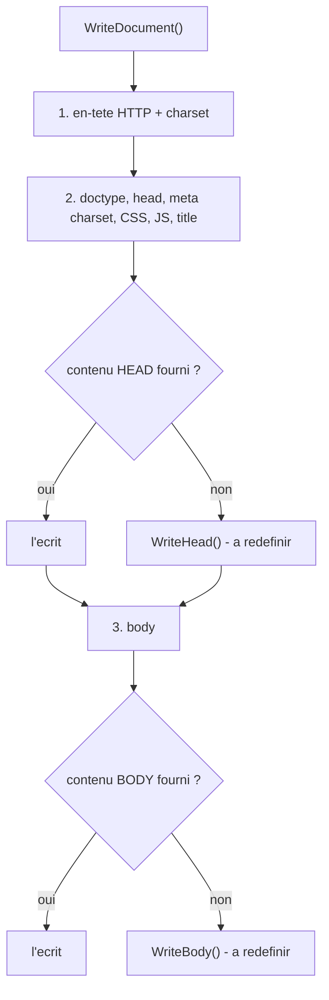

# `CPage` — générer une page HTML (`WriteDocument` et points d'extension)

> **En 30 secondes** — `CPage` écrit une page HTML complète (`<!doctype>`, `<head>`, `<body>`) avec le bon encodage et les fichiers CSS/JS. Le titre et le contenu se fournissent soit **en paramètres**, soit en écrivant une **classe fille** qui remplit deux étapes laissées vides. Tout ce qui est affiché passe par `IntoHtml` pour éviter l'injection de code (XSS).



---

## 1. Vue Macro & Utilité (le « Pourquoi »)

- **Problématique** : chaque page d'un site répète le même squelette HTML (encodage, balises, liens CSS/JS). Le recopier partout, c'est multiplier les erreurs et rendre un changement global impossible. Il faut écrire ce squelette **une seule fois** et ne fournir que ce qui est propre à chaque page (son titre, son contenu).
- **Emplacement dans la carte globale** : couche **présentation** du serveur. `CPage` est le maillon entre la logique métier (PHP) et ce que reçoit le navigateur (HTML). Elle consomme `CApplication` (charset, échappement, CSS/JS communs) et vit dans `.pid/`.
- **Analogie (cuisine)** : une **recette de base** imprimée dans le livre — entrée, plat, dessert, toujours dans cet ordre — avec **deux étapes en blanc** (« ici, le chef ajoute sa touche »). Soit on suit la recette en fournissant les ingrédients (paramètres), soit on écrit **sa propre version** de la recette en remplissant les blancs (classe fille). L'ordre du menu ne change jamais.

## 2. Le Pont Systémique (sous le capot)

Une page web, c'est une **suite d'octets envoyée dans un ordre précis** :

1. Le navigateur envoie une requête HTTP ; PHP exécute le script.
2. La réponse HTTP commence par des **en-têtes**, puis le **corps**. `header("content-type:text/html;charset=…")` prépare l'en-tête : PHP le garde en mémoire et l'envoie **dès le premier octet du corps**. Voilà pourquoi `DeclareContentType()` est la **toute première** chose de `WriteDocument` : après un premier `print`, il serait trop tard ([[Glossaire — En-têtes HTTP et header()]]).
3. Chaque `print` pousse du texte dans le flux de sortie, qui part vers le navigateur. **L'ordre des appels dans `WriteDocument` est l'ordre des octets reçus** : doctype, head, body.
4. Le navigateur lit l'en-tête `charset`, choisit la table d'encodage et décode les octets en caractères ([[Glossaire — Encodage des caractères (windows-1252 vs UTF-8)]]).
5. Quand le contenu est une **fonction**, PHP l'appelle à ce moment précis : la valeur est calculée à l'instant d'écrire, pas avant.

## 3. Analyse du Code & Logique

```php
public function WriteDocument($headContent = null, $bodyContent = null)
{
    self::DeclareContentType();           // 1. en-tête AVANT tout octet de corps
    print("<!doctype html>…<head>…");     // 2. squelette
    /* CSS puis JS : ceux de l'application, puis ceux de la page */
    /* <title> si défini */
    if (!$this->WriteContent("\t\t", $headContent, $this->HeadContent()))
        $this->WriteHead("\t\t");         // étape « en blanc » du head
    /* <body> */
    if (!$this->WriteContent("\t\t", $bodyContent, $this->BodyContent()))
        $this->WriteBody("\t\t");         // étape « en blanc » du body
}
```
- **Étape 1 — Séquence fixe.** `WriteDocument` impose l'ordre ; les CSS/JS de l'application passent avant ceux de la page (la page a le dernier mot sur le style — voir [[TCssJsFiles et CFileCollection — Collections de fichiers CSS et JS]]). Une URL introuvable est ignorée (`PID_PathTo` renvoie `false`).
- **Étape 2 — Trois formes de valeur.** `Title()`, `HeadContent()`, `BodyContent()` acceptent une **chaîne**, `false` (= rien) ou une **fonction** ([[Glossaire PHP — Closures et fonctions anonymes]]) : pour le titre, elle reçoit la page et renvoie une chaîne ; pour le contenu, elle reçoit l'indentation `$tabs` et la page, et **imprime** elle-même. Ce sont des **accesseurs à double usage** : `Title("x")` écrit, `Title()` lit (même style que `Information()` dans `CMonApp`).
- **Étape 3 — Priorité du contenu.** `WriteContent(...$contents)` ([[Glossaire PHP — Opérateur d'étalement (...)]]) prend le **premier contenu utilisable** : d'abord celui de `WriteDocument`, sinon celui du constructeur. D'où l'exemple `"OUPS LE CONTENU"` du prof : le second `$p->WriteDocument()` sans argument ressort le contenu du constructeur.
- **Étape 4 — Par héritage.** `WriteHead`/`WriteBody` sont **vides** et `protected` : une classe fille les redéfinit (`CettePage extends CPage`, [[Glossaire PHP — Héritage (extends et parent)]]). Ce montage — la mère impose l'ordre, la fille remplit les trous — est le patron **Template Method** (méthode-modèle).
- **Étape 5 — Sécurité au passage.** `CettePage` affiche `"Liste de <fruits> & légumes"` et `"Tomate & cerise"` via `IntoHtml` : le navigateur montre `<fruits>` comme du texte ([[Glossaire — Échappement HTML et faille XSS]]).

**Bonnes pratiques** : squelette écrit une seule fois (DRY) ; extension par héritage plutôt que par copie ; échappement systématique à l'affichage.

> ⚠️ **À confirmer au prochain cours** — `new CettePage()->WriteDocument();` (appel de méthode directement sur `new …()` **sans** parenthèses autour) n'est accepté qu'à partir de **PHP 8.4** ; avant, il faut `(new CettePage())->WriteDocument();`. *Probable : lu dans le code, non exécuté.* Autre point : `IntoHtml` n'échappe pas les guillemets `"` — suffisant entre balises, pas dans un attribut (rôle de `IntoAttr`).

## 4. Synthèse & Prochaine Étape

**À retenir (3 puces max)**
- `WriteDocument` impose l'ordre ; titre et contenu se fournissent par paramètre **ou** par classe fille.
- Trois formes de valeur : chaîne, `false`, fonction.
- Toute donnée affichée passe par `IntoHtml` (texte) ou `IntoAttr` (attribut).

**Lien avec la suite** : d'où viennent `Css()` et `Js()` → [[TCssJsFiles et CFileCollection — Collections de fichiers CSS et JS]].

**Rappel actif**
> **Q :** Que se passe-t-il si un contenu de body est fourni à la fois au constructeur **et** à `WriteDocument` ?
> **R :** Celui de `WriteDocument` gagne (premier contenu utilisable de la liste) ; celui du constructeur ne ressort que si on rappelle `WriteDocument()` sans argument.

> **Q :** Pourquoi `DeclareContentType()` est-il appelé avant tout `print` ?
> **R :** L'en-tête HTTP doit partir avant le corps ; PHP l'envoie au premier octet de corps. Après un `print`, il serait trop tard.

> **Q :** `WriteBody()` est vide dans `CPage`. À quoi sert-elle ?
> **R :** C'est un point d'extension (Template Method) : une classe fille la redéfinit pour écrire son corps. `WriteDocument` ne l'appelle que si aucun contenu n'a été fourni.

> **Q :** Pourquoi passer le titre par `IntoHtml()` ?
> **R :** Pour que `<`, `>` et `&` s'affichent comme du texte au lieu d'être interprétés comme du HTML — sinon une donnée d'un visiteur pourrait injecter du JavaScript (XSS).

**Pièges fréquents**
- ⚠️ **Contenu par paramètre ET dans `WriteBody`** — le paramètre l'emporte, `WriteBody` n'est jamais appelée.
- ⚠️ **Oublier `IntoHtml`** sur une donnée qui ne vient pas de toi : le framework fournit l'outil, **c'est à l'auteur de `WriteBody` de l'utiliser**.

**Connexions**
- [[Dossier .pid et préfixe étoile — Séparer le framework du site]] — `CPage` vit dans `.pid/`.
- [[CApplication, CMonApp et CPage — Singleton applicatif et charset]] — source du charset, de `IntoHtml` et des CSS/JS communs.
- [[Glossaire PHP — Visibilité et encapsulation]] — pourquoi `WriteHead`/`WriteBody` sont `protected`.
- [[Laravel ↔ framework PID — Correspondances]] — l'équivalent côté Laravel (layouts Blade).
