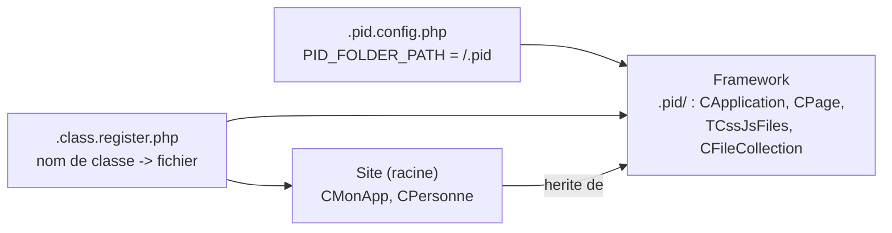

# Dossier `.pid` et préfixe `*` — séparer le framework du site

> **En 30 secondes** — Le 19/09, le code du framework quitte la racine du site pour un dossier dédié `.pid/`. Une nouvelle constante `PID_FOLDER_PATH` dit où il est, `PID_PathTo` gagne un raccourci `*` pour l'atteindre, et l'autoloader apprend à explorer les dossiers dont le nom commence par un point.



---

## 1. Vue Macro & Utilité (le « Pourquoi »)

- **Problématique** : jusqu'au 12/09, `application.php` et `page.php` (le framework) cohabitaient à la racine avec `monapp.php` (le code **du site**). Impossible de voir d'un coup d'œil ce qu'on ne doit pas toucher, et de réutiliser le framework sur un autre site sans trier les fichiers un par un.
- **Emplacement dans la carte globale** : couche **organisation des fichiers** de l'application, entre la configuration (Bootstrap) et le chargement des classes (autoloader). Elle décide *où vit* le code avant même qu'on l'exécute.
- **Analogie (restauration)** : un restaurant a une **salle** (ce que voient les clients : le site) et une **cuisine centrale** (ce qui fait tourner la maison : le framework). Avant, les casseroles traînaient dans la salle. Le 19/09 le prof construit la cuisine ; le préfixe `*` est le raccourci « va me chercher ça **en cuisine** ».

## 2. Le Pont Systémique (sous le capot)

Tout se joue sur le **système de fichiers** du serveur, pas en mémoire :

1. Apache reçoit la requête HTTP et lance PHP sur le `index.php` du dossier demandé.
2. Pour connaître la racine du site, ce fichier remonte les dossiers (Bootstrap). Ensuite `PID_PathTo` ne fait que **concaténer des chaînes** : `PID_PATH_TO_ROOT . "/.pid/page.php"` — aucun accès disque à ce stade.
3. Quand l'autoloader ne connaît pas une classe, il **explore le disque** : chaque `glob()` demande au système d'exploitation la liste des sous-dossiers, ce qui coûte des **lectures de répertoire** (entrées/sorties disque). C'est exactement pourquoi le résultat est mémorisé dans `.class.register.php` : le cache transforme un parcours du disque en une simple recherche dans un tableau en RAM.
4. Le nom `.pid` commence par un point : c'est la convention Unix des dossiers « cachés ». Le motif `*` de `glob` **ne les voit pas** ; il faut demander `.*` explicitement — et `.*` renvoie aussi `.` (dossier courant) et `..` (parent), à écarter pour ne pas tourner en rond.

## 3. Analyse du Code & Logique

```php
// .pid.config.php — 8e constante obligatoire
define("PID_FOLDER_PATH", "/.pid");
```
- **Étape 1 — Déclarer.** Le Bootstrap ajoute `PID_FOLDER_PATH` à sa liste de constantes exigées (7 → 8). Absente : `die("PID error : missing some constant(s)…")` ([[Bootstrap PID — Detection de la Racine du Site]]).

```php
// PID_PathTo — nouveau préfixe *
if (str_starts_with($url, "*"))
{
    $url = substr($url, 1);
    if (str_starts_with($url, "/")) $url = substr($url, 1);
    $url = PID_FOLDER_PATH . (str_ends_with(PID_FOLDER_PATH, "/") ? "" : "/") . $url;
}
```
- **Étape 2 — Raccourci `*`.** `PID_PathTo("*page.php")` → `"/.pid/page.php"`, puis la fonction continue comme d'habitude (`PID_PATH_TO_ROOT` devant). Sans étoile, rien ne change ([[PID_PathTo, PID_Include et PID_IncludeOnce]]). *Défini mais **pas encore utilisé** dans le code du 19/09 — préparé pour la suite.*

```php
// .class.register.php — la frontière est visible
"CPage"        => ".pid/Page.php",      // framework
"CApplication" => ".pid/Application.php",
"CMonApp"      => "MonApp.php",          // site
```
- **Étape 3 — Le registre trace la frontière** : `.pid/…` = framework, le reste = application.

```php
// Autoloader et action updateIndexes
$subDirectories = array_merge(glob($path . "*", GLOB_ONLYDIR), glob($path . ".*", GLOB_ONLYDIR));
```
- **Étape 4 — Voir les dossiers cachés.** Sans `glob(".*")`, `.pid/` serait invisible. Effet collatéral : `updateIndexes` recopie aussi `index.php` dans `.pid/`.

**Bonnes pratiques** : séparer le générique (framework) du spécifique (site) ; une constante de configuration plutôt qu'un chemin en dur ; un registre qui rend la frontière lisible.

## 4. Synthèse & Prochaine Étape

**À retenir (3 puces max)**
- Framework = `.pid/`, site = le reste ; `PID_FOLDER_PATH` dit où est le framework.
- `*fichier` dans `PID_PathTo` = « cherche dans `.pid/` » (défini, pas encore utilisé).
- Sans `glob(".*")`, l'autoloader est aveugle aux dossiers cachés.

**Lien avec la suite** : la classe la plus visible qui vit désormais dans `.pid/` → [[CPage — Générer une page HTML (WriteDocument et points d'extension)]].

**Rappel actif**
> **Q :** Pourquoi `glob($path . "*")` ne suffisait-il plus ?
> **R :** `*` ne correspond pas aux noms commençant par un point ; `.pid/` en est un. Il faut `glob(".*")` et écarter `.` et `..`.

> **Q :** Que vaut `PID_PathTo("*page.php")` si `PID_FOLDER_PATH` vaut `"/.pid"` ?
> **R :** `"/.pid/page.php"` d'abord, puis `PID_PATH_TO_ROOT` est ajouté devant. Le double slash éventuel est inoffensif.

> **Q :** Pourquoi le cache `.class.register.php` compte-t-il encore plus avec `.pid/` ?
> **R :** L'exploration du disque (`glob`) coûte des lectures de répertoire ; le cache les remplace par une recherche en RAM.

**Pièges fréquents**
- ⚠️ **Croire que `*` est déjà utilisé partout** — défini dans `PID_PathTo`, mais aucun appel du cours ne s'en sert au 19/09.
- ⚠️ **Oublier `PID_FOLDER_PATH`** dans un nouveau `.pid.config.php` — le Bootstrap s'arrête (`die`) : voulu.
- ⚠️ **`glob(".*")` explore tout** — y compris `.git` ou `.vscode` s'ils sont sous la racine du site : lenteur et découvertes inattendues à surveiller.

**Connexions**
- [[Bootstrap PID — Detection de la Racine du Site]] — valide `PID_FOLDER_PATH`.
- [[PID_PathTo, PID_Include et PID_IncludeOnce]] — porte le préfixe `*`.
- [[Autoloading PID — spl_autoload_register et le Cache]] — exploration élargie aux dossiers cachés.
- [[CApplication, CMonApp et CPage — Singleton applicatif et charset]] — les classes qui ont déménagé.
- [[Glossaire PHP — include, require et résolution de chemins]] — le mécanisme natif que tout ceci corrige.
