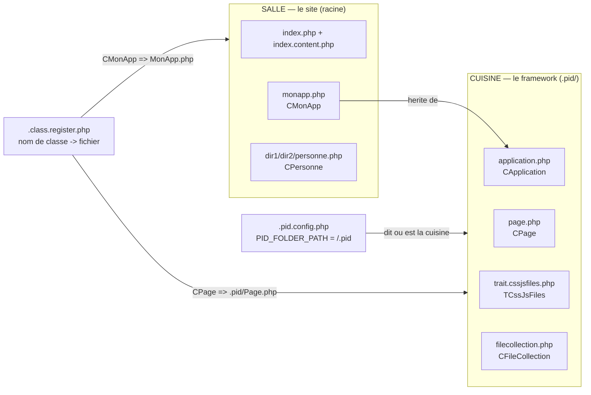

# Dossier `.pid` et préfixe `*` — séparer le framework du site

> Un restaurant a une **salle** (ce que voient les clients : le site) et une **cuisine centrale** (ce qui fait tourner la maison : le framework). Jusqu'au 12/09, les casseroles du framework traînaient dans la salle, mélangées aux tables. Le 19/09, le prof construit la cuisine : un dossier `.pid/` où vit tout le code du framework, et un raccourci (`*`) pour dire "va me chercher ça **en cuisine**" sans connaître le chemin.

## En une phrase simple

Le code du framework (`CApplication`, `CPage`, `TCssJsFiles`, `CFileCollection`) quitte la racine du site pour un dossier dédié `.pid/`, déclaré par une nouvelle constante `PID_FOLDER_PATH`, et `PID_PathTo` apprend un nouveau raccourci : un chemin qui commence par `*` est cherché **dans ce dossier**, pas à la racine.

## Pourquoi ça existe ?

Au 12/09, `application.php` et `page.php` (le framework) cohabitaient à la racine avec `monapp.php` (le code **du site**). Deux problèmes :
1. **Mélange des rôles** — impossible de voir d'un coup d'œil ce qui appartient au framework (à ne pas toucher) et ce qui appartient à l'application (à écrire soi-même).
2. **Framework non isolable** — pour le réutiliser sur un autre site, il faudrait trier les fichiers un par un.

Ranger le framework dans un dossier unique règle les deux. Le point devant le nom (`.pid`) est la convention "dossier technique / caché" — comme `.git` ou `.vscode`.

## Comment ça fonctionne ?

### 1. Une 8ᵉ constante obligatoire : `PID_FOLDER_PATH`

Dans `.pid.config.php` :
```php
define("PID_FOLDER_PATH", "/.pid");
```
Et le Bootstrap ([[Bootstrap PID — Detection de la Racine du Site]]) l'ajoute à sa liste de constantes **obligatoires** : si elle manque, `die("PID error : missing some constant(s)...")`. On passe de 7 à 8 constantes vérifiées.

### 2. Le préfixe `*` dans `PID_PathTo`

```php
if (str_starts_with($url, "*"))
{
    $url = substr($url, 1);                          // retire l'étoile
    if (str_starts_with($url, "/")) $url = substr($url, 1);
    $url = PID_FOLDER_PATH . (str_ends_with(PID_FOLDER_PATH, "/") ? "" : "/") . $url;
}
```
Lecture : `PID_PathTo("*page.php")` → `"/.pid/page.php"`, puis le reste de la fonction fait comme d'habitude (`PID_PATH_TO_ROOT . $url`). Sans étoile, le comportement reste celui vu au 05/09 ([[PID_PathTo, PID_Include et PID_IncludeOnce]]).

> ℹ️ **État au 19/09** : le préfixe `*` est **défini** dans `PID_PathTo` mais **aucun fichier du code du prof ne l'utilise encore**. C'est une fonctionnalité préparée pour la suite (par exemple, référencer une feuille CSS ou un script fournis par le framework lui-même). À ne pas présenter comme "utilisé" à l'examen.

### 3. Le registre de classes pointe désormais vers `.pid/`

`.class.register.php` :
```php
"CPage"           => ".pid/Page.php",
"TCssJsFiles"     => ".pid/trait.CssJsFiles.php",
"CApplication"    => ".pid/Application.php",
"CFileCollection" => ".pid/FileCollection.php",
"CMonApp"         => "MonApp.php",              // reste à la racine : c'est le code DU SITE
"CPersonne"       => "dir1/dir2/Personne.php"
```
La frontière est visible dans le registre lui-même : ce qui commence par `.pid/` est le framework, le reste est l'application.

### 4. L'exploration inclut maintenant les dossiers "cachés"

Autoloader ([[Autoloading PID — spl_autoload_register et le Cache]]) **et** action `updateIndexes` utilisaient `glob($path . "*", GLOB_ONLYDIR)` — or `*` ne matche **pas** les noms commençant par un point. Sans correction, `.pid/` serait invisible. Le prof ajoute :
```php
$subDirectories = array_merge(glob($path . "*", GLOB_ONLYDIR), glob($path . ".*", GLOB_ONLYDIR));
```
`.*` matche aussi `.` (dossier courant) et `..` (parent) — d'où les lignes déjà présentes `if (str_ends_with($subPath, "/./") || str_ends_with($subPath, "/../")) continue;` qui les écartent.

Conséquence : `updateIndexes` recopie aussi `index.php` **dans `.pid/`** (le fichier `.pid/index.php` est identique à celui de la racine).

## Schéma



## Exemple concret

Tu demandes `CPage` pour la première fois. L'autoloader consulte le registre : `"CPage" => ".pid/Page.php"`. Il appelle `PID_Include(".pid/Page.php")` → `PID_PathTo` ajoute `PID_PATH_TO_ROOT` devant → le fichier est chargé **depuis n'importe quelle profondeur** (`dir1/truc/machin/` compris). Si le registre est vide (premier lancement), l'exploration descend dans `.pid/` grâce au `glob(".*")` et le retrouve seule.

## Connexions

- [[Bootstrap PID — Detection de la Racine du Site]] — valide `PID_FOLDER_PATH` comme constante obligatoire.
- [[PID_PathTo, PID_Include et PID_IncludeOnce]] — porte le nouveau préfixe `*`.
- [[Autoloading PID — spl_autoload_register et le Cache]] — exploration élargie aux dossiers commençant par un point.
- [[CApplication, CMonApp et CPage — Singleton applicatif et charset]] — les classes qui ont déménagé dans `.pid/`.
- [[Glossaire PHP — include, require et résolution de chemins]] — rappel du mécanisme natif que tout ceci corrige.

## Questions de rappel actif

> **Q :** Pourquoi `glob($path . "*")` ne suffisait-il plus pour trouver les classes ?
> **R :** Parce que `*` ne correspond pas aux noms de dossiers qui commencent par un point. `.pid/` étant justement un tel dossier, il fallait ajouter `glob($path . ".*")` — et écarter `.` et `..` pour ne pas boucler sur soi-même.

> **Q :** Que vaut `PID_PathTo("*page.php")` si `PID_FOLDER_PATH` vaut `"/.pid"` ?
> **R :** `"/.pid/page.php"` d'abord, puis `PID_PATH_TO_ROOT` est ajouté devant (ex. `"../../" . "/.pid/page.php"`). Le double slash est inoffensif pour le système de fichiers.

> **Q :** Dans le registre, comment repère-t-on d'un coup d'œil une classe du framework et une classe du site ?
> **R :** Le chemin du framework commence par `.pid/` ; celui du site non (`MonApp.php`, `dir1/dir2/Personne.php`).

## Pièges fréquents

- ⚠️ **Croire que `*` est déjà utilisé partout** — au 19/09 il est seulement prévu dans `PID_PathTo`, aucun appel du cours ne s'en sert encore.
- ⚠️ **Oublier `PID_FOLDER_PATH` dans un nouveau `.pid.config.php`** — le Bootstrap s'arrête net (`die`) : c'est voulu, la constante est obligatoire depuis le 19/09.
- ⚠️ **Effet de bord de `glob(".*")` à garder en tête pour le projet** — l'exploration parcourt désormais *tous* les sous-dossiers de la racine, y compris `.git`, `.vscode`, etc. si on les place sous la racine du site. À surveiller si on garde cette approche plus tard (lenteur, et découverte de classes inattendues).

## À retenir absolument
- Framework = `.pid/`, site = le reste ; `PID_FOLDER_PATH` dit où est le framework.
- `*monfichier` dans `PID_PathTo` = "cherche dans `.pid/`" (défini, pas encore utilisé).
- Sans `glob(".*")`, l'autoloader serait aveugle aux dossiers cachés.

## Explorer ensuite
- [[CPage — Générer une page HTML (WriteDocument et points d'extension)]] — la classe la plus visible qui vit désormais dans `.pid/`.
