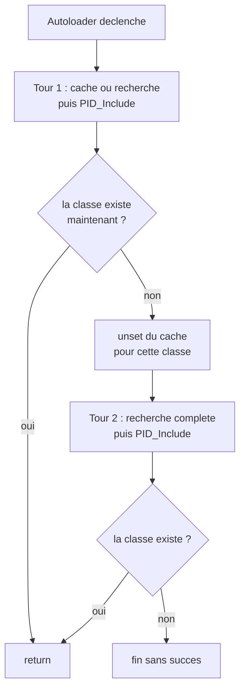

# Évolution de l'autoloader — boucle de retry (05/09 → 12/09)

> **En 30 secondes** — Le 05/09, l'autoloader inclut le fichier trouvé sans vérifier que la classe y est bien. Le 12/09, le prof ajoute une **vérification après inclusion** (`class_exists`, `interface_exists`, `trait_exists`) ; si elle échoue, l'entrée de cache est **jetée** et la recherche est **retentée une seule fois**.



---

## 1. Vue Macro & Utilité (le « Pourquoi »)

- **Problématique** — Un cache est une **optimisation, pas une garantie**. Si `.class.register.php` pointe vers un fichier déplacé, renommé ou modifié pour ne plus contenir la classe, `PID_Include` réussit à inclure *un* fichier… mais `CPersonne` n'existe toujours pas. PHP plante alors juste après avec un « Class not found » très éloigné de la vraie cause (un cache périmé).
- **Emplacement dans la carte globale** : **durcissement** du maillon « chargement des classes » ([[Autoloading PID — spl_autoload_register et le Cache]]) — le passage d'un outil qui « marche » à un outil qui **se surveille**.
- **Analogie (cuisine)** : le 05/09, le cuisinier sort le plat du four et le sert **sans y goûter**, en se fiant à la fiche recette. Le 12/09, il **goûte avant de servir** ; si le plat n'est pas bon, il jette la fiche recopiée à la va-vite et refait l'essai **une seule fois** à partir de zéro, avant d'abandonner franchement.

## 2. Le Pont Systémique (sous le capot)

- **`class_exists($nom, $autoload)`** consulte la **table interne des classes** du processus. Avec `$autoload = true` (valeur par défaut), si le nom est absent, PHP appelle **les fonctions enregistrées par `spl_autoload_register`** — c'est-à-dire **l'autoloader lui-même**, dans lequel on se trouve déjà. Avec `false`, il se contente de répondre « déjà connue ou non », **sans rien charger**. D'où le `false` : il évite une **récursion** (l'autoloader qui se rappelle lui-même en pleine vérification).
- **`eval()`** demande au moteur de **compiler en mémoire** une chaîne, puis de l'exécuter comme du code écrit dans le fichier ([[Glossaire PHP — eval() et exécution dynamique]]). Ici la chaîne est construite avec `$kindName` (`class`, `interface` ou `trait`).
- **`unset`** n'agit que sur le **tableau en RAM** `$PID_CLASS_REGISTER` : le fichier de cache sur le disque n'est **pas** touché à ce moment. Il ne sera réécrit qu'au tour suivant, quand la recherche à froid trouvera un nouveau chemin.

## 3. Analyse du Code & Logique

```php
for ($step = 0; $step < 2; $step++)
{
    if (!isset($PID_CLASS_REGISTER[$className])) { /* recherche à froid + réécriture du cache */ }
    else { $filePath = $PID_CLASS_REGISTER[$className]; }
    PID_Include($filePath);
    eval("\$exists = $kindName" . "_exists(\"$className\", false);");
    if ($exists) return;
    unset($PID_CLASS_REGISTER[$className]);
}
```

- **Étape 1 — La boucle de 2 tours.** Tout le corps de la fonction du 05/09 est enveloppé dans un `for`. Tour 0 : même comportement qu'avant (cache ou recherche, puis inclusion). **Limitée à 2** pour ne jamais boucler indéfiniment : mieux vaut échouer clairement.
- **Étape 2 — La vérification.** `eval("\$exists = class_exists(\"CPersonne\", false);")` — un raccourci pour appeler dynamiquement la bonne fonction (`class_exists`, `interface_exists` ou `trait_exists`) sans `switch`. Le **`false`** est **critique** (voir Pont Systémique).
- **Étape 3 — Le verdict.** `if ($exists) return;` : tout va bien, PHP a ce qu'il lui fallait.
- **Étape 4 — Le rattrapage.** Sinon `unset` de l'entrée : au tour suivant, `!isset(...)` redevient vrai → **recherche complète à froid**, avec mise à jour du fichier de cache. Si la recherche ne trouve rien du tout, `die("PID error : can't find …")` a déjà été déclenché ; si elle trouve un fichier qui ne contient toujours pas la classe, la boucle se termine sans `return` et PHP échoue ensuite avec l'erreur habituelle.

**Bonnes pratiques** : ne jamais faire confiance à un cache sans le vérifier **après usage** ; borner les tentatives de rattrapage ; échouer avec un message explicite.

> ℹ️ **Historique de fiabilité** — cette note a d'abord été rédigée sur le matériel publié *avant* le cours du 12/09, qui omettait le `false` de `class_exists`. Corrigée après la publication post-cours : ce paramètre change le comportement de fond de la vérification.

## 4. Synthèse & Prochaine Étape

**À retenir (3 puces max)**
- Un cache est une optimisation, pas une garantie : **vérifier après usage**.
- La boucle de retry offre **une** chance de rattrapage automatique, pas une garantie de succès.
- Le `false` de `class_exists` empêche l'autoloader de se rappeler lui-même.

**Lien avec la suite** : les classes concrètes que cet autoloader durci finit par charger → [[Structure POO — CPersonne et CAutre]]. À l'oral (traitement et fiabilité PHP), c'est un bon exemple de **détection puis correction** d'un état incohérent plutôt que de plantage silencieux.

**Rappel actif**
> **Q :** Quel problème de la version du 05/09 la boucle de retry résout-elle ?
> **R :** L'autoloader faisait confiance au chemin trouvé sans vérifier après l'inclusion que la classe existait ; un cache obsolète menait à une erreur peu explicite plus loin.

> **Q :** Pourquoi le second argument `false` de `class_exists` est-il indispensable ici ?
> **R :** Par défaut `class_exists` déclencherait lui-même l'autoloader, qui se rappellerait en pleine vérification (récursion) ; `false` demande seulement si PHP connaît **déjà** le nom.

> **Q :** Pourquoi limiter la boucle à 2 tours ?
> **R :** Pour éviter une boucle infinie si le problème persiste ; une tentative de rattrapage suffit, au-delà on échoue clairement.

> **Q :** Que se passe-t-il pour `$PID_CLASS_REGISTER` entre les deux tours ?
> **R :** L'entrée de la classe est supprimée **en mémoire** (`unset`), ce qui relance la recherche à froid au tour 2 ; le fichier de cache n'est réécrit que si un nouveau chemin est trouvé.

**Pièges fréquents**
- ⚠️ **Recopier `class_exists($className)` « de mémoire » sans le `false`** — l'autoloader se rappellerait lui-même.
- ⚠️ **Penser qu'`eval()` est nécessaire ici** — un `match($kindName)` ferait la même chose sans exécuter de code construit par concaténation ; c'est un choix pédagogique du prof, à ne pas copier sans réfléchir.
- ⚠️ **Croire que la boucle répare tout** — elle ne fait que forcer une nouvelle recherche.

**Connexions**
- [[Glossaire PHP — eval() et exécution dynamique]] — `eval()` et ses risques.
- [[Autoloading PID — spl_autoload_register et le Cache]] — la version de référence du 05/09 que celle-ci corrige.
- [[Structure POO — CPersonne et CAutre]] — les classes testées par ce mécanisme.
