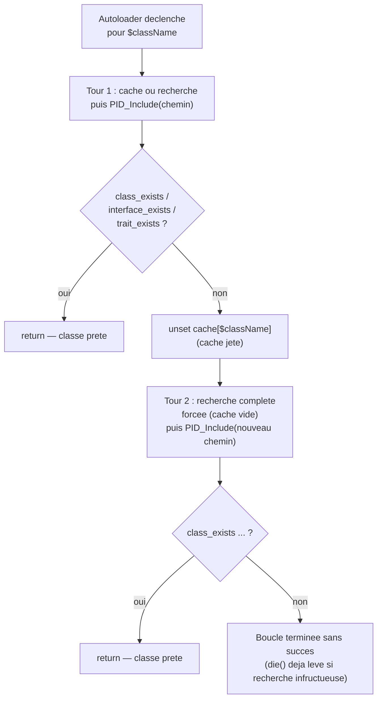

# Évolution de l'autoloader — boucle de retry (05/09 → 12/09)

> Le 05/09, le cuisinier sort le plat du four et le sert directement, sans y goûter, en se fiant à la fiche recette. Le 12/09, il a ajouté un réflexe : goûter avant de servir — et si le plat n'est pas bon, il jette la fiche recette recopiée à la va-vite et refait l'essai **une seule fois** à partir de zéro, avant d'abandonner franchement.

## En une phrase simple

Entre le 05/09 et le 12/09, le prof a ajouté **une vérification après l'inclusion** du fichier de classe : "le nom que je cherchais existe-t-il vraiment maintenant ?" (`class_exists`/`interface_exists`/`trait_exists`), et si non, il **efface l'entrée du cache et retente une fois** une recherche complète — au lieu de faire une confiance aveugle au chemin trouvé.

## Pourquoi ce changement ?

Dans la version du 05/09 (voir [[Autoloading PID — spl_autoload_register et le Cache]]), une fois `$filePath` trouvé (par cache ou par recherche), l'autoloader fait juste `PID_Include($filePath); ` et s'arrête là — **sans jamais vérifier que la classe a réellement été déclarée**. Si le cache contient un chemin obsolète (fichier déplacé, renommé, ou modifié pour ne plus contenir cette classe), `PID_Include` réussit à inclure *un* fichier, mais `CPersonne` n'existe toujours pas — et PHP plante juste après avec une erreur fatale bien plus difficile à diagnostiquer ("Class not found"), loin de la vraie cause (cache pourri).

Le 12/09, le prof **fiabilise** cette étape en ajoutant un contrôle de qualité après l'inclusion, avec une possibilité de rattrapage automatique.

## Comment ça fonctionne ? (code du 12/09)

### 1. La boucle englobante — deux tentatives maximum

```php
for ($step = 0; $step < 2; $step++)
{
    if (!isset($PID_CLASS_REGISTER[$className])) { /* recherche + mise en cache */ }
    else { $filePath = $PID_CLASS_REGISTER[$className]; }
    PID_Include($filePath);
    eval("\$exists = $kindName" . "_exists(\"$className\");");
    if ($exists) return;
    unset($PID_CLASS_REGISTER[$className]);
}
```

Tout le corps de la closure de 05/09 est maintenant **enveloppé dans un `for` de 2 tours**. Premier tour (`$step = 0`) : comportement identique à avant (cache ou recherche, puis include). Nouveauté : juste après l'`include`, on vérifie.

### 2. La vérification dynamique — `eval` + `class_exists`/`interface_exists`/`trait_exists`

```php
eval("\$exists = $kindName" . "_exists(\"$className\");");
```

`$kindName` vaut `"class"`, `"interface"` ou `"trait"` (décodé à partir du préfixe, voir la note sur l'autoloading). Le code construit **dynamiquement** la chaîne `"$exists = class_exists(\"CPersonne\");"` (ou `interface_exists`/`trait_exists` selon le cas), puis `eval()` l'exécute comme du vrai code PHP. `eval()` est une fonction native qui **compile et exécute une chaîne de caractères comme si c'était du code écrit directement** — ici, c'est un raccourci pour appeler dynamiquement la bonne fonction de vérification (`class_exists`, `interface_exists` ou `trait_exists`) sans écrire un `switch` à la main.

### 3. Le verdict et la sortie normale

```php
if ($exists) return;
```

Si la classe/interface/trait existe bel et bien après l'inclusion : tout va bien, la closure se termine (`return`), PHP a maintenant ce qu'il lui fallait.

### 4. Le rattrapage — invalider le cache et retenter

```php
unset($PID_CLASS_REGISTER[$className]);
```

Si `$exists` est faux : l'entrée de cache est **supprimée** de `$PID_CLASS_REGISTER`. Au tour suivant de la boucle (`$step = 1`), la condition `!isset($PID_CLASS_REGISTER[$className])` redevient vraie → une **recherche complète à froid** est relancée (comme si rien n'était en cache), avec mise à jour du fichier `.class.register.php`. Si cette seconde tentative échoue aussi, la boucle se termine sans avoir fait de `return` — et selon le chemin de recherche interne, `die("PID error : can't find $kindName '$className' !")` a déjà été déclenché plus tôt si `$exploreToFind` n'a rien trouvé du tout.

## Schéma



## Exemple concret

Imagine que le cache contienne `"CPersonne" => "dir1/truc/machin/personne.php"`, mais qu'entre-temps le fichier ait été renommé ou que la classe ait été retirée de ce fichier (erreur de manipulation, refactor en cours). Version 05/09 : `PID_Include` inclut le fichier, la classe n'y est pas → PHP plante juste après avec une erreur "Class CPersonne not found", très déroutante puisqu'on est censé être passé par l'autoloader. Version 12/09 : `class_exists("CPersonne")` renvoie `false` juste après l'include → le cache est invalidé → une recherche complète relance et retrouve (si possible) le bon fichier ailleurs dans l'arborescence → la classe finit par se charger correctement, **sans intervention manuelle**.

## Connexions

- [[Autoloading PID — spl_autoload_register et le Cache]] — cette note documente la version de référence (05/09) que celle-ci vient corriger.
- [[Structure POO — CPersonne, CPersonne2 et CAutre]] — ce sont les classes concrètes testées par ce mécanisme (`CPersonne`, `CPersonne2`, `CAutre`).

## Questions de rappel actif

> **Q :** Quel problème concret de la version du 05/09 la boucle de retry du 12/09 vient-elle résoudre ?
> **R :** Le fait que l'autoloader faisait une confiance aveugle au chemin trouvé (via cache ou recherche) sans jamais vérifier, après l'inclusion, que la classe/interface/trait attendue existait réellement — un cache obsolète menait alors à une erreur PHP peu explicite plus loin dans l'exécution.

> **Q :** Que fait exactement la ligne `eval("\$exists = $kindName" . "_exists(\"$className\");");` ?
> **R :** Elle construit dynamiquement une chaîne de code PHP (par exemple `$exists = class_exists("CPersonne");`) puis l'exécute avec `eval()`, ce qui permet d'appeler la bonne fonction de vérification (`class_exists`, `interface_exists` ou `trait_exists`) sans écrire un `if`/`switch` explicite sur `$kindName`.

> **Q :** Pourquoi la boucle est-elle limitée à exactement 2 tours (`$step < 2`) et pas illimitée ?
> **R :** Pour éviter une boucle infinie si le problème persiste (fichier définitivement introuvable ou classe définitivement absente) — une seule tentative de rattrapage est jugée suffisante ; au-delà, mieux vaut échouer clairement que de re-scanner indéfiniment toute l'arborescence.

> **Q :** Que se passe-t-il précisément avec `$PID_CLASS_REGISTER` entre le premier et le second tour de boucle en cas d'échec ?
> **R :** L'entrée correspondant à `$className` est supprimée (`unset`) après le premier échec, ce qui force la condition `!isset(...)` à redevenir vraie au tour suivant — la recherche complète est donc relancée comme si aucune information n'était en cache.

## Pièges fréquents

- ⚠️ **Penser que `eval()` est nécessaire ici** — techniquement, un simple `match($kindName) { "class" => class_exists($className), ... }` ferait la même chose sans les risques de sécurité et de lisibilité liés à `eval()` (exécution de code arbitraire construit par concaténation de chaînes). C'est un choix pédagogique du prof pour montrer la mécanique, pas une bonne pratique à copier sans réfléchir en dehors du cours.
- ⚠️ **Croire que la boucle "répare" n'importe quel problème** — elle ne fait que forcer une nouvelle recherche ; si la classe n'existe réellement nulle part dans l'arborescence, le second tour échouera exactement comme le premier (et `$exploreToFind` aura déjà déclenché un `die()` avant même d'atteindre le second `class_exists`).
- ⚠️ **Oublier que `$exists` est une variable créée par `eval()`, pas déclarée avant** — elle n'existe dans la portée de la closure qu'après l'exécution de cet `eval()`, ce qui peut surprendre en debug si on cherche `$exists` plus haut dans le code.

## À retenir absolument
- Le principe général : **ne jamais faire confiance à un cache sans le vérifier après usage** — un cache est une optimisation, pas une garantie.
- La boucle de retry = 1 chance de rattrapage automatique, pas une garantie de succès absolu.
- C'est un excellent exemple à citer à l'examen oral pour le critère "traitement en PHP" et "sécurité/fiabilité en PHP" : détecter puis corriger un état incohérent plutôt que de planter silencieusement.

## Explorer ensuite
- [[Structure POO — CPersonne, CPersonne2 et CAutre]] — les classes concrètes que cet autoloader durci finit par charger.
