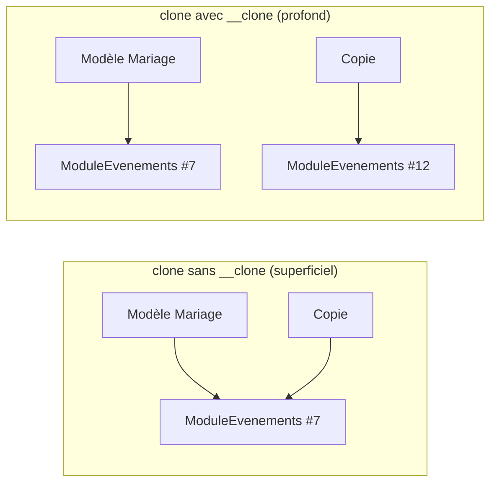

# `clone`, `__clone()` et le motif Prototype

> **En 30 secondes** — Le **motif Prototype** crée un nouvel objet en **copiant un modèle** plutôt qu'en le construisant de zéro. En PHP : `$copie = clone $modele;`. Piège central : `clone` fait une **copie superficielle** — les objets contenus sont **partagés**, pas copiés. La méthode magique `__clone()` sert à compléter la copie **en profondeur**.



## 1. C'est quoi, et pourquoi ça existe ?

> 📘 **Introduction (ajoutée)** — Le cours a montré `__construct` et `__wakeup` ([[Glossaire PHP — Méthodes magiques]]), pas encore `clone`/`__clone`. La notion vient du brainstorm du projet (duplication de services et modèles, 25/09).

- **Problématique** : le Photographe veut « Nouveau service à partir du modèle *Mariage complet* » : 7 événements types, options, suppléments déjà réglés. Reconstruire tout ça champ par champ serait long ; copier le modèle est immédiat. Et la copie doit être **indépendante** : modifier le modèle ensuite ne doit pas changer les services déjà créés (critère d'acceptation du L2).
- **Analogie (cuisine)** : la fiche recette « Mariage » dit *« sauces : voir classeur B »*. Photocopier la fiche seule (copie superficielle) = deux fiches qui renvoient au **même** classeur B : si quelqu'un raye une sauce dans le classeur, les deux recettes changent. Copie profonde = photocopier **aussi** le classeur B et agrafer la copie à la nouvelle fiche.

## 2. Comment ça marche (sous le capot)
- `$b = $a;` sur un objet **ne copie rien** : `$b` reçoit la même **poignée** (*handle* — numéro qui désigne l'objet dans le tas, la zone de RAM des objets). Deux noms, un seul objet.
- `clone $a` : le moteur réserve un **nouvel objet** dans le tas et recopie chaque propriété **telle quelle**. Un nombre ou une chaîne est une valeur → vraiment copiée. Une propriété objet est une poignée → c'est **la poignée** qui est copiée, pas l'objet pointé.
- Un **tableau** est copié par valeur (mécanisme *copy-on-write* : la copie réelle n'a lieu qu'à la première écriture), **mais** les objets qu'il contient restent des poignées partagées. `$this->modules` copié = nouveau tableau… vers les **mêmes** modules.
- Juste après la copie, le moteur appelle `__clone()` **sur la copie** (jamais sur l'original) : c'est là qu'on remplace les poignées partagées par des clones.

## 3. En pratique (modèle du brainstorm, pas encore codé)
```php
class Service
{
    private array $modules = [];

    public function __clone(): void                    // appelée sur la COPIE, automatiquement
    {
        $this->modules = array_map(fn(Module $m) => clone $m, $this->modules);  // copie profonde
        $this->statut  = 'brouillon';                  // règle métier : toute copie naît en brouillon
        $this->estModele = false;
    }
}

class ModuleEvenements extends Module
{
    private array $evenements = [];                    // EvenementType[] : à cloner aussi
    public function __clone(): void
    {
        $this->evenements = array_map(fn($e) => clone $e, $this->evenements);
    }
}

$mariage2026 = clone $modeleMariage;                   // UC-S2 : indépendant de sa source
```
- La copie profonde est **récursive** : chaque niveau qui contient des objets a son propre `__clone()`.
- `fn(...) => ...` est une fonction fléchée, cousine des closures ([[Glossaire PHP — Closures et fonctions anonymes]]).
- ⚠️ Probable : en base de données, « cloner » devra aussi recopier les **lignes** des tables de modules avec de nouveaux identifiants — l'objet PHP n'est que la moitié du travail (Niveau 3 du brainstorm, MySQL pas encore vu en cours).

## Utilisé dans ce projet
- [[L2-catalogue-services]] §4 et §6 — `Service::__clone()`, modèles de service et d'événement, UC-S2 et UC-S7.

## Retenir et vérifier
- **À retenir** : `=` partage l'objet, `clone` copie en surface, `__clone()` complète en profondeur ; Prototype = créer par copie d'un modèle.
> **Q :** Après `$copie = clone $modele;` sans `__clone()`, on change le prix de l'événement « Église » dans `$copie`. Que devient `$modele` ?
> **R :** Il change aussi : les deux services partagent le même objet `ModuleEvenements` (et ses événements), seules les poignées ont été copiées.

> **Q :** Sur quel objet `__clone()` est-elle exécutée ?
> **R :** Sur la nouvelle copie, juste après la copie superficielle — jamais sur l'original.

**Pièges** : ⚠️ oublier un niveau (cloner les modules mais pas leurs `EvenementType`) ; ⚠️ appeler `$obj->__clone()` à la main (c'est `clone $obj` qui la déclenche) ; ⚠️ confondre avec le [[Glossaire — Le motif de conception Singleton]], qui fait l'inverse : interdire toute seconde instance.
