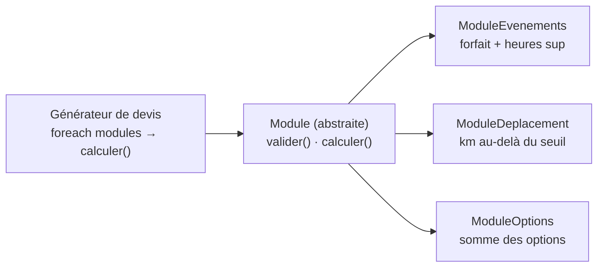

# Classe abstraite, interface et polymorphisme

> **En 30 secondes** — Une **classe abstraite** est un plan incomplet qu'on ne peut pas instancier : elle impose des méthodes que chaque fille **doit** écrire. Une **interface** est un pur contrat (des signatures, aucun code). Le **polymorphisme** (du grec « plusieurs formes ») est le bénéfice : on appelle `$module->calculer()` sur n'importe quel objet qui respecte le contrat, et **chacun exécute sa propre version**.



## 1. C'est quoi, et pourquoi ça existe ?

> 📘 **Introduction (ajoutée)** — Le cours a montré l'héritage (`extends`, 19/09) et une interface fournie par PHP (`Iterator`, 19/09), mais **pas encore** les classes `abstract`, les interfaces écrites soi-même, ni le mot « polymorphisme ». Ces notions arrivent ici par le brainstorm du projet (catalogue de services, 25/09).

- **Problématique** : le devis d'un mariage additionne des événements, des kilomètres, des options, des suppléments ; celui d'une photo d'identité, juste un prix. Sans polymorphisme, le générateur serait un grand `if ($type == 'evenements') … elseif ($type == 'deplacement') …` à modifier à chaque nouvelle règle.
- **Analogie (restauration)** : au coup de feu, le chef annonce « **Envoyez la table 12 !** ». Il ne dit pas au grill comment griller ni au poste froid comment dresser : **chaque poste sait faire sa part**. La **fiche de poste** (« tout poste doit savoir *préparer* et *vérifier* ») est la classe abstraite : on n'embauche pas « un poste » en général, on embauche un grillardin ou un pâtissier qui la remplit.
- **Classe abstraite vs interface** :

| | Classe abstraite | Interface |
|---|---|---|
| Contient du code ? | Oui (méthodes communes) + méthodes `abstract` sans corps | Non, seulement des signatures |
| Instanciable ? | Non | Non |
| Combien par classe ? | Une seule mère (`extends`) | Plusieurs (`implements A, B`) |
| Dans le projet | `Module`, `Option` | `Condition`, `Effet` |

## 2. Comment ça marche (sous le capot)
- **Au chargement de la classe** (quand l'autoloader l'a incluse), le moteur PHP vérifie le contrat : une fille concrète qui oublie une méthode `abstract` de la mère, ou une méthode d'une interface → **erreur fatale** avant qu'un seul objet existe. Même moment que la vérification d'`Iterator` ([[Glossaire PHP — Interface Iterator et foreach]]).
- **À l'appel** `$m->calculer($demande)` : le moteur regarde la **classe réelle de l'objet** pointé (pas le type de la variable) et prend *sa* version dans la table des méthodes de cette classe — c'est la même remontée que pour l'héritage ([[Glossaire PHP — Héritage (extends et parent)]]). ⚠️ Probable pour le détail interne : le moteur Zend mémorise le résultat de cette recherche pour chaque endroit d'appel, afin de ne pas refaire la recherche à chaque tour de boucle.
- **Pont avec le C++** (connu) : en C++ il faut écrire `virtual` pour obtenir ce comportement (table de pointeurs de fonctions, la *vtable*). En PHP, **toute** méthode est « virtuelle » par défaut.
- `new Module()` → erreur « Cannot instantiate abstract class » : le moteur refuse de réserver en mémoire un objet dont une partie du comportement n'existe pas.

## 3. En pratique (modèle du brainstorm, pas encore codé)
```php
abstract class Module                       // plan incomplet : jamais de new Module()
{
    abstract public function valider(Demande $d): array;   // chaque fille DOIT l'écrire
    abstract public function calculer(Demande $d): array;  // renvoie des LignePrix
}

class ModuleDelai extends Module
{
    public function __construct(private int $joursMin) {}
    public function valider(Demande $d): array { /* date trop proche ? → erreur */ return []; }
    public function calculer(Demande $d): array { return []; }  // ne coûte rien : il contraint seulement
}

interface Condition { public function estRemplie(Demande $d): bool; }   // contrat pur

// Le générateur ne connaît AUCUNE classe concrète :
foreach ($service->modules() as $module) {
    $lignes = [...$lignes, ...$module->calculer($demande)];   // polymorphisme + étalement
}
```
- Le `foreach` du générateur **ne change jamais** quand on ajoute un module : c'est ce qui rend le catalogue extensible ([[Glossaire — Composition, motif Stratégie et principe ouvert-fermé]]).
- `[...$a, ...$b]` : voir [[Glossaire PHP — Opérateur d'étalement (...)]].

## Utilisé dans ce projet
- [[L2-catalogue-services]] §4 — `Module` (abstraite) et ses 7 filles ; `Option` (abstraite) ; `Condition` et `Effet` (interfaces).

## Retenir et vérifier
- **À retenir** : abstraite = plan incomplet avec du code commun ; interface = contrat pur, plusieurs par classe ; polymorphisme = un appel, la version de l'objet réel.
> **Q :** Pourquoi le générateur de devis n'a-t-il pas besoin d'un `switch` sur le type de module ?
> **R :** Parce que chaque module est garanti (par la classe abstraite) d'avoir `calculer()`, et que PHP exécute automatiquement la version de la classe réelle de l'objet.

> **Q :** Quand choisir une interface plutôt qu'une classe abstraite ?
> **R :** Quand il n'y a aucun code à partager et seulement une promesse de méthode (ex. `Condition::estRemplie()`), ou quand une classe doit respecter plusieurs contrats à la fois.

**Pièges** : ⚠️ croire qu'une classe abstraite ne peut contenir que des méthodes abstraites (elle peut avoir du code normal) ; ⚠️ oublier que la vérification du contrat se fait au **chargement** de la classe — une erreur apparaît même si la méthode manquante n'est jamais appelée.
