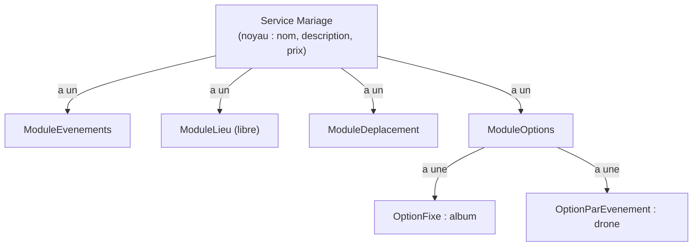

# Composition, motif Stratégie et principe ouvert/fermé

> **En 30 secondes** — **Composition** : un objet *possède* d'autres objets (« a un ») au lieu d'*être* une sous-classe (« est un »). **Stratégie** : chaque façon de calculer est rangée dans sa propre petite classe, interchangeable. Ensemble, elles donnent le **principe ouvert/fermé** : le code est *ouvert* à l'extension (nouvelle classe) mais *fermé* à la modification (on ne retouche pas l'existant).



## 1. C'est quoi, et pourquoi ça existe ?

> 📘 **Introduction (ajoutée)** — Le cours a utilisé l'héritage (`CMonApp extends CApplication`, `CettePage extends CPage`) et un trait pour partager du code ([[Glossaire PHP — Traits]]). La composition comme **choix de conception** et le motif Stratégie ne sont pas encore enseignés ; ils viennent du brainstorm du projet (25/09).

- **Problématique** : avec l'héritage seul, on écrirait `ServiceSimple`, `ServiceAvecLieu`, `ServiceAvecLieuEtDeplacement`, `ServiceAvecLieuDeplacementEtOptions`… 7 modules = jusqu'à 2⁷ = 128 combinaisons de classes. Et un service simple qui devient avancé devrait **changer de classe**, ce qu'un objet ne sait pas faire.
- **Analogie (multiprise)** : un service est une **multiprise** (le noyau) ; les modules sont des **appareils qu'on y branche**. Transformer « photo d'identité » en « mariage » = brancher des appareils, pas racheter une autre multiprise. La prise normalisée, c'est le contrat `Module` ([[Glossaire — Classe abstraite, interface et polymorphisme]]).
- **Stratégie (cuisine)** : la recette dit « cuire la viande » ; *comment* (poêle, four, basse température) est un **mode de cuisson interchangeable**. `Option` dit « calcule ton prix » ; *comment* (fixe, par unité, par événement) est une stratégie.

| Principe | Question qu'il pose | Réponse du projet |
|---|---|---|
| Composition | « est un » ou « a un » ? | Un service **a des** modules |
| Stratégie | Où ranger chaque formule ? | Une classe par formule (`OptionFixe`, `OptionParUnite`…) |
| Ouvert/fermé | Que faut-il toucher pour ajouter une règle ? | Rien d'existant : une nouvelle classe, ou juste de la configuration |

## 2. Comment ça marche (sous le capot)
- Un objet PHP vit dans le **tas** (*heap* — zone de RAM des données dont la durée de vie n'est pas liée à une fonction). Une propriété qui « contient » un autre objet ne contient en réalité qu'une **poignée** (*handle* — un numéro qui désigne l'objet dans la table des objets du moteur). Composer = relier des objets par des poignées : un **graphe d'objets** en mémoire.
- Conséquence 1 : ajouter un module = ajouter une poignée dans un tableau (`$this->modules[] = $m`), aucun changement de classe.
- Conséquence 2 : copier un service **ne copie pas** ses modules, seulement les poignées → voir [[Glossaire PHP — clone, __clone et motif Prototype]].
- **Côté base de données** : une composition polymorphe (des modules de types différents) ne tient pas naturellement dans une table SQL — c'est précisément la question renvoyée au Niveau 3 du brainstorm. MySQL n'est pas encore vu en cours ([[RYTHME-COURS]]).

## 3. En pratique (modèle du brainstorm, pas encore codé)
```php
class Service
{
    private array $modules = [];                       // composition : "a des" modules
    public function activer(Module $m): void { $this->modules[] = $m; }
}

class Supplement                                       // deux stratégies branchées
{
    public function __construct(private Condition $condition, private Effet $effet) {}
    public function appliquer(Demande $d, string $sousTotal): ?LignePrix
    {
        return $this->condition->estRemplie($d) ? $this->effet->appliquer($sousTotal) : null;
    }
}
// "Samedi +15 %" = new Supplement(new JourSemaine(['samedi']), new Pourcentage('15'))
// "Urgent +50 €" = new Supplement(new Urgence(30), new MontantFixe('50.00'))
```
- **Ouvert/fermé en action** : un supplément « nocturne » demain = une classe `Nocturne implements Condition`, sans toucher `Supplement` ni le générateur.
- L'héritage n'est pas banni : il reste utilisé **pour les contrats** (`ModuleDelai extends Module`), pas pour empiler des variantes.

## Utilisé dans ce projet
- [[L2-catalogue-services]] §3-4 — noyau + modules ; `Option`, `Condition`, `Effet` comme stratégies.

## Retenir et vérifier
- **À retenir** : « a un » (composition) plutôt que « est un » quand les combinaisons explosent ; Stratégie = une formule par classe ; ouvert/fermé = ajouter sans modifier.
> **Q :** Pourquoi `ServiceSimple extends Service` / `ServiceAvance extends Service` serait-il un mauvais modèle ici ?
> **R :** Un service simple qui reçoit un module devrait changer de classe (impossible pour un objet existant), et chaque combinaison de modules demanderait sa propre sous-classe.

> **Q :** Qu'est-ce qui rend `Supplement` « fermé à la modification » ?
> **R :** Il ne connaît que les contrats `Condition` et `Effet` ; toute nouvelle condition ou nouvel effet est une nouvelle classe branchée de l'extérieur.

**Pièges** : ⚠️ croire que composition = « jamais d'héritage » (on hérite des contrats, on compose les comportements) ; ⚠️ sur-découper : une formule qui n'a qu'une seule variante n'a pas besoin d'une stratégie (YAGNI).
