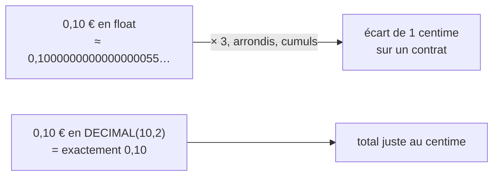

# Montants d'argent : décimal exact vs flottant

> **En 30 secondes** — Un `float` (nombre à virgule flottante) range les nombres **en binaire**, et beaucoup de décimaux simples comme `0,1` n'y ont **pas d'écriture exacte** : `0.1 + 0.2` vaut `0.30000000000000004`. Sur un devis qui vaut contrat, on stocke donc les montants en **décimal exact** (`DECIMAL` en SQL, chaîne + calcul décimal en PHP) ou en **centimes entiers**.



## 1. C'est quoi, et pourquoi ça existe ?

> 📘 **Introduction (ajoutée)** — L'[[Introduction au PHP — Bases pour débutant]] présente `$prix = 12.50;` comme un `float`. Le cours n'a pas encore abordé les limites de ce type ni MySQL. La règle vient du brainstorm du projet (règle 8 : « tout montant est stocké en décimal exact, jamais en flottant »).

- **Problématique** : le devis du mariage additionne 250 €, 1 h 30 × 60 €, 31,5 km × 0,50 €, un supplément de 15 %… Chaque opération en `float` peut ajouter une erreur minuscule ; cumulées puis arrondies, elles peuvent décaler un total d'un centime. Sur un document contractuel, « 612,74 € » affiché et « 612,75 € » recalculé côté serveur = litige.
- **Analogie (restauration)** : une balance de cuisine graduée en **tiers de gramme** : impossible d'y peser exactement 10 g, on tombe toujours un peu à côté. Le `float` est une règle graduée en **puissances de 2** ; les dixièmes et centièmes tombent entre deux graduations. La caisse, elle, compte **en centimes** : jamais d'écart.

## 2. Comment ça marche (sous le capot)
- **Le `float` de PHP** est un *double* IEEE 754 (norme de représentation des flottants, la même que le `double` du C#/C++) : 64 bits = 1 bit de signe, 11 bits d'exposant, 52 bits de mantisse. Le processeur calcule dessus en matériel, très vite — mais `0,1` = `0,000110011001100…` en binaire, une suite **infinie** tronquée à 52 bits.
- **Le `DECIMAL(10,2)` de MySQL** stocke les **chiffres décimaux eux-mêmes** (compactés par paquets de 9 chiffres dans 4 octets) : 10 chiffres dont 2 après la virgule, sans approximation. Le calcul est plus lent que le flottant du processeur, ce qui est sans importance pour un devis.
- ⚠️ Probable : via PDO/MySQL, une colonne `DECIMAL` revient en PHP sous forme de **chaîne** (`"250.00"`), justement pour ne pas perdre l'exactitude en la convertissant en `float`.
- **Deux stratégies exactes côté PHP** : (1) **centimes entiers** (`int` : 25000 pour 250,00 €) — les entiers sont exacts ; (2) **chaînes + extension `bcmath`** (`bcadd`, `bcmul` : calcul décimal en précision choisie).

## 3. En pratique
```php
var_dump(0.1 + 0.2 == 0.3);          // bool(false) : le piège du float
echo 0.1 + 0.2;                       // affiche 0.3 (arrondi d'affichage) — l'erreur est cachée !

// Stratégie centimes entiers
$prixEvenement = 25000 + 90 * 100;    // 250,00 € + 1 h 30 × 60 € → 34000 centimes = 340,00 €

// Stratégie décimale (bcmath) : 31,5 km facturés × 0,50 €/km
$frais = bcmul('31.5', '0.50', 2);    // "15.75" exactement
```
```sql
prix_base DECIMAL(10,2) NOT NULL      -- jusqu'à 99 999 999,99 €, exact au centime
```
- **Règle 8 du projet** : arrondir **au centime uniquement sur le total de chaque ligne**, pas à chaque étape intermédiaire (sinon les arrondis se cumulent).
- ⚠️ Probable : `bcmath` **tronque** à la précision demandée au lieu d'arrondir — un pourcentage (15 % de 297,50 € = 44,625 €) doit être arrondi explicitement ; la règle d'arrondi (au demi supérieur ?) reste à fixer au Niveau 3.

## Utilisé dans ce projet
- [[L2-catalogue-services]] §9, règle 8 — montants exacts, arrondi par ligne ; règle 2 — l'instantané tarifaire fige ces montants dans le devis.

## Retenir et vérifier
- **À retenir** : un `float` est binaire, donc approximatif sur les décimaux ; argent = `DECIMAL` en base, centimes `int` ou `bcmath` en PHP ; on arrondit une fois, à la fin de chaque ligne.
> **Q :** Pourquoi `echo 0.1 + 0.2;` affiche-t-il `0.3` alors que la comparaison `== 0.3` est fausse ?
> **R :** `echo` arrondit l'affichage à 14 chiffres significatifs (réglage `precision` de PHP) ; la valeur en mémoire est `0.30000000000000004`, différente de la représentation binaire de `0.3`.

**Pièges** : ⚠️ `FLOAT`/`DOUBLE` en SQL pour un prix ; ⚠️ convertir la chaîne `"250.00"` venue de la base en `(float)` « pour calculer » — on perd l'exactitude gagnée en base ; ⚠️ arrondir chaque étape intermédiaire.
