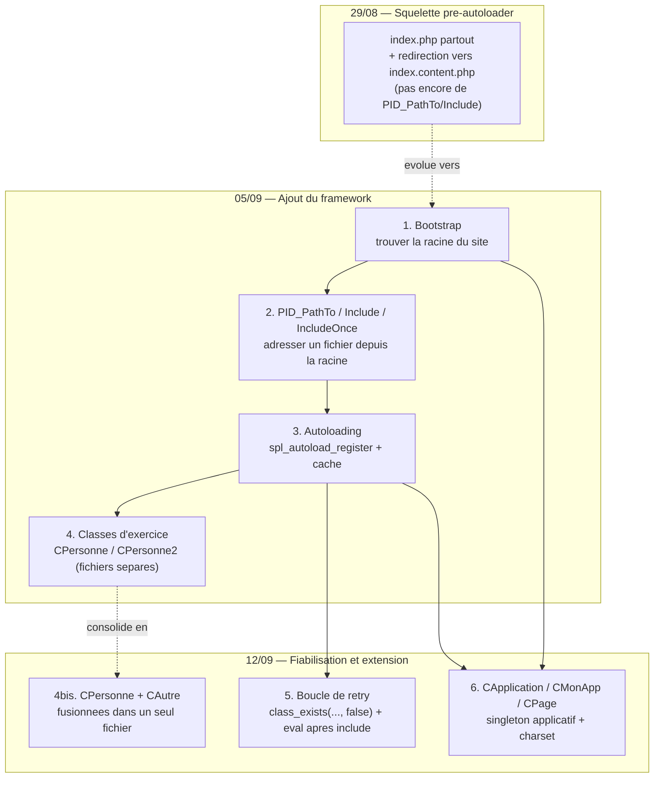

# PID — Map of Content

> **En résumé** : chaque samedi, le prof code en direct un mini-framework PHP maison qui sert de "squelette" pédagogique. Il tient en 3 idées : (1) **se retrouver** dans l'arborescence peu importe où on est (bootstrap + `PID_PathTo`/`PID_Include`), (2) **charger les classes tout seul** sans liste de `require` (autoloader + cache, durci le 12/09), et (3) **garantir une instance applicative unique** partagée par tout le code, persistante en session (`CApplication`/`CMonApp`, 12/09). `CPersonne`/`CAutre` sont les cobayes du (2), `CMonApp`/`CPage` ceux du (3). Ce contenu est distinct du projet Laravel personnel de mentalyas — c'est le mécanisme brut que Laravel automatise en coulisses.
>
> ⚠️ **Note de fiabilité (18/09)** : les notes de la session du 12/09 avaient d'abord été rédigées à partir du matériel publié *avant* le cours (dossier `pid_avant_cours.20260912/`). Une fois la version réellement publiée *après* le cours récupérée, plusieurs corrections ont été apportées (constantes `PID_CHARSET`/`PID_APPLICATION_SESSION_ITEM_NAME`, paramètre `false` de `class_exists` dans la boucle de retry, fusion `CPersonne2` → `CPersonne`) et le concept `CApplication`/`CMonApp`/`CPage` — absent du matériel avant-cours — a été ajouté.
>
> Réseau visuel → [[PID — Reseau.canvas]]

---

## Zéro PHP ? Commence ici
- [[Introduction au PHP — Bases pour débutant]] — syntaxe de base (variables, types, fonctions, tableaux, POO minimale) pour quelqu'un qui n'a jamais écrit une ligne de PHP. À lire avant tout le reste si besoin.

## Glossaire PHP — concepts transversaux approfondis
*Notions PHP générales, indépendantes du framework du prof, utilisées par plusieurs notes ci-dessous. Consulte-les à la demande, quand un terme d'une note PID mérite une explication plus "deep".*
- [[Glossaire PHP — Visibilité et encapsulation]] — `public`/`protected`/`private`
- [[Glossaire PHP — Méthodes magiques]] — `__construct`, `__wakeup`, `__destruct`, `__toString`
- [[Glossaire PHP — Propriétés et méthodes statiques]] — `static`, `self::`
- [[Glossaire PHP — Closures et fonctions anonymes]] — fonctions sans nom, `use (...)`
- [[Glossaire PHP — Superglobales et sessions]] — `$_SESSION` et la persistance entre requêtes HTTP
- [[Glossaire PHP — eval() et exécution dynamique]] — exécuter du code construit dynamiquement
- [[Glossaire PHP — Tokenisation (token_get_all)]] — analyser la structure du code source sans l'exécuter
- [[Glossaire PHP — include, require et résolution de chemins]] — le mécanisme natif que `PID_Include` corrige
- [[Glossaire — Le motif de conception Singleton]] — le design pattern général derrière `CApplication`

## Concepts fondamentaux
*À maîtriser en premier — le "où suis-je et comment je m'y retrouve"*
- [[Bootstrap PID — Detection de la Racine du Site]] — trouve `.pid.config.php` en remontant les dossiers, fige `PID_PATH_TO_ROOT`
- [[PID_PathTo, PID_Include et PID_IncludeOnce]] — traduit un chemin "depuis la racine" en chemin réel, remplace `include` natif

## Concepts intermédiaires
*Nécessitent les fondamentaux — le "comment les classes se chargent toutes seules"*
- [[Autoloading PID — spl_autoload_register et le Cache]] — charge une classe inconnue à la demande, cache le résultat dans `.class.register.php`
- [[Structure POO — CPersonne, CPersonne2 et CAutre]] — les classes d'exercice concrètes que l'autoloader charge (encapsulation, accesseurs validants)

## Concepts avancés
*Raffinement et extension observés dans l'évolution du cours (12/09)*
- [[Evolution de l'Autoloader — Boucle de Retry (0509 vers 1209)]] — le 12/09, ajout d'une vérification `class_exists(..., false)`/`eval` après include + un retry, pour ne plus faire confiance aveuglément au cache
- [[CApplication, CMonApp et CPage — Singleton applicatif et charset]] — le 12/09, nouveau motif Singleton persistant en session + gestion centralisée du charset (ANSI/UTF-8) — concept entièrement nouveau, absent du 05/09

## Ordre d'apprentissage recommandé
0. (Si PHP est nouveau) [[Introduction au PHP — Bases pour débutant]] — variables, fonctions, tableaux, POO minimale
1. [[Bootstrap PID — Detection de la Racine du Site]] — comprendre comment le framework se repère
2. [[PID_PathTo, PID_Include et PID_IncludeOnce]] — comprendre comment il adresse et charge un fichier
3. [[Structure POO — CPersonne, CPersonne2 et CAutre]] — voir des classes PHP simples à charger
4. [[Autoloading PID — spl_autoload_register et le Cache]] — comprendre comment ces classes sont chargées automatiquement
5. [[Evolution de l'Autoloader — Boucle de Retry (0509 vers 1209)]] — voir comment le mécanisme a été durci une semaine plus tard
6. [[CApplication, CMonApp et CPage — Singleton applicatif et charset]] — voir comment le même principe de persistance en session est formalisé en motif Singleton réutilisable

## Questions de révision globale
> **Q :** Si tu devais résumer en 2 phrases ce que fait ce framework maison au professeur d'examen, que dirais-tu ?
> **R :** Il fournit un système d'adressage de fichiers indépendant du répertoire courant (bootstrap + `PID_PathTo`/`Include`), et un autoloader de classes qui évite d'écrire des `require` manuels, avec un cache de correspondance nom→fichier qui se fiabilise lui-même (vérification `class_exists` + retry ajoutés au fil des séances).

> **Q :** Pourquoi la connexion Bootstrap → PID_PathTo → Autoloading → Retry forme-t-elle une chaîne de dépendance stricte, et pas un ensemble de briques indépendantes ?
> **R :** Chaque brique a besoin de la précédente pour fonctionner : `PID_PathTo` a besoin de `PID_PATH_TO_ROOT` (Bootstrap) pour calculer un chemin ; l'autoloader a besoin de `PID_Include`/`PID_PathTo` pour charger et localiser le cache ; la boucle de retry n'a de sens que parce qu'un autoloader (avec son cache faillible) existe déjà à corriger.

> **Q :** En quoi ce cours "brut" éclaire-t-il ce que fait Laravel automatiquement dans le projet personnel de mentalyas (site photographe) ?
> **R :** Laravel a son propre autoloader (via Composer/PSR-4) et son propre système de résolution de chemins (`base_path()`, helpers de routes) — ce que le prof code à la main ici (bootstrap de racine, cache classe→fichier, autoloader avec fallback) est exactement ce que ces outils font pour nous, en plus robuste et standardisé. Comprendre le mécanisme brut permet de répondre aux questions d'examen sur "traitement PHP" et "sécurité PHP" même quand le projet final s'appuie sur un framework.

## Ressources complémentaires
- `docs/FOUNDATION.md` (§5, pont pédagogique explicite entre le cours et le projet Laravel)
- `Suivit_Cours/Synthèse/plan_du_cours.20260824 (1).txt` — objectifs du squelette sécurisé visé par le cours
- `Suivit_Cours/Synthèse/modalites_examen.20260824 (2).txt` — grille de cotation (traitement PHP /20, sécurité PHP /20, framework/généricité /20)
- Code source de référence : `Suivit_Cours/05_09_2026/pid.20260905/_htdocs/` (version de base, 05/09) et `Suivit_Cours/12_09_2026/` (version réellement publiée **après** le cours du 12/09 — CApplication/CMonApp/CPage, boucle de retry corrigée) ; `Suivit_Cours/12_09_2026/pid_avant_cours.20260912/_htdocs/` est conservé pour mémoire mais **ne fait plus référence** — c'est le matériel publié avant le cours, incomplet/imprécis par endroits.
