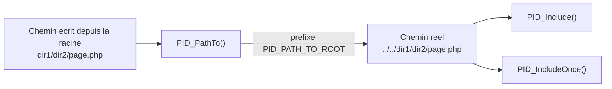

# `PID_PathTo`, `PID_Include` et `PID_IncludeOnce`

> **En 30 secondes** — Trois fonctions globales qui remplacent `include`/`require` : tu écris toujours le chemin **depuis la racine du site**, et elles le convertissent en chemin valide depuis l'endroit où le code s'exécute. `PID_PathTo` calcule (et vérifie), `PID_Include`/`PID_IncludeOnce` calculent puis incluent.



![[attachments/schema-bootstrap-autoloader-avant-apres.png]]
*Même schéma que [[Bootstrap PID — Detection de la Racine du Site]] — colonne « APRÈS », bloc central `PID_PathTo()`/`PID_Include()`.*

---

## 1. Vue Macro & Utilité (le « Pourquoi »)

- **Problématique** — Avec `include` natif, un chemin **relatif** n'est jamais relatif à la racine du site : il dépend du script demandé et/ou du fichier qui écrit l'instruction. Le même `include("dir1/dir2/personne.php")` exécuté depuis deux profondeurs différentes pointe donc vers deux endroits différents — ou vers rien ([[Glossaire PHP — include, require et résolution de chemins]]). Or le même code est dupliqué dans tous les dossiers.
- **Emplacement dans la carte globale** : deuxième maillon, juste après le Bootstrap ; c'est la **couche d'abstraction** (une interface simple qui cache la complexité) sur laquelle s'appuient l'autoloader et tout le framework.
- **Analogie (multiprise)** : des **adaptateurs universels** : peu importe la pièce où tu es, tu branches ta demande (« je veux `dir1/dir2/page.php` ») et l'adaptateur te ressort la bonne adresse vers le tableau électrique (la racine).

## 2. Le Pont Systémique (sous le capot)

- **`PID_PathTo` ne touche presque pas au disque** : il travaille sur des **chaînes de caractères** (retirer un préfixe, coller `PID_PATH_TO_ROOT` devant). Seule la vérification `file_exists` est un **appel système au disque** (le système d'exploitation cherche l'entrée dans le répertoire).
- **`include` fait bien plus** : PHP **lit** le fichier sur le disque, le **compile** en instructions internes, puis l'**exécute** dans la portée courante. Si le fichier déclare une classe, la classe entre dans la table interne des classes du processus. *(Avec OPcache, la version compilée peut rester en mémoire — hors cours.)*
- **`@`** (l'opérateur de suppression d'erreurs) ne supprime pas l'erreur : il **masque son affichage**. Elle a bien lieu ; c'est pourquoi `PID_Include` teste d'abord `is_file` et renvoie `false` au lieu de laisser l'erreur se produire.
- Rien ne survit à la requête : chaque chargement de page recalcule tous ces chemins.

## 3. Analyse du Code & Logique

**Étape 1 — `PID_PathTo($url, $checkIfFileExists = true)` : le traducteur**

```php
$slashIndex = strpos($url, "/");  $colonIndex = strpos($url, ":");
if (($colonIndex !== false) && (($slashIndex === false) || ($colonIndex < $slashIndex))) { /* lien externe : inchangé */ }
else
{
    if (str_starts_with($url, "*")) { /* 19/09 : préfixe le dossier du framework, PID_FOLDER_PATH */ }
    else { if (str_starts_with($url, "./")) $url = substr($url, 2); else if (str_starts_with($url, "/")) $url = substr($url, 1); }
    $url = PID_PATH_TO_ROOT . $url;
    /* si $checkIfFileExists : file_exists sur $url SANS sa query string, sinon return false */
}
return $url;
```
- **Lien externe** : un `:` avant le premier `/` (comme dans `https://…`) → renvoyé tel quel.
- **Lien interne** : retire un `./` ou `/` de tête, puis **préfixe `PID_PATH_TO_ROOT`**. Depuis le 19/09, un chemin qui commence par **`*`** est cherché dans le dossier du framework (`PID_FOLDER_PATH`, ex. `.pid/`) : défini, **pas encore utilisé** dans le code du cours ([[Dossier .pid et préfixe étoile — Séparer le framework du site]]).
- **Query string** : pour tester l'existence, tout ce qui suit `?` est **retiré** — `PID_PathTo("dir1/dir2/?nom=duchemin&prenom=robert")` vérifie `dir1/dir2/`, mais renvoie l'URL complète.

**Étape 2 — `PID_Include($url)` : l'inclusion « sûre »**

Appelle `PID_PathTo`, renvoie `false` si le chemin est introuvable ou n'est pas un fichier (`is_file`), sinon fait `@include($url)` et renvoie `true`.

**Étape 3 — `PID_IncludeOnce($url)` : la variante anti-doublon**

Identique mais avec `include_once` : le fichier n'est chargé qu'**une seule fois** par requête — indispensable pour un fichier de classe (une classe déclarée deux fois provoque une erreur fatale).

**Étape 4 — `$checkIfFileExists = false` : chercher un fichier qui n'existe pas encore**

Utilisé par l'autoloader pour obtenir le chemin où **écrire** `.class.register.php` : à cet instant le fichier n'existe pas forcément, vérifier son existence ferait échouer l'écriture à tort ([[Autoloading PID — spl_autoload_register et le Cache]]).

**Étape 5 — Exemple du cours** (`dir1/dir2/page12.php`, donc `PID_PATH_TO_ROOT = "../../"`)

```php
PID_PathTo("./dir1/dir2/page12.php");                   // "../../dir1/dir2/page12.php"
PID_PathTo("/dir1/dir2");                               // "../../dir1/dir2"
PID_PathTo("dir1/truc.php");                            // false (le fichier n'existe pas)
PID_PathTo("dir1/dir2/?nom=duchemin&prenom=robert");    // "../../dir1/dir2/?nom=duchemin&prenom=robert"
PID_Include("dir1/dir2/a_inclure.php");                 // traduit, puis inclut réellement le fichier
```
Le même appel fonctionnerait à l'identique depuis la racine, `dir1/` ou `dir1/truc/machin/` : seule la traduction interne change, jamais ce que le développeur écrit.

**Bonnes pratiques** : une seule façon d'écrire un chemin ; échec explicite (`false`) plutôt que chemin invalide ; paramètre optionnel pour le cas particulier.

## 4. Synthèse & Prochaine Étape

**À retenir (3 puces max)**
- Un seul système d'adressage (depuis la racine) remplace les chemins relatifs fragiles.
- `PID_PathTo` calcule et vérifie ; `PID_Include`/`PID_IncludeOnce` calculent et incluent.
- `$checkIfFileExists = false` sert quand on veut *écrire*, pas lire.

**Lien avec la suite** : ces trois fonctions sont les briques que l'autoloader assemble pour charger une classe inconnue → [[Autoloading PID — spl_autoload_register et le Cache]].

**Rappel actif**
> **Q :** Pourquoi `include("dir1/dir2/personne.php")` natif n'est-il pas fiable dans ce framework ?
> **R :** Un chemin relatif n'est pas résolu depuis la racine du site mais depuis le script demandé et/ou le fichier appelant ; le même chemin écrit à deux profondeurs différentes pointe vers deux endroits différents.

> **Q :** Que renvoie `PID_PathTo("dir1/truc.php")` si ce fichier n'existe pas ?
> **R :** `false` (paramètre `$checkIfFileExists` à `true` par défaut) — volontaire : mieux vaut un échec explicite qu'un chemin vers une ressource inexistante.

> **Q :** Comment `PID_PathTo` traite-t-il une URL contenant `?nom=…` ?
> **R :** Il teste l'existence du chemin sans la query string, mais renvoie l'URL complète.

> **Q :** Quand passer `false` en second paramètre de `PID_PathTo` ?
> **R :** Pour obtenir le chemin d'un fichier qui n'existe pas encore, typiquement pour l'écrire (cache `.class.register.php`).

**Pièges fréquents**
- ⚠️ **Écrire un chemin commençant par `../`** — ces fonctions attendent un chemin depuis la racine ; seuls `./` et `/` de tête sont retirés.
- ⚠️ **Oublier de tester le retour `false`** — `PID_Include` ne lève aucune exception ; ignorer son retour laisse le code continuer avec des données manquantes.
- ⚠️ **Confondre avec un autoloader** — ces fonctions n'agissent que sur appel explicite ; l'autoloader, lui, se déclenche tout seul.

**Connexions**
- [[Glossaire PHP — include, require et résolution de chemins]] — le mécanisme natif que ces fonctions enveloppent et corrigent.
- [[Bootstrap PID — Detection de la Racine du Site]] — fournit `PID_PATH_TO_ROOT`.
- [[Autoloading PID — spl_autoload_register et le Cache]] — utilise `PID_Include` et `PID_PathTo(…, false)`.
