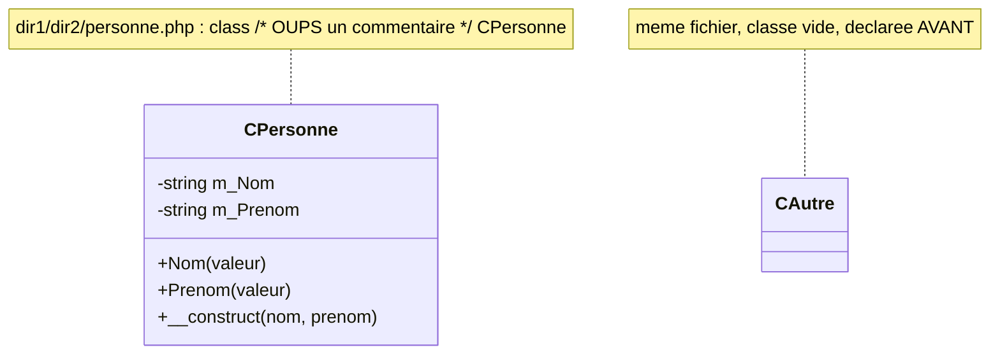

# Structure POO — `CPersonne` et `CAutre`

> **En 30 secondes** — `CPersonne` illustre l'**encapsulation** : ses données sont `private` et n'entrent dans l'objet que par des méthodes publiques qui **valident** chaque valeur. `CAutre` est volontairement vide : c'est un **cas de test pour l'autoloader**, déclaré dans le même fichier (`dir1/dir2/personne.php`), avec un commentaire piégé au milieu de la déclaration de `CPersonne`.



---

## 1. Vue Macro & Utilité (le « Pourquoi »)

- **Problématique** — Comment **garantir** qu'un objet ne contient jamais de données invalides (un nom qui serait un nombre, un prénom vide) ? Si n'importe quel code peut écrire `$p->m_Nom = 3.14`, aucune garantie n'existe. Il faut **fermer l'accès direct** et n'autoriser que des portes qui contrôlent. Le second objectif, plus discret, est de fournir à l'autoloader un **terrain d'essai exigeant** ([[Autoloading PID — spl_autoload_register et le Cache]]).
- **Emplacement dans la carte globale** : c'est la **couche « objets métier »** : dans un vrai projet, `CPersonne` serait un utilisateur, un devis, un client — des entités dont les règles de validité vivent **dans** la classe.
- **Analogie (restauration)** : le **dossier RH** d'un employé. Ses informations sont rangées dans un **tiroir fermé** (`private`) dont seul le service RH a la clé. Un collègue ne fouille jamais le tiroir : il passe par le **guichet RH** (`Nom()`, `Prenom()`), qui vérifie chaque demande avant de répondre.

## 2. Le Pont Systémique (sous le capot)

- **Un objet, c'est une zone de mémoire** (le **tas**, ou *heap*, du processus PHP) qui contient ses propriétés. `new CPersonne(...)` alloue cette zone ; la variable `$p1` ne contient pas l'objet mais un **identifiant** qui y pointe.
- **`private` est vérifié à l'exécution** : PHP étant interprété, c'est le moteur qui lève une erreur fatale quand on touche `$p->m_Nom` de l'extérieur. *(En C# ou C++, cette vérification a lieu à la compilation.)*
- **La session** : à la fin de la requête, l'objet est **sérialisé** (converti en texte) dans un fichier de session sur le disque du serveur ; à la requête suivante il est **désérialisé** — l'objet est reconstruit **sans** rappeler `__construct` ([[Glossaire PHP — Superglobales et sessions]]). Si la classe est inconnue à ce moment, l'autoloader est appelé.
- **Point souvent manqué** : `test_poo.php` utilise `$_SESSION["personne"]` **sans écrire `session_start()`**. C'est l'appel `CApplication::Instance()` plus haut dans le script qui **démarre la session** ([[CApplication, CMonApp et CPage — Singleton applicatif et charset]]). Sans lui, `$_SESSION` ne serait pas initialisé.

## 3. Analyse du Code & Logique

**Étape 1 — Propriétés privées : le tiroir fermé**

```php
private $m_Nom;
private $m_Prenom;
```
`m_` est la convention du cours pour « membre » (propriété d'instance). `private` : seul le code **à l'intérieur** de `CPersonne` peut y accéder — pas l'extérieur, **pas même une classe fille** (contrairement à `protected`).

**Étape 2 — Accesseurs à double usage : le guichet**

```php
public function Nom($valeur = null)
{
    if ($valeur !== null)
    {
        if (!is_string($valeur)) return false;
        $valeur = trim($valeur);
        if (empty($valeur)) return false;
        $this->m_Nom = $valeur;
        return true;
    }
    else { return $this->m_Nom; }
}
```
Une seule méthode est **lecteur et écrivain** : `Nom()` renvoie la valeur ; `Nom("Duvivier")` la modifie **après validation** (`is_string`, `trim`, `empty`). Un nombre ou une chaîne vide est rejeté (`false`) et la propriété n'est pas touchée. `Prenom()` suit le même patron.

**Étape 3 — Le constructeur passe par les accesseurs**

```php
public function __construct($nom, $prenom) { $this->Nom($nom); $this->Prenom($prenom); }
```
Le constructeur **réutilise** `Nom()`/`Prenom()` au lieu d'écrire `$this->m_Nom = $nom` : la même validation s'applique à la création et à toute modification ultérieure. Aucune donnée n'entre sans passer par le guichet.

**Étape 4 — `CAutre` et le commentaire piégé**

```php
class CAutre { }
// Ma classe personne
class /* OUPS un commentaire */ CPersonne { /* ... */ }
```
`CAutre` est une classe **vide**, placée **avant** `CPersonne` dans le même fichier. Son rôle : vérifier que l'autoloader isole le **bon** nom de classe parmi plusieurs. Le commentaire entre `class` et `CPersonne` pousse le test plus loin : `token_get_all()` le découpe en un token `T_COMMENT` distinct, et la recherche doit accepter « `class`, puis du bruit valide (espaces, commentaire), puis le nom » ([[Glossaire PHP — Tokenisation (token_get_all)]]).

**Étape 5 — L'exemple du cours** (`test_poo.php`)

```php
$p1 = new CPersonne("Duchemin", "Robert");
$p1->Nom(3.141592);      // rejeté : pas une chaîne → false, m_Nom inchangé
$p1->Prenom("   ");      // rejeté : vide après trim → false, m_Prenom inchangé
$p1->Nom("Duvivier");    $p1->Prenom(" Marcel  ");   // acceptés ; trim() donne "Marcel"
```
L'objet est stocké dans `$_SESSION["personne"]` : il **survit** au rechargement de la page.

**Bonnes pratiques** : données `private` ; accès uniquement par méthodes qui valident ; constructeur qui ne contourne jamais la validation.

> ℹ️ **Historique** — le 05/09, l'exercice comptait deux classes quasi identiques, `CPersonne` (`dir1/truc/machin/personne.php`) et `CPersonne2` (`dir1/dir2/personne.php`), pour prouver que la recherche de l'autoloader fonctionne où qu'une classe se trouve. Le 12/09 (version publiée **après** le cours), le prof les **fusionne** : `CPersonne2` disparaît et `CPersonne` rejoint `CAutre` dans `dir1/dir2/personne.php`. `dir1/truc/machin/personne.php` n'existe plus.

## 4. Synthèse & Prochaine Étape

**À retenir (3 puces max)**
- Encapsulation = données `private` + accès contrôlé par des méthodes publiques **validantes**.
- Le constructeur ne doit jamais contourner la validation des accesseurs.
- `CAutre` n'a de valeur que comme **cas de test** de l'autoloader (plusieurs classes + commentaire dans un même fichier).

**Lien avec la suite** : comment ces classes sont retrouvées et chargées → [[Autoloading PID — spl_autoload_register et le Cache]] ; puis la même idée de persistance en session, formalisée → [[CApplication, CMonApp et CPage — Singleton applicatif et charset]].

**Rappel actif**
> **Q :** Pourquoi `Nom()` est-elle à la fois lecteur et écrivain, au lieu de `getNom()`/`setNom()` ?
> **R :** Choix de style du prof (un seul point d'entrée, `$valeur = null` distingue lecture et écriture) ; le principe reste le même : validation avant toute modification.

> **Q :** `$p1->Nom(3.141592)` modifie-t-il `m_Nom` ?
> **R :** Non : `is_string(3.141592)` est faux, la méthode renvoie `false` sans toucher à la propriété.

> **Q :** Pourquoi le constructeur appelle-t-il `$this->Nom($nom)` plutôt que `$this->m_Nom = $nom` ?
> **R :** Pour que **toute** entrée de donnée passe par la même validation, à la création comme plus tard.

> **Q :** Pourquoi le prof glisse-t-il un commentaire entre `class` et `CPersonne` ?
> **R :** Pour vérifier que la tokenisation de l'autoloader reste correcte malgré du « bruit » syntaxiquement valide entre le mot-clé et le nom.

> **Q :** Comment `$_SESSION["personne"]` fonctionne-t-il sans `session_start()` dans `test_poo.php` ?
> **R :** L'appel `CApplication::Instance()` placé plus haut dans le script démarre la session.

**Pièges fréquents**
- ⚠️ **Croire que `private` ne bloque que l'extérieur** — il bloque **aussi** les classes filles ; seul `protected` les autorise.
- ⚠️ **`Nom()` et `Nom(null)` sont indistinguables** — on ne peut pas remettre volontairement la valeur à `null` : limite assumée de ce patron.
- ⚠️ **Chercher `CPersonne2` ou `dir1/truc/machin/personne.php`** — ces noms datent du 05/09 et de la publication avant-cours.

**Connexions**
- [[Glossaire PHP — Visibilité et encapsulation]] — `private`/`public`/`protected`.
- [[Glossaire PHP — Méthodes magiques]] — `__construct`.
- [[Glossaire PHP — Superglobales et sessions]] — comment `$_SESSION["personne"]` fait survivre l'objet.
- [[Evolution de l'Autoloader — Boucle de Retry (0509 vers 1209)]] — ces classes servent de cas de test à la vérification `class_exists`.
