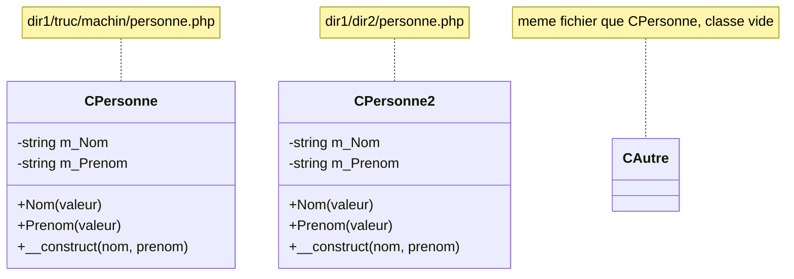

# Structure POO — CPersonne, CPersonne2 et CAutre

> Ces classes, c'est comme le dossier RH d'un employé dans un restaurant : ses informations personnelles (nom, prénom) sont **privées**, rangées dans un tiroir fermé (`private`) auquel seul le service RH a la clé. Un client ou un collègue ne peut jamais fouiller le tiroir directement — il doit passer par le guichet RH (les méthodes publiques `Nom()`/`Prenom()`), qui vérifie chaque demande avant de répondre.

## En une phrase simple

`CPersonne`, `CPersonne2` et `CAutre` sont des classes d'exercice quasiment identiques (POO = Programmation Orientée Objet) qui illustrent le principe d'**encapsulation** : des données privées, accessibles uniquement via des méthodes publiques qui valident chaque accès en lecture ou en écriture.

## Pourquoi ça existe ?

Le prof a créé plusieurs copies volontairement redondantes (`CPersonne` dans `dir1/truc/machin/personne.php`, `CPersonne2` dans `dir1/dir2/personne.php`, et une classe vide `CAutre` à côté de `CPersonne`) pour **deux raisons pédagogiques distinctes** :
1. Démontrer la POO de base (encapsulation, accesseurs avec validation, constructeur) sur un cas simple et répété.
2. Fournir à l'autoloader (voir [[Autoloading PID — spl_autoload_register et le Cache]]) plusieurs classes réparties dans des dossiers différents, pour prouver que la recherche récursive fonctionne bien peu importe où la classe se trouve — et que `CAutre` (une classe vide, sans rapport) ne perturbe pas la recherche du bon fichier.

## Comment ça fonctionne ?

### 1. Les propriétés privées — le tiroir fermé

```php
private $m_Nom;
private $m_Prenom;
```

Préfixe `m_` = convention de nommage pour "membre" (propriété d'instance). `private` signifie que **seul le code à l'intérieur de la classe elle-même** peut lire ou écrire directement ces variables — ni le script appelant, ni même une classe qui hériterait de celle-ci (contrairement à `protected`).

### 2. Les méthodes accesseurs — le guichet, avec un seul point d'entrée pour lire ET écrire

```php
public function Nom($valeur = null)
{
    if ($valeur !== null)
    {
        if (!is_string($valeur)) return false;
        $valeur = trim($valeur);
        if (empty($valeur)) return false;
        $this->m_Nom = $valeur;
        return true;
    }
    else
    {
        return $this->m_Nom;
    }
}
```

Une seule méthode `Nom()` fait office de **getter et de setter à la fois** : appelée sans argument (`$p1->Nom()`), elle renvoie la valeur actuelle ; appelée avec un argument (`$p1->Nom("Duvivier")`), elle tente de **modifier** la valeur, mais seulement après validation (`is_string`, `trim`, `empty`) — un `float` comme `3.141592` ou une chaîne vide/uniquement des espaces sont rejetés (`return false`), la propriété n'est pas touchée. `Prenom()` suit exactement le même patron.

### 3. Le constructeur — passer par les accesseurs, pas par un raccourci

```php
public function __construct($nom, $prenom)
{
    $this->Nom($nom);
    $this->Prenom($prenom);
}
```

`__construct` est la méthode magique appelée automatiquement à chaque `new CPersonne(...)`. Point important : le constructeur **réutilise les méthodes `Nom()`/`Prenom()`** plutôt que d'écrire directement `$this->m_Nom = $nom;` — la même validation s'applique donc à la création qu'à une modification ultérieure. Aucune donnée n'entre dans l'objet sans passer par le contrôle qualité du guichet.

### 4. `CAutre` — le figurant

```php
class CAutre { }
```

Une classe vide, sans aucune propriété ni méthode. Son seul rôle dans le cours : être un second nom de classe déclaré dans le même fichier que `CPersonne`, pour vérifier que l'autoloader (qui cherche un nom de classe précis via tokenisation) ne se laisse pas perturber par la présence d'une autre classe dans le même fichier.

## Schéma



## Exemple concret

Tiré directement de `test_poo.php` :

```php
$p1 = new CPersonne("Duchemin", "Robert");
var_dump($p1->Nom(), $p1->Prenom());   // "Duchemin", "Robert"

$p1->Nom(3.141592);      // rejeté : ce n'est pas une chaîne -> false, m_Nom inchangé
$p1->Prenom("   ");      // rejeté : chaîne vide après trim -> false, m_Prenom inchangé
var_dump($p1->Nom(), $p1->Prenom());   // toujours "Duchemin", "Robert"

$p1->Nom("Duvivier");
$p1->Prenom(" Marcel  ");             // accepté, trim() applique -> "Marcel"
var_dump($p1->Nom(), $p1->Prenom());   // "Duvivier", "Marcel"
```

Le script stocke même l'objet en session (`$_SESSION["personne"]`) pour montrer qu'un objet PHP peut être sérialisé et retrouvé entre deux requêtes — l'objet "survit" au rechargement de la page.

## Connexions

- [[Autoloading PID — spl_autoload_register et le Cache]] — c'est précisément ce mécanisme qui charge ces classes la première fois qu'on écrit `new CPersonne(...)`.
- [[Evolution de l'Autoloader — Boucle de Retry (0509 vers 1209)]] — ces mêmes classes servent de cas de test au mécanisme de vérification `class_exists` après inclusion.

## Questions de rappel actif

> **Q :** Pourquoi `Nom()` et `Prenom()` sont-elles à la fois getter et setter au lieu d'avoir deux méthodes séparées (`getNom()`/`setNom()`) ?
> **R :** C'est un choix de style du prof (un seul point d'entrée par propriété, le paramètre optionnel `$valeur = null` distingue lecture et écriture) — le principe d'encapsulation reste le même que des getters/setters séparés : validation systématique avant toute modification.

> **Q :** Que se passe-t-il si on appelle `$p1->Nom(3.141592)` — la propriété `m_Nom` change-t-elle ?
> **R :** Non — `is_string(3.141592)` renvoie `false`, la méthode retourne `false` immédiatement sans toucher à `$this->m_Nom`, qui garde donc sa valeur précédente.

> **Q :** Pourquoi le constructeur appelle-t-il `$this->Nom($nom)` plutôt que d'écrire directement `$this->m_Nom = $nom` ?
> **R :** Pour garantir que **toute** entrée de donnée dans l'objet — que ce soit à la construction ou plus tard — passe par la même validation, évitant qu'un objet soit créé avec un nom invalide qu'on ne pourrait jamais fixer via la construction.

> **Q :** À quoi sert `CAutre`, une classe complètement vide, dans le cadre du cours ?
> **R :** À vérifier que l'autoloader sait retrouver précisément la bonne classe (`CPersonne`) même quand plusieurs classes sont déclarées dans le même fichier — la tokenisation doit isoler le bon nom, pas se contenter du premier `class` rencontré.

## Pièges fréquents

- ⚠️ **Croire que `private` empêche uniquement l'accès depuis l'extérieur, mais pas depuis une classe fille** — en PHP, `private` bloque aussi les classes qui hériteraient de celle-ci ; seul `protected` autoriserait l'accès depuis une sous-classe.
- ⚠️ **Oublier que `Nom()` sans argument et `Nom(null)` sont indistinguables ici** — la vérification `$valeur !== null` fait qu'on ne peut pas "remettre le nom à null" volontairement via cette méthode ; c'est une limite assumée de ce patron simplifié.
- ⚠️ **Confondre les deux classes `CPersonne` et `CPersonne2`** — elles sont structurellement identiques (copié-collé pédagogique dans deux dossiers différents), seule leur **localisation dans l'arborescence** diffère, ce qui sert à tester l'autoloader sur plusieurs chemins.

## À retenir absolument
- Encapsulation = données privées + accès contrôlé par méthode publique validante.
- Le constructeur ne doit jamais contourner la validation des accesseurs.
- `CAutre` n'a de valeur que comme cas de test pour l'autoloader, pas comme code métier.

## Explorer ensuite
- Retour à [[Autoloading PID — spl_autoload_register et le Cache]] pour boucler la boucle : comment ces classes sont concrètement retrouvées et chargées.
