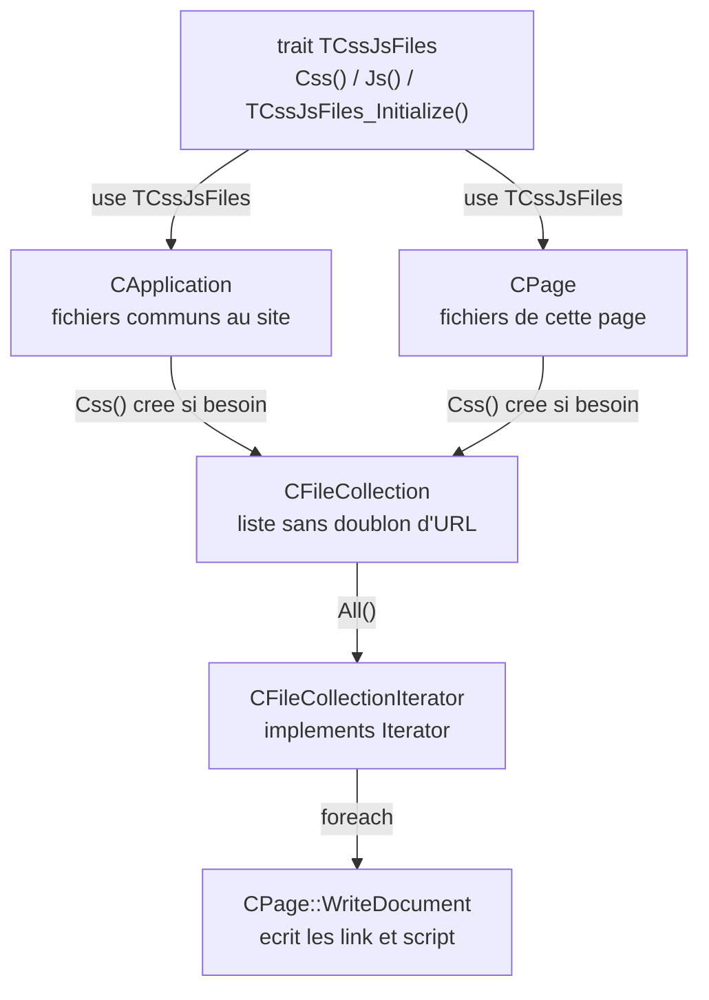

# `TCssJsFiles` et `CFileCollection` — collections de fichiers CSS et JS

> Chaque pièce d'un hôtel (la réception = `CApplication`, chaque chambre = une `CPage`) doit avoir **le même petit kit de service** : un classeur "feuilles de style" et un classeur "scripts". Au lieu de fabriquer ce kit dans chaque pièce, on le range dans une **caisse standard** (le *trait* `TCssJsFiles`) qu'on livre à qui en a besoin. Chaque classeur est une **liste de courses sans doublon** : on peut y ajouter, relire dans l'ordre, mais jamais deux fois la même ligne (`CFileCollection`).

## En une phrase simple

`CFileCollection` est une liste ordonnée d'URL de fichiers (sans doublon), et `TCssJsFiles` est un morceau de code réutilisable qui offre à n'importe quelle classe deux listes prêtes à l'emploi — `Css()` et `Js()` — utilisées par `CApplication` (fichiers communs à tout le site) et par `CPage` (fichiers propres à une page).

## Pourquoi ça existe ?

`CApplication` et `CPage` ont besoin **exactement de la même chose** : une liste de CSS et une liste de JS. En PHP, une classe ne peut hériter que d'**une seule** classe mère — et `CPage` n'a aucune raison d'hériter de `CApplication` (ni l'inverse). Un **trait** résout ça : du code partageable entre classes **sans lien d'héritage** ([[Glossaire PHP — Traits]]). Et pour la liste elle-même, une classe dédiée (`CFileCollection`) évite de manipuler des tableaux bruts partout, en centralisant les règles (pas de doublon, URL nettoyée).

## Comment ça fonctionne ?

### 1. `CFileCollection` — la liste

- **Stockage** : tableau privé `$m_Items` (créé au premier ajout).
- **Lecture** : `Count()`, `Item($index)` (renvoie `false` si l'index est hors limites ou n'est pas un entier — via `PID_IsInteger`), `All()` qui renvoie un **itérateur** pour faire `foreach`.
- **Écriture** : `Add($url)` (à la fin) et `Insert($index, $url)` (à une position). Les deux **nettoient** l'URL en retirant un `./` ou `/` de tête, et refusent une valeur vide ou non textuelle.
- **Constructeur** : `__construct($handleUniqueItems = null, ...$items)` — premier argument = "gérer l'unicité ?", puis un nombre libre d'URL initiales (`...$items` = opérateur d'étalement/collecte, déjà vu avec `new $className(...$arguments)`).

### 2. `CFileCollectionIterator` — permettre le `foreach`

`All()` renvoie un objet qui **implémente l'interface `Iterator`** : cinq méthodes obligatoires (`rewind`, `valid`, `key`, `current`, `next`) que PHP appelle automatiquement à chaque tour de `foreach` ([[Glossaire PHP — Interface Iterator et foreach]]). C'est ce qui permet, dans `CPage`, d'écrire `foreach ($css->All() as $url)`.

### 3. `TCssJsFiles` — le kit livré aux classes

```php
trait TCssJsFiles
{
    private $m_CssFiles;  private $m_JsFiles;
    public function Css() { /* crée la collection au premier appel, puis la renvoie */ }
    public function Js()  { /* idem */ }
    private function TCssJsFiles_Initialize($cssFiles = null, $jsFiles = null) { /* depuis des tableaux */ }
}
```
- **Création paresseuse** (*lazy*) : la collection n'est fabriquée qu'au premier appel de `Css()` / `Js()` — pas de coût si personne ne s'en sert.
- Chaque classe qui fait `use TCssJsFiles;` reçoit ces méthodes **comme si elle les avait écrites** : c'est le cas de `CApplication` et de `CPage`.
- `TCssJsFiles_Initialize` a un **nom préfixé par le trait** : convention pour éviter qu'il entre en collision avec une méthode de la classe hôte. Les constructeurs de `CApplication` et `CPage` l'appellent pour préremplir les listes.

### 4. Le résultat dans la page

`CPage::WriteDocument` parcourt `[CApplication::Instance()->Css(), $this->Css()]` : d'abord les CSS **communs à tout le site**, ensuite ceux **de la page** — donc la page peut surcharger le style général (le dernier gagne, en CSS).

## Schéma



## Exemple concret

Le constructeur `CApplication::__construct($cssFiles = null, $jsFiles = null)` appelle `TCssJsFiles_Initialize`, qui fabrique `new CFileCollection(true, ...$cssFiles)` si on lui passe un tableau. Une application concrète pourrait donc, dans son propre constructeur, faire `parent::__construct(["css/site.css"], ["js/site.js"])`. Au moment d'écrire la page, `WriteDocument` fait `foreach` sur cette collection : pour chaque URL, `PID_PathTo($url)` la traduit en chemin réel (et l'ignore si le fichier n'existe pas), puis écrit `<link rel="stylesheet" href="...">`.

> ℹ️ **État au 19/09** : c'est du code **préparé mais pas encore exercé**. `CMonApp` appelle `parent::__construct()` **sans argument**, et aucune page n'ajoute de CSS/JS : les deux collections restent vides et `WriteDocument` n'écrit aucune balise `<link>`/`<script>`. L'exemple `parent::__construct([...], [...])` ci-dessus est une illustration de l'usage prévu, pas un extrait du cours.

## Connexions

- [[Glossaire PHP — Traits]] — le mécanisme `trait` / `use` en détail.
- [[Glossaire PHP — Interface Iterator et foreach]] — comment `CFileCollectionIterator` rend la liste parcourable.
- [[CPage — Générer une page HTML (WriteDocument et points d'extension)]] — le consommateur principal.
- [[CApplication, CMonApp et CPage — Singleton applicatif et charset]] — l'autre classe qui utilise le trait.
- [[PID_PathTo, PID_Include et PID_IncludeOnce]] — traduit chaque URL de la collection en chemin réel.
- [[Glossaire PHP — Propriétés et méthodes statiques]] — `CApplication::Instance()` (statique) donne accès à la collection commune.

## Questions de rappel actif

> **Q :** Pourquoi un trait plutôt qu'une classe mère commune pour `CApplication` et `CPage` ?
> **R :** Parce que ces deux classes n'ont aucun rapport d'héritage logique, et qu'une classe PHP ne peut avoir qu'une seule classe mère. Un trait permet de partager du code entre elles sans les lier par héritage.

> **Q :** Qu'est-ce qui rend `foreach ($collection->All() as $url)` possible ?
> **R :** `All()` renvoie un `CFileCollectionIterator` qui implémente l'interface `Iterator` (`rewind`, `valid`, `key`, `current`, `next`) — PHP appelle ces cinq méthodes à chaque tour de boucle.

> **Q :** Que veut dire "création paresseuse" pour `Css()` ?
> **R :** La collection n'est fabriquée qu'au premier appel de `Css()` (si `$m_CssFiles === null`). Une page qui n'utilise jamais de CSS supplémentaire ne paie rien.

> **Q :** Dans quel ordre les CSS sont-ils écrits dans la page, et pourquoi c'est utile ?
> **R :** D'abord ceux de l'application (`CApplication::Instance()->Css()`), ensuite ceux de la page (`$this->Css()`). Le CSS suivant l'emportant en cas de conflit, une page peut ajuster le style commun du site.

## Pièges fréquents

- ⚠️ **Bug probable dans le code du prof (à ne pas recopier tel quel)** — dans `Add` et `Insert`, la vérification d'unicité s'écrit `in_array($relativeUrl, $this->m_HandleUniqueItems)` : or `m_HandleUniqueItems` est un **booléen** (voulu : "gérer l'unicité ?"), pas la liste. `in_array` exige un tableau en 2ᵉ argument : en PHP 8, appeler `Add` avec l'unicité activée déclencherait probablement une `TypeError`. La comparaison devrait porter sur `$this->m_Items`. *(⚠️ Probable : constaté par lecture, non exécuté — pas de PHP installé ici. À confirmer au prochain cours ; le prof corrigera peut-être.)*
- ⚠️ **Confondre `$handleUniqueItems` (un choix "oui/non") et la liste elle-même** — c'est justement l'origine du bug ci-dessus.
- ⚠️ **Un trait n'est pas un héritage** — `use TCssJsFiles;` ne crée aucun lien "est-un" : `is_a($page, "TCssJsFiles")` serait faux.
- ⚠️ **Chercher la définition de `PID_IsInteger` dans la classe** — elle est dans `index.php`, avec `PID_IsReal` : deux nouvelles fonctions globales du 19/09, à côté de `PID_PathTo`/`PID_Include`.

## À retenir absolument
- Trait = code partagé sans héritage ; `use NomDuTrait;` dans la classe.
- Collection sans doublon + itérateur = liste que `foreach` sait parcourir.
- Application d'abord, page ensuite : la page a le dernier mot sur le style.

## Explorer ensuite
- [[Glossaire PHP — Traits]] puis [[Glossaire PHP — Interface Iterator et foreach]].
