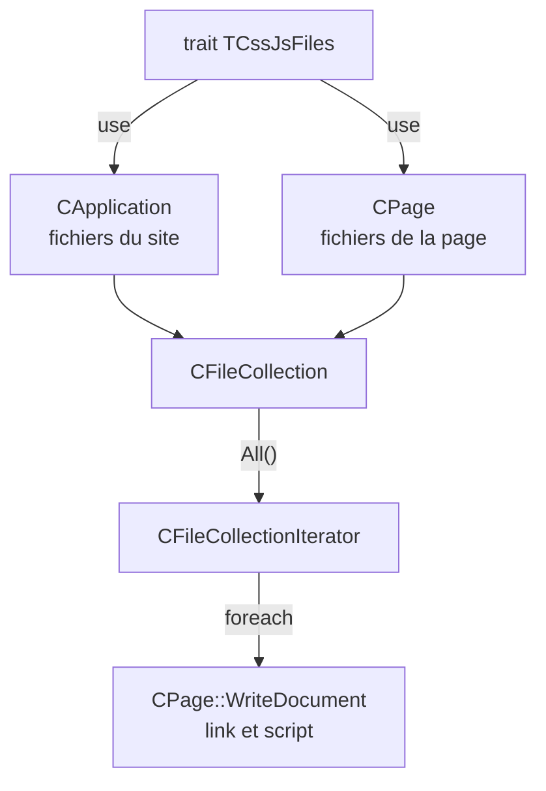

# `TCssJsFiles` et `CFileCollection` — collections de fichiers CSS et JS

> **En 30 secondes** — `CFileCollection` est une liste ordonnée d'URL de fichiers, sans doublon. `TCssJsFiles` est un morceau de code réutilisable qui offre à n'importe quelle classe deux listes prêtes — `Css()` et `Js()` — utilisées par `CApplication` (fichiers communs au site) et `CPage` (fichiers d'une page).



---

## 1. Vue Macro & Utilité (le « Pourquoi »)

- **Problématique** : `CApplication` et `CPage` ont besoin **exactement de la même chose** (une liste de CSS, une liste de JS). Une classe PHP n'a qu'**une seule** classe mère, et une page n'a aucune raison d'hériter de l'application (ni l'inverse). Copier-coller le code violerait le principe DRY (*Don't Repeat Yourself* — ne pas se répéter). Et manipuler des tableaux bruts partout disperserait les règles (pas de doublon, URL nettoyée).
- **Emplacement dans la carte globale** : couche **présentation** (avec `CPage`) : ces listes deviennent les balises `<link>` et `<script>` de la page HTML.
- **Analogie (logistique)** : chaque pièce d'un hôtel (réception = `CApplication`, chambre = `CPage`) reçoit le même **kit de service** dans une **caisse standard** (le trait). Chaque classeur du kit est une **liste de courses sans doublon** (la collection) : on ajoute, on relit dans l'ordre, jamais deux fois la même ligne.

## 2. Le Pont Systémique (sous le capot)

- **Trait** ([[Glossaire PHP — Traits]]) : à la **compilation**, le moteur PHP **recopie** les membres du trait dans chaque classe qui fait `use`. À l'exécution, il n'y a **aucun coût d'indirection** : `Css()` est une méthode de `CPage` comme une autre. Mais chaque classe en reçoit **sa propre copie** — donc ses propres propriétés `$m_CssFiles`/`$m_JsFiles` en mémoire.
- **Collection** : `$m_Items` est un **tableau PHP**, c'est-à-dire une table de hachage ordonnée stockée en **RAM** ; `Add` ajoute à la fin, `Insert` utilise `array_splice` (qui **décale** les éléments suivants).
- **Création paresseuse** (*lazy*) : la collection n'est allouée en mémoire qu'au **premier appel** de `Css()`/`Js()`. Une page qui n'ajoute rien ne consomme rien.
- **`foreach`** : c'est le moteur PHP qui appelle, à chaque tour, les cinq méthodes de l'itérateur ([[Glossaire PHP — Interface Iterator et foreach]]) ; le code du cours ne les appelle jamais lui-même.

## 3. Analyse du Code & Logique

```php
trait TCssJsFiles
{
    private $m_CssFiles;  private $m_JsFiles;
    public function Css() { if ($this->m_CssFiles === null) $this->m_CssFiles = new CFileCollection(true); return $this->m_CssFiles; }
    public function Js()  { /* idem */ }
    private function TCssJsFiles_Initialize($cssFiles = null, $jsFiles = null) { /* depuis des tableaux */ }
}
```
- **Étape 1 — Le trait.** `Css()`/`Js()` créent la collection au premier appel (`=== null`). `TCssJsFiles_Initialize` (nom **préfixé par le trait** : convention anti-collision) préremplit les listes depuis des tableaux, via `new CFileCollection(true, ...$cssFiles)` ([[Glossaire PHP — Opérateur d'étalement (...)]]).

```php
public function Add($relativeUrl)
{
    if (!is_string($relativeUrl) || empty($relativeUrl)) return false;
    if (str_starts_with($relativeUrl, "./")) $relativeUrl = substr($relativeUrl, 2);
    else if (str_starts_with($relativeUrl, "/")) $relativeUrl = substr($relativeUrl, 1);
    /* … vérification d'unicité … */ $this->m_Items[] = $relativeUrl; return true;
}
```
- **Étape 2 — La collection.** `Add` (à la fin) et `Insert` (à une position) **nettoient** l'URL (retirent `./` ou `/` de tête) et refusent une valeur vide ou non textuelle. Lecture : `Count()`, `Item($index)` (`false` si index invalide, via `PID_IsInteger`), `All()`.
- **Étape 3 — L'itérateur.** `All()` renvoie un `CFileCollectionIterator` (`implements Iterator`) : la collection garde les données, l'itérateur ne retient que la **position** `$m_Index`.
- **Étape 4 — Le résultat.** `CPage::WriteDocument` parcourt `[CApplication::Instance()->Css(), $this->Css()]` : d'abord les CSS du site, puis ceux de la page — **le dernier CSS l'emporte**, donc la page peut ajuster le style commun.

**Bonnes pratiques** : DRY par trait ; règles centralisées dans une classe ; création paresseuse ; noms de méthodes de trait préfixés.

> ℹ️ **État au 19/09** — code **préparé mais pas encore exercé** : `CMonApp` appelle `parent::__construct()` **sans argument** et aucune page n'ajoute de CSS/JS ; les deux collections restent vides et `WriteDocument` n'écrit aucune balise `<link>`/`<script>`.

> ⚠️ **À confirmer au prochain cours** — dans `Add` et `Insert`, l'unicité s'écrit `in_array($relativeUrl, $this->m_HandleUniqueItems)` alors que `m_HandleUniqueItems` est un **booléen**, pas la liste. `in_array` exige un tableau en 2ᵉ argument : en PHP 8, appeler `Add` avec l'unicité activée provoquerait probablement une `TypeError`. La comparaison devrait porter sur `$this->m_Items`. *Probable : lu dans le code, non exécuté.*

## 4. Synthèse & Prochaine Étape

**À retenir (3 puces max)**
- Trait = code partagé sans héritage (recopié à la compilation) ; `use NomDuTrait;`.
- Collection sans doublon + itérateur = liste que `foreach` sait parcourir.
- Application d'abord, page ensuite : la page a le dernier mot sur le style.

**Lien avec la suite** : quand une page ajoutera réellement du CSS/JS, la correction du point ⚠️ ci-dessus deviendra nécessaire → à suivre au prochain cours. Pour la page elle-même : [[CPage — Générer une page HTML (WriteDocument et points d'extension)]].

**Rappel actif**
> **Q :** Pourquoi un trait plutôt qu'une classe mère commune pour `CApplication` et `CPage` ?
> **R :** Ces classes n'ont aucun lien d'héritage logique et PHP n'autorise qu'une seule classe mère ; le trait partage le code sans relation « est-un ».

> **Q :** Qu'est-ce qui rend `foreach ($collection->All() as $url)` possible ?
> **R :** `All()` renvoie un itérateur qui implémente `Iterator` (`rewind`, `valid`, `key`, `current`, `next`) ; PHP appelle ces méthodes à chaque tour.

> **Q :** Que veut dire « création paresseuse » pour `Css()` ?
> **R :** La collection n'est créée qu'au premier appel (`$m_CssFiles === null`) ; sans appel, aucune mémoire n'est utilisée.

**Pièges fréquents**
- ⚠️ **Un trait n'est pas un héritage** — `is_a($page, "TCssJsFiles")` est faux ; il ne peut être ni instancié ni utilisé comme type.
- ⚠️ **Confondre `$handleUniqueItems` (choix oui/non) et la liste** — origine du bug probable ci-dessus.
- ⚠️ **Chercher `PID_IsInteger` dans la classe** — elle est dans `index.php`, avec `PID_IsReal` (nouvelles fonctions globales du 19/09).

**Connexions**
- [[Glossaire PHP — Traits]] · [[Glossaire PHP — Interface Iterator et foreach]] · [[Glossaire PHP — Opérateur d'étalement (...)]]
- [[CApplication, CMonApp et CPage — Singleton applicatif et charset]] — l'autre classe qui utilise le trait.
- [[PID_PathTo, PID_Include et PID_IncludeOnce]] — traduit chaque URL de la collection en chemin réel.
