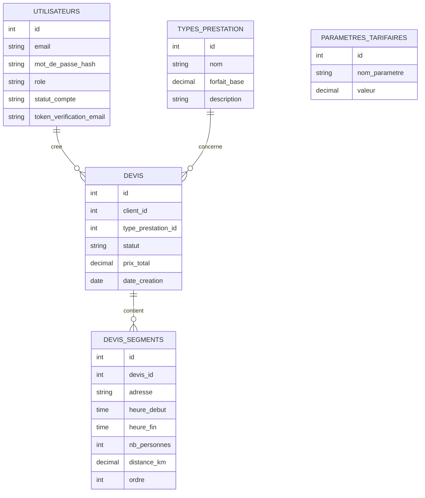
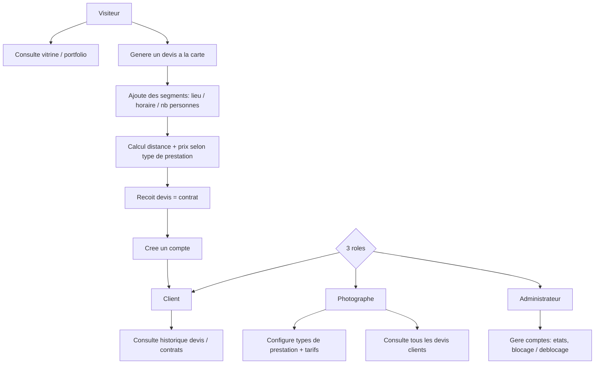

# Cahier des Charges — PID (Photographie — Devis & Squelette Sécurisé)
> mentalyas · Full-Stack Dev
> Date : 2026-09-12
> Statut : Brainstorm niveau 1 seul
> Niveaux exécutés : docs/brainstorm/L1-fondation.md

---

## 1. Concept Global

Site personnel de photographe (vitrine + portfolio) construit dans le cadre du cours PID (Projet d'Intégration et Développement), avec double finalité assumée : livrable d'examen **et** outil professionnel réel. Le squelette imposé par le cours (comptes utilisateurs sécurisés, multi-rôles, accès restreints) sert de fondation ; le "plus" spécifique au thème est un **générateur de devis à la carte** permettant à un client potentiel de composer une prestation multi-segments (plusieurs lieux/horaires/nombre de personnes dans une même journée — ex. mariage : mairie → église → salle), avec calcul automatique du prix (distance, durée, forfait selon le type de prestation). Le document généré fait office de devis **et** de contrat de référence, servant de preuve en cas de litige sur ce qui a été convenu verbalement le jour de la prestation. Les paiements restent en cash/Smart (pas de facturation intégrée) — le document sert de base pour transcrire manuellement la facture côté Smart.

Examen oral prévu fin de cursus (30/01, probablement 2027) — ~4,5 mois de développement en parallèle des séances hebdomadaires du samedi, pendant lesquelles le professeur code en direct le squelette sécurisé (auth, autoloader maison, POO) : ce contenu est capturé séance par séance dans `docs/academique/` (voir `## Suivi academique` du CLAUDE.md) pour servir de référence de défense orale.

## 2. Fonctionnalités

### Fonctionnalités core (MVP — à livrer pour l'examen)
- [ ] Squelette sécurisé complet : inscription/connexion, validation d'email, mot de passe oublié, anti brute-force, gestion des états de compte, navigation filtrée par rôle
- [ ] 3 rôles distincts : Client / Photographe (gérant) / Administrateur (technique)
- [ ] Vitrine : accueil, portfolio, présentation des services
- [ ] Générateur de devis à la carte : ajout de segments (adresse, heure début/fin, nombre de personnes), calcul distance/durée, calcul prix selon type de prestation + paramètres tarifaires
- [ ] Génération du document devis = contrat (téléchargeable/imprimable, détail complet)
- [ ] Espace Client : historique de ses devis/contrats
- [ ] Espace Photographe : configuration des types de prestation et paramètres tarifaires, vue globale des devis clients
- [ ] Espace Administrateur : gestion des comptes (états, blocage/déblocage)

### Fonctionnalités secondaires (v2+ — pas prioritaire, pertinent seulement en cas de passage indépendant complet)
- [ ] Paiement en ligne / acompte
- [ ] Signature électronique du contrat
- [ ] Notifications email automatiques (suivi de devis, rappels)
- [ ] Galerie photo avancée, SEO, blog

### Hors scope (explicitement exclu)
- Facturation intégrée (gérée manuellement via Smart)
- Multi-langue

## 3. Structure de Base de Données

### Entités principales
| Entité | Champs clés | Relations |
|--------|-------------|-----------|
| `utilisateurs` | id, email, mot_de_passe_hash, role, statut_compte, token_verification_email | 1-N vers `devis` (en tant que client) |
| `types_prestation` | id, nom (mariage / portrait / événementiel / ...), forfait_base, description | 1-N vers `devis` |
| `devis` | id, client_id, type_prestation_id, statut, prix_total, date_creation | N-1 `utilisateurs`, N-1 `types_prestation`, 1-N `devis_segments` |
| `devis_segments` | id, devis_id, adresse, heure_debut, heure_fin, nb_personnes, distance_km, ordre | N-1 `devis` |
| `parametres_tarifaires` | id, nom_parametre, valeur (prix/km, prix/heure sup., supplément weekend, ...) | transversal, pas de FK directe |

### Diagramme ERD (Mermaid)

## 4. Diagrammes Use Cases — Vue d'ensemble (Mermaid)

## 5. Stack Technologique

| Couche | Technologie | Justification |
|--------|-------------|---------------|
| Frontend | HTML5, CSS3, JS + jQuery, AJAX | Imposé par le cours |
| Backend | PHP + Laravel | Autorisé explicitement par le professeur ; déjà maîtrisé (CharlesNadejda-Project) ; couvre nativement une grande partie du squelette sécurisé (hash, CSRF, requêtes paramétrées) |
| Base de données | MySQL | Imposé par le cours |
| Auth | Laravel natif (Breeze/Fortify à évaluer en niveau 3) + logique de rôles maison | Squelette exigé : email, mot de passe oublié, anti brute-force, états de compte |
| Hébergement | À définir | Ouvert — pas de contrainte du cours |
| CI/CD | À définir | Pas prioritaire pour un projet d'examen solo |

**Pont pédagogique explicite** : le cours enseigne le mécanisme brut (PDO, autoloader maison, POO) que Laravel automatise. `docs/academique/` doit systématiquement relier "ce que Laravel fait pour moi" à "le mécanisme équivalent vu en cours" — indispensable pour la défense orale sur les critères Sécurité PHP (/20) et Traitement PHP (/20).

## 6. Algorithmes & Patterns Techniques

- **Calcul de distance/géocodage** — pattern déjà résolu dans un projet antérieur du même auteur (PortfolioPhotographe : calcul km via Nominatim/Haversine). Réutilisable comme référence d'implémentation, à réadapter en Laravel.
- **Moteur de tarification** — somme(forfait_base du type de prestation, distance_km × prix/km, heures_supplementaires × prix/heure, suppléments éventuels) par segment, agrégé sur le devis complet. Logique métier à détailler en niveau 3 (règles de calcul précises, arrondis, cas limites).
- **Génération de document devis=contrat** — à trancher en niveau 3 : PDF (ex. lib PHP dompdf/Laravel-PDF) vs HTML imprimable.

## 7. Sécurité — Bloc Dédié

### Niveau de sensibilité des données
Moyen — comptes utilisateurs (emails, mots de passe), adresses de prestation (données personnelles clients), pas de données bancaires/paiement stockées (paiement hors ligne).

### Vulnérabilités à anticiper
| Risque | Vecteur | Mitigation |
|--------|---------|------------|
| Injection SQL | Formulaires devis, recherche admin | Eloquent ORM (requêtes paramétrées) |
| XSS | Champs adresse, commentaires devis | Échappement Blade natif, sanitization |
| CSRF | Tous les formulaires | Protection CSRF native Laravel |
| Auth faible | Brute-force sur connexion | Rate limiting Laravel, verrouillage après N tentatives |
| Élévation de privilèges | Accès direct à des routes admin/photographe | Middleware de rôle sur chaque route, jamais de contrôle uniquement côté vue |
| Fuite de données personnelles clients | Accès non autorisé aux devis d'autrui | Policy Laravel (un client ne voit que ses propres devis) |

### Exceptions & Gestion d'erreurs
- Ne jamais exposer les stack traces en production (`APP_DEBUG=false`).
- Messages d'erreur génériques pour l'utilisateur final.
- Logging structuré côté serveur (sans mot de passe ni token en clair).

### Checklist sécurité minimale
- [ ] Authentification sécurisée (hash bcrypt via Laravel, jamais MD5/SHA1)
- [ ] HTTPS obligatoire (à voir selon hébergement choisi)
- [ ] Variables d'env pour tous les secrets (`.env`, jamais commité)
- [ ] Rate limiting sur connexion/inscription/mot de passe oublié
- [ ] Validation des entrées côté serveur (Form Requests Laravel)
- [ ] Policies Laravel pour isoler les données par rôle/propriétaire

## 8. Références

| Référence | Ce qui est inspirant | Ce qu'on fait différemment |
|-----------|---------------------|---------------------------|
| PortfolioPhotographe (projet antérieur, même auteur) | Module Devis déjà pensé, calcul distance via Nominatim/Haversine | Reconstruit en Laravel/MySQL (contrainte du cours), enrichi du multi-segments et du volet contrat |
| Claude Design — "Ernest H Photography.dc.html" (`https://claude.ai/design/p/2300b657-e8df-473b-b3d1-8c938410c29b`) | Direction visuelle déjà maquettée pour ce même profil photographe | À réimporter lors du travail frontend (niveau 4 / implémentation UI) — pas encore inspecté en détail à ce stade du brainstorm |

Aucune référence externe (outils de devis type HoneyBook/Hectic) identifiée — le générateur à la carte multi-segments est une conception originale, pas copiée d'un outil existant.
