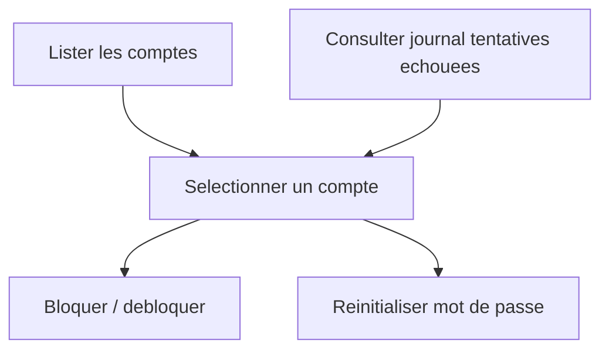

# Niveau 2 — Détail Fonctionnalité : Administration des comptes
> Projet : PID · Basé sur : docs/brainstorm/L1-fondation.md
> Date : 2026-09-12

## 1. Objectif de la fonctionnalité

Donner à l'Administrateur les outils pour superviser les comptes utilisateurs : débloquer un compte suite à un verrouillage anti brute-force, réinitialiser un mot de passe à la demande, et garder un œil sur les tentatives de connexion suspectes. C'est le troisième rôle explicitement exigé par le cours (aux côtés de Client et Photographe), distinct même si en pratique le même individu peut porter cette casquette.

## 2. Use Cases précis

### UC-1 : Lister les comptes utilisateurs
- **Acteur :** Administrateur
- **Scénario nominal :** Voit la liste de tous les comptes avec email, rôle, statut, date de création
- **Post-condition :** Vue d'ensemble des comptes

### UC-2 : Bloquer / débloquer un compte
- **Acteur :** Administrateur
- **Scénario nominal :** Change le statut d'un compte entre `actif`, `bloque`, `desactive` manuellement (indépendamment du verrouillage automatique anti brute-force)
- **Post-condition :** Statut mis à jour, l'utilisateur concerné ne peut plus (ou peut de nouveau) se connecter

### UC-3 : Réinitialiser un mot de passe à la demande
- **Acteur :** Administrateur
- **Scénario nominal :** Déclenche l'envoi d'un lien de réinitialisation vers l'email d'un utilisateur qui ne parvient pas à utiliser le flux self-service
- **Post-condition :** Utilisateur reçoit un nouveau lien de réinitialisation

### UC-4 : Consulter le journal des tentatives de connexion échouées
- **Acteur :** Administrateur
- **Scénario nominal :** Consulte l'historique des tentatives échouées (compte, IP, date) pour identifier une activité suspecte
- **Post-condition :** Visibilité sur les tentatives d'intrusion potentielles

## 3. Workflow (Mermaid)

## 4. Règles métier
| # | Règle | Justification |
|---|-------|----------------|
| 1 | Seul le rôle Administrateur accède à ces écrans | Exigence du cours (accès restreint par rôle) |
| 2 | Toute action de blocage/déblocage/réinitialisation est journalisée (qui, quand, sur quel compte) | Auditabilité |
| 3 | Un Administrateur ne peut pas se bloquer lui-même par erreur d'un simple clic | Éviter un verrouillage accidentel sans porte de sortie |

## 5. Critères d'acceptation (Definition of Done)
- [ ] Seul un compte avec le rôle Administrateur peut accéder à ces écrans (vérifié côté serveur)
- [ ] Bloquer un compte empêche immédiatement toute nouvelle connexion de cet utilisateur
- [ ] Chaque action d'administration est tracée avec horodatage et auteur

## 6. Signal de complexité — Niveau 3 nécessaire ?
| Critère | Présent ? | Détail |
|---------|-----------|--------|
| Logique métier complexe (calculs, machine à états) | Non | Réutilise la machine à états déjà détaillée dans L2-auth-comptes |
| Intégration API tierce | Non | — |
| Données sensibles (paiement/santé/légal) | Oui | Comptes utilisateurs, journal de connexions |
| Accès multi-rôles / permissions différenciées | Oui | Accès exclusif au rôle Administrateur |

**Recommandation :** Niveau 2 suffisant pour cette fonctionnalité prise isolément — le détail technique (schéma des états, mécanisme de verrouillage) est déjà couvert par le niveau 3 de "Authentification & gestion de comptes multi-rôles", pour éviter une conception dupliquée.
