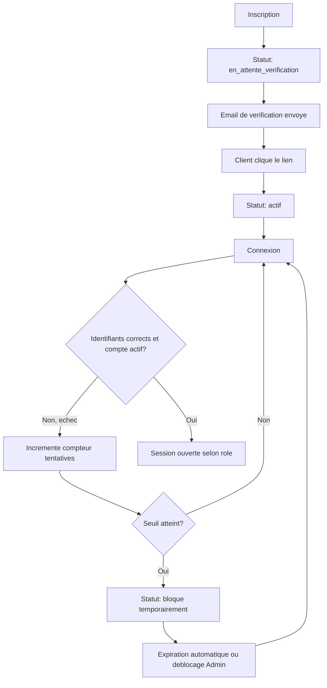

# Niveau 2 — Détail Fonctionnalité : Authentification & gestion de comptes multi-rôles
> Projet : PID · Basé sur : docs/brainstorm/L1-fondation.md
> Date : 2026-09-12

## 1. Objectif de la fonctionnalité

Permettre à un visiteur de créer un compte, se connecter en sécurité et gérer son profil, tout en garantissant que chaque rôle (Client / Photographe / Administrateur) n'accède qu'à ce qui lui est autorisé. C'est le squelette exigé par le cours — la base sur laquelle repose toute la crédibilité sécurité du projet à l'examen.

## 2. Use Cases précis

### UC-1 : Inscription
- **Acteur :** Visiteur
- **Déclencheur :** Clic sur "Créer un compte" (souvent après avoir généré un devis, cf. L2-generateur-devis)
- **Scénario nominal :**
  1. Le visiteur saisit email, mot de passe, confirmation
  2. Le système crée le compte avec le rôle `client` et le statut `en_attente_verification`
  3. Un email de vérification est envoyé avec un token à usage unique
  4. Le visiteur clique le lien, le statut passe à `actif`
- **Scénarios alternatifs / erreurs :**
  - Email déjà utilisé → message explicite, proposer la connexion ou le mot de passe oublié
  - Mot de passe trop faible → règles affichées avant soumission
  - Lien de vérification expiré → bouton "renvoyer l'email"
- **Post-condition :** Compte créé, statut `actif` après vérification

### UC-2 : Connexion
- **Acteur :** Utilisateur (tout rôle)
- **Déclencheur :** Saisie email + mot de passe
- **Scénario nominal :**
  1. Vérification des identifiants
  2. Vérification du statut du compte (doit être `actif`)
  3. Session ouverte, redirection vers l'espace correspondant au rôle
- **Scénarios alternatifs / erreurs :**
  - Identifiants invalides → incrémente le compteur de tentatives échouées
  - Compte `bloque` ou `desactive` → message explicite, pas de détail sur la raison exacte (anti-énumération)
  - Compte `en_attente_verification` → proposer de renvoyer l'email de vérification
- **Post-condition :** Session active, utilisateur redirigé vers son espace

### UC-3 : Mot de passe oublié
- **Acteur :** Utilisateur
- **Scénario nominal :**
  1. Saisie de l'email
  2. Envoi d'un lien de réinitialisation à usage unique et à durée limitée
  3. L'utilisateur définit un nouveau mot de passe via ce lien
- **Scénarios alternatifs / erreurs :**
  - Email inconnu → même message générique que si l'email existait (anti-énumération)
  - Lien expiré → message explicite, redemander un nouveau lien
- **Post-condition :** Mot de passe mis à jour, toutes les sessions actives invalidées

### UC-4 : Anti brute-force
- **Acteur :** Système (déclenché par des tentatives de connexion répétées)
- **Scénario nominal :**
  1. Après N tentatives échouées sur un même compte/IP dans une fenêtre de temps, verrouillage temporaire
  2. Déverrouillage automatique après expiration, ou manuel par l'Administrateur
- **Post-condition :** Compte protégé, tentative loggée pour audit (cf. L2-administration-comptes)

### UC-5 : Modification de son profil
- **Acteur :** Utilisateur (tout rôle)
- **Scénario nominal :** Modifie email/mot de passe/informations de contact ; changement d'email redéclenche une vérification
- **Post-condition :** Profil à jour

## 3. Workflow (Mermaid)

## 4. Règles métier
| # | Règle | Justification |
|---|-------|----------------|
| 1 | Un compte a un statut parmi : `en_attente_verification`, `actif`, `bloque`, `desactive` | Exigence explicite du cours (gestion de l'état des comptes) |
| 2 | Le mot de passe est haché (bcrypt via Laravel), jamais stocké en clair | Sécurité minimale non négociable |
| 3 | Après N tentatives échouées (ex: 5) dans une fenêtre de 15 min, verrouillage temporaire du compte/IP | Exigence explicite du cours (anti brute-force) |
| 4 | Les messages d'erreur de connexion et de mot de passe oublié ne révèlent jamais si un email existe en base | Anti-énumération de comptes |
| 5 | Un changement d'email redéclenche une vérification | Exigence explicite du cours (validité de l'adresse email) |
| 6 | Une réinitialisation de mot de passe invalide toutes les sessions actives de ce compte | Empêche une session compromise de survivre à un changement de mot de passe |

## 5. Critères d'acceptation (Definition of Done)
- [ ] Un visiteur peut s'inscrire, reçoit un email de vérification, et ne peut pas se connecter tant que le compte n'est pas vérifié
- [ ] Un mot de passe oublié génère un lien à usage unique et à durée de vie limitée
- [ ] 5 tentatives de connexion échouées verrouillent temporairement le compte
- [ ] Aucun message d'erreur ne permet de déduire l'existence d'un compte
- [ ] Les 3 rôles (Client, Photographe, Administrateur) redirigent vers 3 espaces distincts après connexion
- [ ] Toute route protégée rejette un utilisateur non authentifié ou n'ayant pas le rôle requis (contrôle serveur, jamais uniquement côté vue)

## 6. Signal de complexité — Niveau 3 nécessaire ?
| Critère | Présent ? | Détail |
|---------|-----------|--------|
| Logique métier complexe (calculs, machine à états) | Oui | Machine à états du compte + logique de verrouillage anti brute-force à fenêtre glissante |
| Intégration API tierce | Oui | Service d'envoi d'email (SMTP/Mailgun) pour vérification et réinitialisation |
| Données sensibles (paiement/santé/légal) | Oui | Mots de passe, emails, sessions |
| Accès multi-rôles / permissions différenciées | Oui | 3 rôles avec routes/vues strictement séparées |

**Recommandation :** Niveau 3 nécessaire — schéma de la machine à états des comptes, contrat technique du service d'envoi d'email, et détail du mécanisme de rate limiting/verrouillage.
