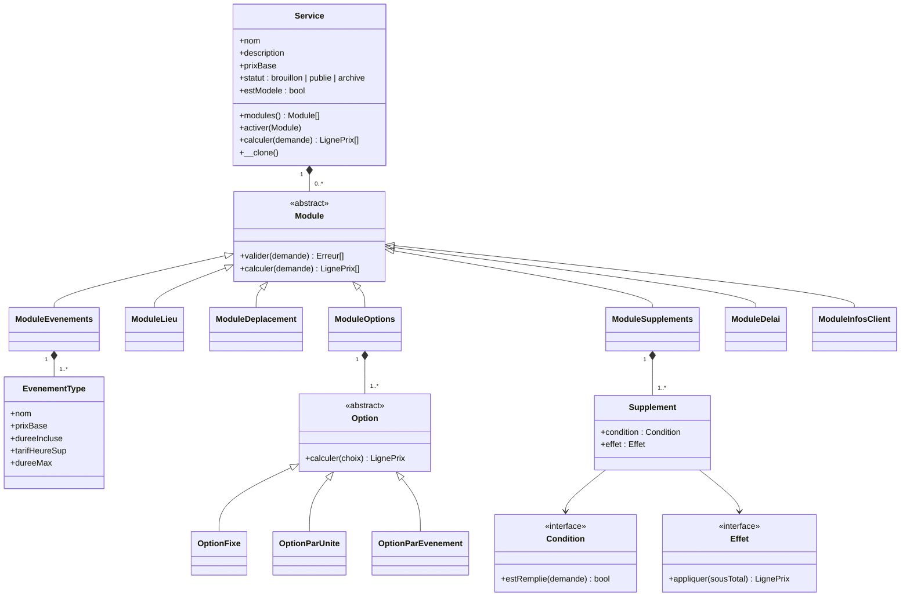
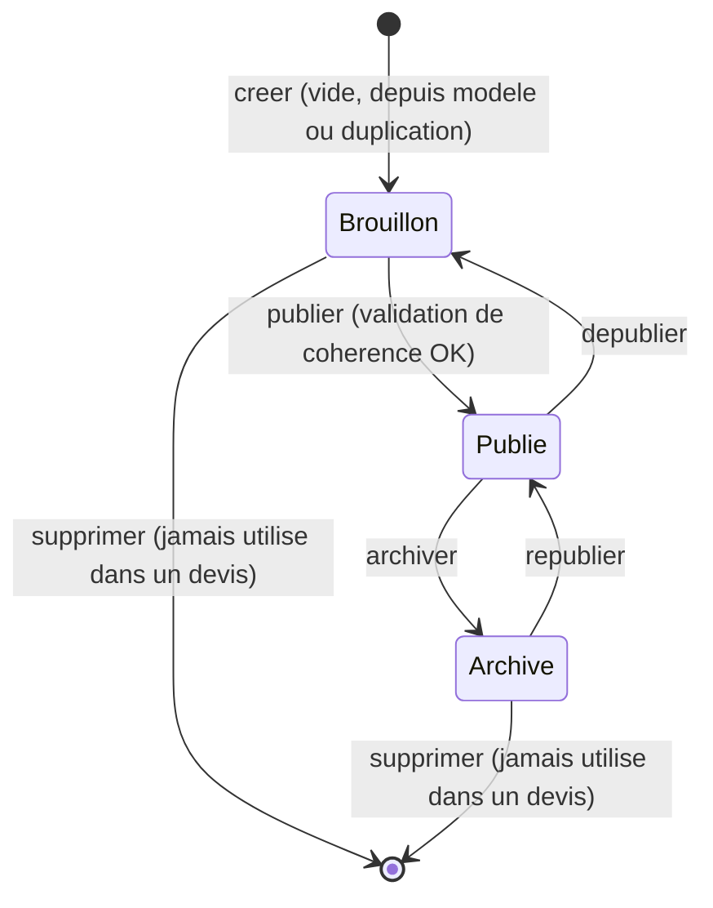
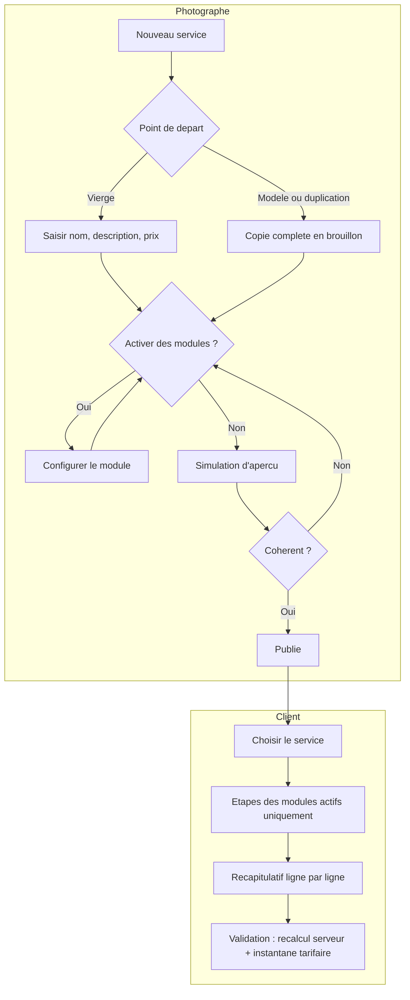

# Niveau 2 — Détail Fonctionnalité : Catalogue de services paramétrable
> Projet : PID · Basé sur : docs/brainstorm/L1-fondation.md, L2-generateur-devis.md, L3-generateur-devis.md
> Date : 2026-09-25
> Statut : **validé par mentalyas le 2026-09-25** — points ouverts marqués ⏳ (§11) ; prochaine étape : Niveau 3

## 1. Objectif de la fonctionnalité

Permettre au Photographe (gérant — mentalyas) de **créer, modifier, dupliquer et retirer rapidement ses offres** sans toucher au code, et faire en sorte que le générateur de devis côté client **s'adapte automatiquement** à ce que chaque service autorise et à la façon dont il est tarifé.

Remplace le modèle initial trop pauvre (`types_prestation` = nom + forfait de base, `parametres_tarifaires` globaux) par un modèle **générique et orienté objet** : un service est *composé* d'un noyau minimal et de modules optionnels.

**Origine du besoin (vécu terrain) :** mariage facturé à l'événement (~250 €/événement, jusqu'à ~6 événements sur une journée chargée : préparatifs, commune, église, drink + déjeuner, shooting couple, apéro, dîner + gâteau, soirée dansante). Pertes subies sur les déplacements : les mariés ont multiplié les allers-retours entre adresses redondantes, sans que ce soit facturé.

## 2. Vocabulaire du domaine

| Terme | Définition | Exemple |
|-------|-----------|---------|
| **Service** | Une offre du catalogue | Photo d'identité, Portrait studio, Mariage |
| **Service simple** | Service réduit à son noyau : nom + description + prix | Photo d'identité — 100 € |
| **Service avancé** | Service noyau + un ou plusieurs modules actifs | Mariage (événements, lieu, déplacement, options, suppléments) |
| **Module** | Brique optionnelle qui ajoute des contraintes et/ou des règles de prix à un service | Événements, Lieu, Déplacement, Options, Suppléments, Délai, Informations client |
| **Événement type** | Moment configuré dans un service, avec son forfait minimum | Église — 250 € jusqu'à 2 h, 60 €/h sup |
| **Événement réel** | Événement type choisi par le client, complété par une adresse et des heures réelles | Église — rue X — 12h00 → 14h00 |
| **Forfait minimum** | Prix de base d'un événement, couvrant une durée incluse ; jamais réduit | 250 € jusqu'à 2 h |
| **Heures supplémentaires** | Durée réelle au-delà de la durée incluse, arrondie à la demi-heure entamée | 2 h 10 pour 2 h incluses → 0 h 30 |
| **Itinéraire** | Départ photographe → événements dans l'ordre chronologique → retour | 56,5 km |
| **Modèle** | Service ou événement de référence, jamais visible des clients, qu'on clone pour aller vite | Modèle « Mariage complet » |
| **Instantané tarifaire** | Copie figée des tarifs appliqués, enregistrée dans le devis à la validation | — |

## 3. Principe directeur : noyau minimal + modules optionnels

Décision mentalyas 2026-09-25 : **le strict minimum d'un service = nom + description + prix.** On doit pouvoir créer aussi bien des services simples que des services avancés avec contraintes (lieux, distances, heures minimum, tarif heures sup…).

| Module | Ce qu'il ajoute | Réglages |
|--------|-----------------|----------|
| *(noyau)* | Nom, description, prix de base (≥ 0 €), statut | — |
| **Date** | Toujours présent : le client indique la date de la prestation | — |
| **Événements** | Le client choisit des événements types et saisit leurs heures réelles | Nb min/max d'événements (optionnel) ; par événement : prix de base, durée incluse, tarif heure sup, durée max (optionnelle) |
| **Lieu** | Où se déroule la prestation | Mode : *aucun* · *fixe* (studio, adresse du gérant) · *libre* (le client saisit une adresse par événement, ou une adresse unique s'il n'y a pas d'événements) |
| **Déplacement** | Frais kilométriques sur l'itinéraire (R2) | km inclus, prix/km (valeurs générales par défaut, surchargeables) — **requiert le lieu en mode libre** |
| **Options** | Extras cochés par le client (R3) | Liste d'options avec mode de tarification |
| **Suppléments** | Majorations automatiques (R4) | Liste condition + effet |
| **Délai de réservation** | Refuse une date trop proche | Nb de jours minimum |
| **Informations client** | Champs définis par service (nb d'invités, nb de plats…), repris dans le contrat | Libellé, type (texte / nombre), obligatoire ou non — **informatifs uniquement dans le MVP** |

| Exemple | Composition |
|---------|-------------|
| Photo d'identité | Noyau seul (100 €), lieu *fixe* |
| Portrait studio | Noyau + lieu *fixe* + options (photos retouchées en plus) |
| Mariage | Noyau (0 € ou frais fixes) + événements + lieu *libre* + déplacement + options + suppléments + informations client (nb d'invités) |

- Le générateur côté client **n'affiche que les étapes des modules actifs** (photo d'identité : choisir le service → date → récapitulatif → valider).
- L'écran de création côté Photographe suit la même logique (*progressive disclosure* — divulgation progressive : l'essentiel d'abord, l'avancé sur demande) : saisie du noyau, puis « + Activer un module ».

## 4. Modèle orienté objet

| Concept POO | Où | Pourquoi (argument d'oral) |
|-------------|-----|----------------------------|
| **Composition plutôt qu'héritage** | `Service` *possède* des `Module` au lieu de sous-classes `ServiceSimple` / `ServiceAvance` | Transformer un service simple en avancé = ajouter un module, pas changer la classe de l'objet |
| **Classe abstraite + polymorphisme** | `Module::valider()` / `calculer()` | Le générateur parcourt les modules actifs sans savoir lesquels ; chacun valide et chiffre sa partie |
| **Motif Stratégie** | `Option` (fixe / par unité / par événement), `Condition`, `Effet` | Chaque façon de calculer est encapsulée dans sa classe, interchangeable |
| **Principe ouvert/fermé** | Tout le modèle | Nouveau service = configuration, zéro code ; nouvelle façon de tarifer = nouvelle classe, sans modifier les existantes |
| **Motif Prototype** | `Service::__clone()` | Duplication et modèles (§6) — en PHP : `clone` + `__clone()` pour copier en profondeur les modules |
| **Lignes de prix nommées** | Chaque `calculer()` renvoie des `LignePrix` | La décomposition ligne par ligne du devis vient gratuitement |

## 5. Règles de tarification

`total = prixBase(service) + Σ lignes(ModuleEvenements) + frais(ModuleDeplacement) + Σ options + Σ suppléments`

### R1 — Forfait minimum + heures supplémentaires (par événement)
- `heures_sup = ceil(max(0, durée_réelle − durée_incluse) / 30 min) × 0,5 h`
- `prix_événement = prixBase + heures_sup × tarif_heure_sup`
- **Tarif heure sup propre à chaque événement type** (décision 2026-09-25).
- **Arrondi à la demi-heure entamée** : 2 h 10 pour 2 h incluses → 0 h 30 ; 2 h 31 → 1 h 00.
- **Minimum sans réduction** : 1 h réelle pour 2 h incluses → prix de base.

Exemple : Église, 250 € jusqu'à 2 h, 60 €/h sup — 12h00 → 14h00 = **250 €** ; 12h00 → 15h30 = 250 € + 1 h 30 × 60 € = **340 €**.

### R2 — Frais de déplacement (itinéraire complet)
**Transparence totale : tous les km sont comptés et affichés, seuls ceux au-delà du seuil sont facturés.**
- Itinéraire = départ photographe → événement 1 → … → événement N → retour (ordre chronologique).
- `frais = max(0, km_total − km_inclus) × prix_km` — défaut général : **25 km inclus, 0,50 €/km**, surchargeable par service.
- **Distance routière via OSRM** (Open Source Routing Machine — moteur d'itinéraire libre sur données OpenStreetMap). Le vol d'oiseau sous-estime la route de 20 à 40 %.
- Repli si OSRM indisponible : vol d'oiseau, ligne marquée « estimation », recalcul routier à la validation si possible.
- L'adresse de départ du photographe n'est **jamais affichée** au client (« Départ photographe → Mairie : 12,4 km »).
- Deux événements à la même adresse → 0 km.
- Le temps de trajet n'est pas facturé.

| Trajet | Distance |
|--------|---------:|
| Départ photographe → Préparatifs | 8,2 km |
| Préparatifs → Commune | 11,5 km |
| Commune → Église | 3,1 km |
| Église → Salle | 14,7 km |
| Salle → Retour photographe | 19,0 km |
| **Total** | **56,5 km** |
| Inclus | − 25,0 km |
| **Facturé : 31,5 km × 0,50 €** | **15,75 €** |

### R3 — Options (cochées par le client)
| Mode | Calcul | Exemples |
|------|--------|----------|
| **Fixe** | `prix` | Album, clé USB, livraison express, séance d'engagement |
| **Par unité** | `quantité × prix_unitaire` (quantité bornée min/max/pas) | Photos retouchées en plus, tirages |
| **Par événement** | `nb_événements_cochés × prix` (requiert le module Événements) | Second photographe, drone, photobooth |

### R4 — Suppléments automatiques (appliqués par le moteur)
| Condition | Paramètre | Exemple |
|-----------|-----------|---------|
| Jour de la semaine | jours visés | samedi, dimanche |
| Jour férié | table des jours fériés belges gérée par le Photographe | 15 août |
| Réservation urgente | délai en jours entre la demande et la date | < 30 jours |
| Période / saison | plage de dates récurrente | 1er mai → 30 septembre |

| Effet | Calcul |
|-------|--------|
| Pourcentage | `% × (prixBase + sous-total des événements)` — ni déplacement, ni options |
| Montant fixe | montant ajouté une fois |

Les suppléments applicables se **cumulent**, chacun sur une ligne distincte du détail.

## 6. Gestion du catalogue (côté Photographe)

**Rôle :** catalogue géré par le **Photographe**. L'Administrateur (technique) n'a aucun droit sur les services ni les tarifs — principe du moindre privilège (décision 2026-09-25 : 3 rôles conservés).

**Événements propres à chaque service** : pas de bibliothèque partagée liée, donc aucun effet de bord entre services.

**Cycle de vie :**

- **Brouillon** : invisible des clients ; **simulation d'aperçu** du générateur disponible pour le Photographe.
- **Publié** : proposé dans le générateur.
- **Archivé** : retiré du catalogue, conservé pour l'historique.

**Modèles réutilisables (motif Prototype)** — le clone est une **copie indépendante** : modifier le modèle ensuite ne change pas les services déjà créés.

| Niveau | Contenu | Usage |
|--------|---------|-------|
| **Modèle de service** | Service complet avec ses modules, jamais visible des clients | « Nouveau service à partir du modèle *Mariage complet* » |
| **Modèle d'événement** | Événement type pré-rempli | « Ajouter un événement depuis *Événement standard 250 € / 2 h* » |

- Tout service peut être **enregistré comme modèle** ; un modèle se modifie et se supprime librement.

**Paramètres généraux** (écran dédié du Photographe) : adresse de départ, km inclus et prix/km par défaut, table des jours fériés.

## 7. Use Cases

### Côté Photographe

#### UC-S1 : Créer un service simple
- **Acteur :** Photographe
- **Scénario nominal :** « Nouveau service » → saisit nom, description, prix → enregistré en **brouillon**
- **Erreurs :** nom vide ou déjà utilisé par un service non archivé ; prix négatif → rejet avec message clair
- **Post-condition :** service brouillon créé

#### UC-S2 : Créer un service depuis un modèle ou par duplication
- **Scénario nominal :** choisit un modèle (ou « Dupliquer » sur un service existant) → une copie complète est créée en **brouillon**, nom suffixé « (copie) » → ajuste ce qu'il veut
- **Post-condition :** nouveau service indépendant de sa source

#### UC-S3 : Activer, configurer ou retirer un module
- **Scénario nominal :** sur un service, « + Activer un module » → choisit le module → renseigne ses réglages (§3)
- **Erreurs :** Déplacement sans lieu *libre* → refusé ; option *par événement* sans module Événements → refusée ; réglage incohérent (durée max < durée incluse, quantité min > max) → refusé
- **Post-condition :** le générateur de ce service intègre (ou retire) l'étape correspondante

#### UC-S4 : Gérer les événements types d'un service
- **Scénario nominal :** ajoute un événement (vierge ou depuis un modèle d'événement), modifie prix de base / durée incluse / tarif heure sup / durée max, réordonne, supprime
- **Post-condition :** liste d'événements proposés au client mise à jour

#### UC-S5 : Simuler un devis (aperçu)
- **Scénario nominal :** sur un service (même brouillon), lance le générateur en mode aperçu → compose un devis fictif → voit le détail ligne par ligne
- **Post-condition :** rien n'est enregistré

#### UC-S6 : Publier, dépublier, archiver, republier, supprimer
- **Scénario nominal :** change le statut selon le cycle de vie (§6)
- **Erreurs :** publication refusée si le service est incohérent ; suppression refusée si le service figure dans un devis → proposer l'archivage
- **Post-condition :** visibilité côté client mise à jour ; devis existants intacts

#### UC-S7 : Enregistrer un service comme modèle
- **Scénario nominal :** « Enregistrer comme modèle » → copie ajoutée à la liste des modèles
- **Post-condition :** modèle disponible pour UC-S2

#### UC-S8 : Gérer les paramètres généraux
- **Scénario nominal :** modifie l'adresse de départ, les valeurs par défaut du déplacement, la table des jours fériés
- **Post-condition :** s'applique aux **futurs** calculs ; devis validés intacts (instantané)

### Côté Client (impact sur le générateur — cf. `L2-generateur-devis.md`)

#### UC-C1 : Parcourir le catalogue
- **Acteur :** Visiteur ou Client
- **Scénario nominal :** voit les services **publiés** (nom, description, « à partir de X € »)

#### UC-C2 : Composer un devis adapté au service
- **Scénario nominal :** choisit un service → le générateur enchaîne **uniquement** les étapes des modules actifs : date → événements et heures → adresses → options → informations client → récapitulatif détaillé → validation
- **Erreurs :** contraintes du service non respectées (nb d'événements, durée max, délai de réservation) → message précis sur l'étape concernée ; service dépublié entre-temps → message « service plus disponible » à la validation
- **Post-condition :** devis validé avec **instantané tarifaire**

## 8. Workflow (Mermaid)

## 9. Règles métier

| # | Règle | Justification |
|---|-------|----------------|
| 1 | Un service a au minimum un nom, une description et un prix de base ≥ 0 € | Noyau minimal (décision 2026-09-25) |
| 2 | **Un devis validé fige un instantané des tarifs appliqués** (noyau, modules, lignes de prix). Modifier, dépublier ou archiver un service n'altère jamais un devis existant | Le devis vaut contrat (Constitution, principe III) |
| 3 | Un service utilisé dans au moins un devis ne se supprime pas : il s'archive | Pas de devis orphelin, traçabilité |
| 4 | Seuls les services **publiés** apparaissent dans le générateur ; brouillons, archives et modèles jamais | Maîtrise de ce que voit le client |
| 5 | Le module Déplacement requiert le Lieu en mode *libre* ; une option *par événement* requiert le module Événements | Cohérence du modèle |
| 6 | Un service n'est publiable que si tous ses modules sont cohérents (au moins 1 événement si le module est actif, min ≤ max, durée max ≥ durée incluse…) | Pas de service cassé côté client |
| 7 | Le prix est **toujours recalculé côté serveur** à la validation à partir des modules du service — jamais repris du navigateur | Sécurité (déjà exigé par `L2-generateur-devis` règle 6) |
| 8 | Tout montant est stocké en décimal exact (jamais en flottant) et arrondi au centime uniquement sur le total de chaque ligne | Pas d'erreurs d'arrondi sur un document contractuel |
| 9 | Une modification des paramètres généraux ne s'applique qu'aux futurs calculs | Cohérence avec la règle 2 |
| 10 | Le catalogue (services, modèles, paramètres généraux) n'est modifiable que par le rôle Photographe | Moindre privilège |

## 10. Critères d'acceptation (Definition of Done)

- [ ] Le Photographe crée un service simple (nom, description, prix) en moins d'une minute, et le publie
- [ ] Le Photographe crée un service avancé en activant des modules, sans aucune modification de code
- [ ] Un service créé depuis un modèle ou par duplication est indépendant : modifier la source ne le change pas
- [ ] Le générateur n'affiche au client que les étapes des modules actifs du service choisi
- [ ] R1 : 12h00 → 15h30 sur un événement « 250 € / 2 h / 60 €/h » donne 340 € ; 2 h 10 → 30 min facturées ; 1 h → 250 €
- [ ] R2 : le détail liste chaque trajet, le total, les km inclus et les km facturés ; l'adresse de départ n'apparaît jamais
- [ ] R2 : OSRM indisponible → le devis reste composable avec une distance marquée « estimation »
- [ ] Modifier le prix d'un service après la validation d'un devis ne change pas ce devis
- [ ] Un service utilisé dans un devis ne peut pas être supprimé, seulement archivé
- [ ] Un Administrateur ou un Client ne peut ni lire ni modifier l'écran de gestion du catalogue (403)
- [ ] Le moteur de tarification est couvert par des tests unitaires sur chaque règle (R1 à R4) et leurs cas limites

## 11. Points ouverts ⏳

- Modèles fournis au démarrage (seeders) : lesquels ? (proposition : *Mariage complet*, *Portrait studio*, *Photo d'identité*, *Événement standard 250 € / 2 h*)
- Informations client qui influencent le prix (ex. 20 €/personne au-delà de 4) : **v2**, via une future classe de règle — à confirmer
- Instance OSRM publique (limites d'usage) vs auto-hébergée, mise en cache des distances → Niveau 3

## 12. Impact sur les documents existants

- `L2-generateur-devis.md` : UC-1 → choix d'un **service** du catalogue ; UC-2/UC-3 « segments » → **événements réels** ; UC-5 → formule remplacée par §5 ; nouvelles étapes conditionnelles selon les modules.
- `L3-generateur-devis.md` : tables `types_prestation` et `parametres_tarifaires` remplacées par le nouveau schéma (Niveau 3 de cette fiche).
- `L2-devis-contrat.md` / `L3-devis-contrat.md` : le document contrat s'appuie sur l'**instantané tarifaire** (règle 2).
- `L4-parcours.md` : écrans Photographe à ajouter (liste des services, éditeur de service à modules, modèles, paramètres généraux, simulation).
- `docs/USER-STORIES.md`, `docs/ARCHITECTURE.md`, `docs/API-ENDPOINTS.md`, `docs/UI-DESIGN.md` (Phase 1 du pipeline) : à réaligner après export.

## 13. Signal de complexité — Niveau 3 nécessaire ?

| Critère | Présent ? | Détail |
|---------|-----------|--------|
| Logique métier complexe | **Oui** | Moteur de tarification modulaire, arrondis, cumul de suppléments, cycle de vie, clonage profond |
| Intégration API tierce | **Oui** | OSRM (distance routière) + géocodage |
| Données sensibles | Oui (moyen) | Adresse de départ du photographe, adresses clients ; montants contractuels |
| Multi-rôles | **Oui** | Catalogue réservé au Photographe |

**Recommandation : Niveau 3 nécessaire** — schéma relationnel des modules (comment stocker une composition polymorphe en MySQL), format de l'instantané tarifaire, contrat OSRM et cache, algorithme de calcul pas à pas, endpoints de gestion du catalogue.
