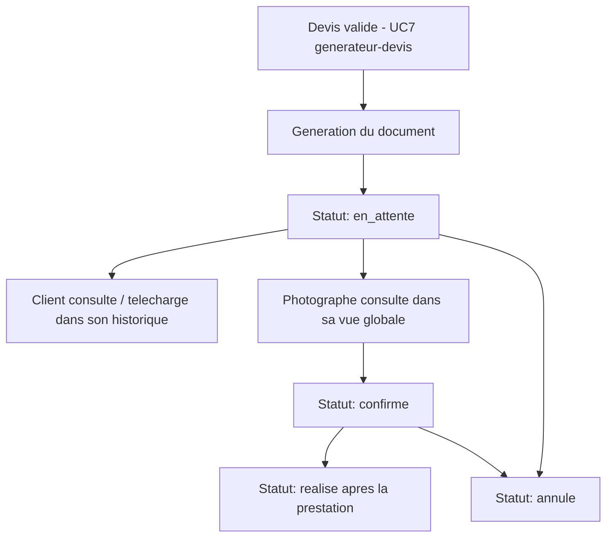

# Niveau 2 — Détail Fonctionnalité : Génération & consultation du devis=contrat
> Projet : PID · Basé sur : docs/brainstorm/L1-fondation.md
> Date : 2026-09-12

## 1. Objectif de la fonctionnalité

Transformer un devis validé en document de référence exploitable — par le Client comme preuve de ce qui a été convenu, par le Photographe comme suivi opérationnel et base pour la facturation manuelle via Smart. C'est la finalité concrète du générateur de devis (L2-generateur-devis) : sans ce document, le calcul de prix ne sert à rien le jour du litige.

## 2. Use Cases précis

### UC-1 : Génération du document
- **Acteur :** Système
- **Déclencheur :** Validation d'un devis (cf. L2-generateur-devis, UC-7)
- **Scénario nominal :** Génère un document (PDF ou HTML imprimable — à trancher en niveau 3) reprenant tous les segments détaillés, la décomposition du prix, le type de prestation, les coordonnées du client et du photographe
- **Post-condition :** Document disponible en téléchargement, lié au devis

### UC-2 : Consulter l'historique (Client)
- **Acteur :** Client
- **Scénario nominal :** Voit la liste de ses devis passés et en cours, avec leur statut
- **Post-condition :** Client retrouve tout devis déjà créé

### UC-3 : Télécharger un devis/contrat (Client)
- **Acteur :** Client
- **Scénario nominal :** Télécharge le document correspondant à un de ses devis
- **Scénarios alternatifs / erreurs :** Tentative d'accès à un devis d'un autre client → refusé (403), jamais un simple masquage côté vue
- **Post-condition :** Document téléchargé

### UC-4 : Consulter tous les devis (Photographe)
- **Acteur :** Photographe
- **Scénario nominal :** Vue globale de tous les devis clients, filtrable par statut/date/type de prestation
- **Post-condition :** Photographe a une vision d'ensemble de son activité

### UC-5 : Changer le statut d'un devis (Photographe)
- **Acteur :** Photographe
- **Scénario nominal :** Fait progresser un devis : `en_attente` → `confirme` → `realise`, ou `annule` à tout moment avant `realise`
- **Post-condition :** Statut mis à jour, historique de la prestation reflété

## 3. Workflow (Mermaid)

## 4. Règles métier
| # | Règle | Justification |
|---|-------|----------------|
| 1 | Un Client ne peut consulter/télécharger que ses propres devis | Isolation des données personnelles et financières entre clients |
| 2 | Le Photographe a accès en lecture à tous les devis, en écriture uniquement sur le statut | Vue globale nécessaire à la gestion de l'activité, sans pouvoir altérer les données saisies par le client |
| 3 | Un devis `realise` ne peut plus changer de statut | Le document devient une référence figée une fois la prestation effectuée |
| 4 | Le document généré ne recalcule jamais le prix après coup — il fige les valeurs au moment de la validation | Le document doit rester la preuve fidèle de ce qui a été convenu, même si les paramètres tarifaires changent ensuite |

## 5. Critères d'acceptation (Definition of Done)
- [ ] Un document est généré automatiquement à la validation d'un devis
- [ ] Le document contient le détail complet (segments, distances, décomposition du prix)
- [ ] Un client ne peut jamais accéder au devis d'un autre client, même en modifiant l'URL
- [ ] Le photographe voit tous les devis et peut changer leur statut selon le cycle défini
- [ ] Les valeurs figées dans un document déjà généré ne changent jamais rétroactivement

## 6. Signal de complexité — Niveau 3 nécessaire ?
| Critère | Présent ? | Détail |
|---------|-----------|--------|
| Logique métier complexe (calculs, machine à états) | Oui (léger) | Machine à états du statut du devis (en_attente / confirme / realise / annule) |
| Intégration API tierce | Non | Génération de document via une librairie PHP, pas un service externe |
| Données sensibles (paiement/santé/légal) | Oui | Détail financier et adresses personnelles des clients |
| Accès multi-rôles / permissions différenciées | Oui | Isolation stricte Client (ses devis uniquement) vs Photographe (vue globale) |

**Recommandation :** Niveau 3 nécessaire — modélisation précise de la policy d'accès (Laravel Policy Client/Photographe) et choix technique du format de document (PDF vs HTML imprimable) avec justification.
