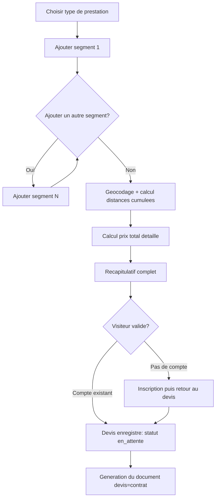

# Niveau 2 — Détail Fonctionnalité : Générateur de devis à la carte
> Projet : PID · Basé sur : docs/brainstorm/L1-fondation.md
> Date : 2026-09-12

## 1. Objectif de la fonctionnalité

Le cœur différenciant du projet : permettre à un visiteur de composer précisément sa prestation (un ou plusieurs segments dans une même journée — lieu, horaires, nombre de personnes) et d'obtenir un prix exact calculé automatiquement, sans aller-retour manuel avec le photographe. C'est ce qui distingue le site d'une simple vitrine avec formulaire de contact.

## 2. Use Cases précis

### UC-1 : Sélectionner un type de prestation
- **Acteur :** Visiteur
- **Scénario nominal :** Choisit un type parmi ceux configurés par le Photographe (mariage, portrait, événementiel, ...) ; le forfait de base s'affiche à titre indicatif
- **Post-condition :** Type de prestation retenu pour la suite du devis

### UC-2 : Ajouter un segment
- **Acteur :** Visiteur
- **Déclencheur :** Clic sur "Ajouter une étape" dans le tunnel de devis
- **Scénario nominal :**
  1. Saisit l'adresse du lieu
  2. Saisit l'heure de début et de fin
  3. Saisit le nombre de personnes présentes
  4. Le système géocode l'adresse (coordonnées lat/lon)
- **Scénarios alternatifs / erreurs :**
  - Adresse non trouvée par le géocodage → proposer une correction manuelle ou une adresse alternative
  - Heure de fin antérieure à l'heure de début → rejeté avec message clair
- **Post-condition :** Segment ajouté au devis en cours

### UC-3 : Ajouter plusieurs segments (multi-étapes)
- **Acteur :** Visiteur
- **Scénario nominal :** Répète UC-2 pour chaque lieu de la journée (ex : mairie → église → salle) ; les segments sont ordonnés chronologiquement
- **Scénarios alternatifs / erreurs :** Chevauchement d'horaires entre deux segments → rejeté ou signalé
- **Post-condition :** Liste ordonnée de segments constituant la journée complète

### UC-4 : Calcul automatique de la distance
- **Acteur :** Système
- **Déclencheur :** Ajout ou modification d'un segment
- **Scénario nominal :** Calcule la distance entre les coordonnées du segment précédent et du segment courant (cumul des trajets de la journée)
- **Post-condition :** `distance_km` renseignée sur chaque segment (sauf le premier, sans trajet précédent)

### UC-5 : Calcul du prix total
- **Acteur :** Système
- **Scénario nominal :** Prix = forfait_base(type_prestation) + Σ(distance_km × prix/km) + Σ(heures_supplémentaires × prix/heure) + suppléments applicables (weekend, jour férié...)
- **Post-condition :** `prix_total` affiché en détail (décomposition ligne par ligne, pas juste un total)

### UC-6 : Visualiser le récapitulatif
- **Acteur :** Visiteur
- **Scénario nominal :** Voit le détail complet (segments, distances, durées, décomposition du prix) avant de valider
- **Post-condition :** Visiteur informé, peut modifier ou valider

### UC-7 : Valider le devis
- **Acteur :** Visiteur
- **Scénario nominal :**
  1. Clique "Valider ce devis"
  2. Si non connecté, redirigé vers l'inscription (cf. L2-auth-comptes) avec le devis en cours conservé
  3. Devis enregistré en base, statut initial `en_attente`
- **Post-condition :** Devis persisté, rattaché au compte Client, document généré (cf. L2-devis-contrat)

## 3. Workflow (Mermaid)

## 4. Règles métier
| # | Règle | Justification |
|---|-------|----------------|
| 1 | Un devis doit contenir au moins 1 segment | Pas de devis vide |
| 2 | Les segments sont ordonnés par heure de début croissante | Cohérence de la journée |
| 3 | La distance d'un segment = distance géodésique entre son lieu et celui du segment précédent (0 pour le premier) | Modélisation simple et prévisible du trajet |
| 4 | Prix = forfait_base + Σ(distance × prix_km) + Σ(heures_sup × prix_heure) + suppléments | Formule centrale, doit être configurable sans toucher au code (paramètres en base) |
| 5 | Le devis en cours de composition est conservé (session/cache) si le visiteur doit s'inscrire en cours de route | Ne pas perdre le travail de composition du client |
| 6 | Le calcul de prix est refait côté serveur à la validation, jamais fait confiance au calcul affiché côté client | Sécurité — un visiteur ne doit pas pouvoir manipuler le prix via le JS |

## 5. Critères d'acceptation (Definition of Done)
- [ ] Un visiteur peut composer un devis à plusieurs segments sans compte
- [ ] La distance entre segments est calculée automatiquement via géocodage
- [ ] Le prix total est décomposé ligne par ligne, pas juste un chiffre final
- [ ] Le devis en cours survit à une inscription initiée en cours de route
- [ ] Le prix final est recalculé et vérifié côté serveur à la validation (jamais fait confiance à un prix envoyé depuis le client)

## 6. Signal de complexité — Niveau 3 nécessaire ?
| Critère | Présent ? | Détail |
|---------|-----------|--------|
| Logique métier complexe (calculs, machine à états) | Oui | Moteur de tarification multi-variable, cumul de distances entre segments ordonnés |
| Intégration API tierce | Oui | Service de géocodage (ex. Nominatim, déjà utilisé dans PortfolioPhotographe) |
| Données sensibles (paiement/santé/légal) | Oui (moyen) | Adresses des lieux de prestation (données personnelles) |
| Accès multi-rôles / permissions différenciées | Non | Accessible à tout visiteur, pas de distinction de rôle sur cette fonctionnalité elle-même |

**Recommandation :** Niveau 3 nécessaire — contrat de l'API de géocodage (quotas, gestion des échecs), schéma de données détaillé des segments, algorithme de calcul de prix pas à pas avec cas limites (segment unique, adresses non géolocalisables, arrondis).
