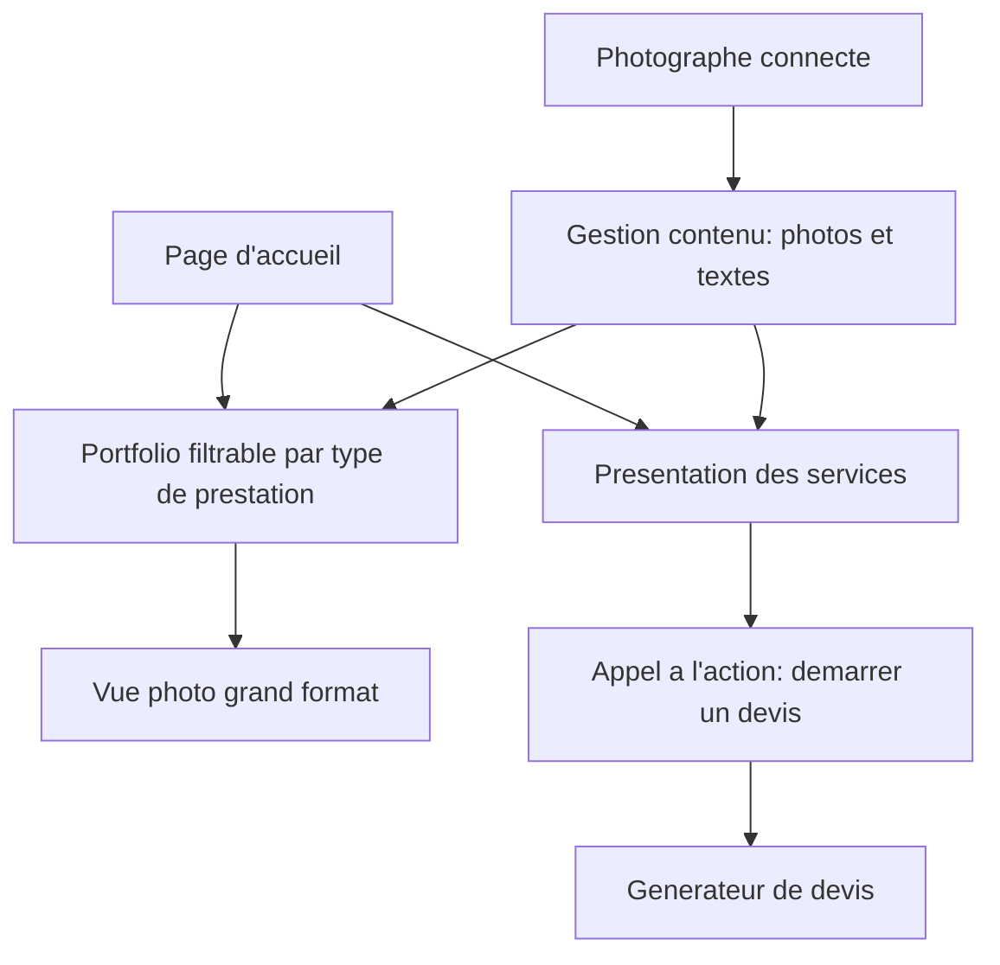

# Niveau 2 — Détail Fonctionnalité : Vitrine / Portfolio
> Projet : PID · Basé sur : docs/brainstorm/L1-fondation.md
> Date : 2026-09-12

## 1. Objectif de la fonctionnalité

Présenter le travail et les services du photographe à un visiteur non connecté, de façon à donner envie de démarrer un devis. C'est la partie "vitrine classique" du site — moins différenciante que le générateur de devis, mais nécessaire pour la crédibilité et l'accès au tunnel de devis.

## 2. Use Cases précis

### UC-1 : Consulter la page d'accueil
- **Acteur :** Visiteur
- **Scénario nominal :** Arrive sur l'accueil, voit une sélection de photos phares et un appel à l'action vers le portfolio et le générateur de devis
- **Post-condition :** Visiteur orienté vers portfolio ou devis

### UC-2 : Consulter le portfolio
- **Acteur :** Visiteur
- **Scénario nominal :**
  1. Parcourt les photos, idéalement filtrables par type de prestation (mariage / portrait / événementiel — mêmes catégories que `types_prestation`)
  2. Ouvre une photo en grand format
- **Post-condition :** Visiteur a une idée concrète du style du photographe

### UC-3 : Consulter la présentation des services
- **Acteur :** Visiteur
- **Scénario nominal :** Lit la description de chaque type de prestation proposé, avec éventuellement une fourchette de prix indicative avant de se lancer dans un devis précis
- **Post-condition :** Visiteur comprend l'offre avant de démarrer un devis

### UC-4 : Gérer le contenu de la vitrine
- **Acteur :** Photographe
- **Scénario nominal :** Ajoute/modifie/supprime des photos du portfolio, modifie les textes de présentation des services
- **Scénarios alternatifs / erreurs :** Upload d'un fichier non-image → rejeté avec message clair
- **Post-condition :** Contenu vitrine à jour, visible immédiatement côté public

## 3. Workflow (Mermaid)

## 4. Règles métier
| # | Règle | Justification |
|---|-------|----------------|
| 1 | Les catégories du portfolio correspondent aux `types_prestation` définis par le Photographe | Cohérence entre vitrine et générateur de devis |
| 2 | Seul le rôle Photographe peut modifier le contenu de la vitrine | Un seul propriétaire de contenu |
| 3 | Les fichiers uploadés sont validés en type et en taille avant stockage | Sécurité de base sur l'upload |

## 5. Critères d'acceptation (Definition of Done)
- [ ] Un visiteur peut parcourir le portfolio sans compte
- [ ] Le portfolio est filtrable par type de prestation
- [ ] Le Photographe peut ajouter/retirer une photo et voir le changement immédiatement en public
- [ ] Chaque page vitrine propose un appel à l'action clair vers le générateur de devis

## 6. Signal de complexité — Niveau 3 nécessaire ?
| Critère | Présent ? | Détail |
|---------|-----------|--------|
| Logique métier complexe (calculs, machine à états) | Non | Simple CRUD de contenu |
| Intégration API tierce | Non | Pas de service externe requis pour le MVP (stockage local des images) |
| Données sensibles (paiement/santé/légal) | Non | Contenu public |
| Accès multi-rôles / permissions différenciées | Non | Une seule distinction simple (Photographe modifie, tout le monde consulte) |

**Recommandation :** Niveau 2 suffisant — pas de conception technique dédiée nécessaire.
