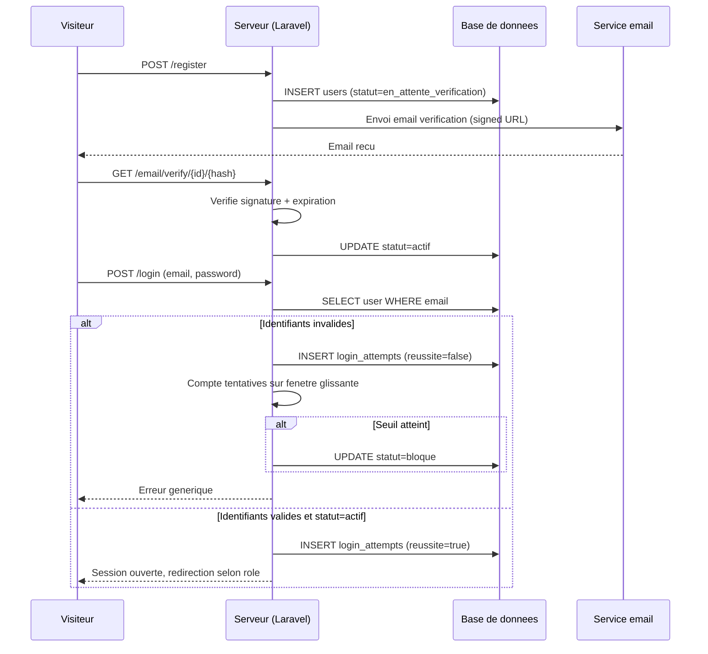

# Niveau 3 — Conception Technique : Authentification & gestion de comptes multi-rôles
> Basé sur : docs/brainstorm/L1-fondation.md + docs/brainstorm/L2-auth-comptes.md
> Date : 2026-09-12

## 1. Contrat API

| Endpoint | Méthode | Entrée | Sortie | Codes d'erreur |
|----------|---------|--------|--------|-----------------|
| `/register` | POST | name, email, password, password_confirmation | Redirection + compte créé (statut `en_attente_verification`) | 422 validation |
| `/login` | POST | email, password | Session ouverte, redirection selon rôle | 422 identifiants invalides / 429 trop de tentatives |
| `/logout` | POST | — | Session détruite | — |
| `/email/verify/{id}/{hash}` | GET | Signed URL (Laravel `signed` middleware) | Statut passe à `actif` | 403 signature invalide/expirée |
| `/email/verification-notification` | POST | — (utilisateur connecté non vérifié) | Nouvel email envoyé, ancien token invalidé | 429 si renvoi trop fréquent |
| `/password/forgot` | POST | email | Email de reset envoyé (message générique quel que soit le résultat) | 429 trop de tentatives |
| `/password/reset` | POST | token, email, password, password_confirmation | Mot de passe mis à jour, sessions existantes invalidées | 422 token invalide/expiré |
| `/ajax/check-email` | GET (AJAX) | email (query) | `{available: true\|false}` | 422 format email invalide |

## 2. Schéma de données détaillé

### Tables concernées
| Table | Colonnes | Contraintes | Index |
|-------|----------|-------------|-------|
| `users` | id, name, email, email_verified_at, password, role (enum: client/photographe/administrateur), statut_compte (enum: en_attente_verification/actif/bloque/desactive), remember_token, timestamps | `email` UNIQUE, `password` jamais en clair | index sur `email`, `statut_compte` |
| `login_attempts` | id, email, ip_address, reussite (bool), timestamps | — | index composite `(email, created_at)` pour le calcul du seuil de verrouillage et le journal Admin |
| `password_reset_tokens` (convention Laravel) | email, token (hashé), created_at | — | clé primaire `email` |

## 3. Diagramme de séquence (Mermaid)

## 4. Cas limites techniques
- **Concurrence :** deux inscriptions simultanées avec le même email → la contrainte UNIQUE en base tranche, la seconde requête reçoit une erreur 422 propre (catch de l'exception de contrainte, jamais un 500 brut)
- **Idempotence :** renvoyer l'email de vérification plusieurs fois invalide le token précédent — un seul lien valide à la fois
- **Transactions / rollback :** la création du compte n'est pas annulée si l'envoi d'email échoue (ex: service SMTP indisponible) — le compte reste `en_attente_verification`, l'utilisateur peut redemander l'envoi depuis son espace ; l'échec d'envoi est loggé côté serveur
- **Volumétrie :** `login_attempts` doit être purgée au-delà de 90 jours (commande Artisan planifiée) pour ne pas grossir indéfiniment

## 5. Sécurité spécifique à cette fonctionnalité
| Risque | Vecteur | Mitigation |
|--------|---------|------------|
| Brute-force sur `/login` | Tentatives répétées automatisées | Rate limiting Laravel (`throttle`) par IP **et** par email — évite le contournement par rotation d'IP ; verrouillage du compte après 5 échecs / 15 min |
| Énumération de comptes | Réponses différenciées sur `/password/forgot` ou `/login` selon qu'un email existe | Message générique identique dans tous les cas (`/ajax/check-email` reste la seule exception assumée, tolérée à l'inscription) |
| Falsification de lien de vérification/reset | Manipulation d'URL | Signed URLs Laravel (signature cryptographique + expiration intégrée, `hash::equals` en comparaison constante) |
| Session compromise après reset | Session existante réutilisée après changement de mot de passe | Invalidation de toutes les sessions actives du compte à la réinitialisation |
| Mot de passe faible | Choix utilisateur | Règles de complexité minimales via Form Request Laravel (`Password::min(8)->mixedCase()->numbers()`) |
