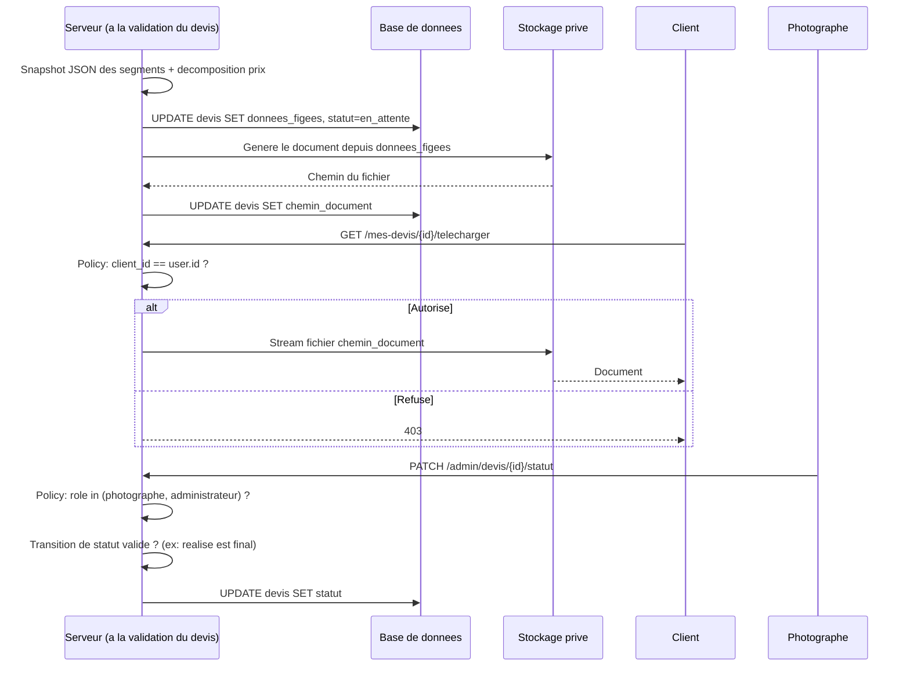

# Niveau 3 — Conception Technique : Devis = contrat (génération & consultation)
> Basé sur : docs/brainstorm/L1-fondation.md + docs/brainstorm/L2-devis-contrat.md
> Date : 2026-09-12

## 1. Contrat API

| Endpoint | Méthode | Entrée | Sortie | Codes d'erreur |
|----------|---------|--------|--------|-----------------|
| `/mes-devis` | GET | — (Client connecté) | Liste des devis du client courant | — |
| `/mes-devis/{id}/telecharger` | GET | — | Stream du document (jamais une URL de fichier publique) | 403 si `{id}` n'appartient pas au client |
| `/admin/devis` | GET | filtres (statut, date, type) — AJAX pour rafraîchir sans recharger la page | Liste paginée, tous devis confondus | 403 si rôle ≠ photographe/administrateur |
| `/admin/devis/{id}/statut` | PATCH (AJAX) | nouveau_statut | Statut mis à jour | 403 rôle insuffisant / 422 transition de statut invalide |

## 2. Schéma de données détaillé

### Tables concernées
| Table | Colonnes | Contraintes | Index |
|-------|----------|-------------|-------|
| `devis` (complément de L3-generateur-devis) | + `chemin_document` (string, chemin de stockage privé), `donnees_figees` (JSON — snapshot des segments et de la décomposition du prix au moment de la génération) | — | — |

Le champ `donnees_figees` est la clé technique de la règle métier "un document déjà généré ne change jamais rétroactivement" : `devis_segments` peut rester la source vivante pour l'affichage courant, mais le document téléchargé est toujours régénéré à partir du JSON figé, jamais depuis les tables actuelles.

## 3. Diagramme de séquence (Mermaid)

## 4. Cas limites techniques
- **Concurrence :** le Photographe change le statut pendant que le Client consulte la même page → non critique, simple rafraîchissement côté client à la prochaine requête
- **Idempotence :** télécharger plusieurs fois le même devis sert toujours le fichier déjà généré depuis `chemin_document` — jamais de régénération à la volée depuis les données courantes
- **Transactions / rollback :** génération du document + écriture de `donnees_figees`/`chemin_document` dans une même transaction — si l'écriture du fichier échoue, le statut n'avance pas et l'opération est journalisée pour reprise manuelle
- **Volumétrie :** pagination obligatoire sur `/admin/devis` dès que le nombre de devis dépasse quelques dizaines ; filtres (statut/date/type) traités côté requête SQL, pas en mémoire

## 5. Sécurité spécifique à cette fonctionnalité
| Risque | Vecteur | Mitigation |
|--------|---------|------------|
| Accès à un devis d'un autre client | Modification de l'`{id}` dans l'URL de téléchargement | Laravel Policy `DevisPolicy::view` vérifiée avant tout accès — jamais un simple masquage côté vue |
| Exposition directe du fichier | Chemin de stockage public devinable | Fichiers stockés hors du répertoire public (`storage/app/private`), servis uniquement via une route contrôlée par Policy, jamais un lien direct |
| Élévation de privilège sur le changement de statut | Un Client appelle directement `PATCH /admin/devis/{id}/statut` | Policy `update` distincte de `view`, réservée aux rôles photographe/administrateur, vérifiée côté serveur avant toute écriture |
| Falsification rétroactive du contrat | Modification des `parametres_tarifaires` après coup affectant un devis déjà émis | Le document servi provient toujours de `donnees_figees`, jamais recalculé depuis les paramètres tarifaires courants |
