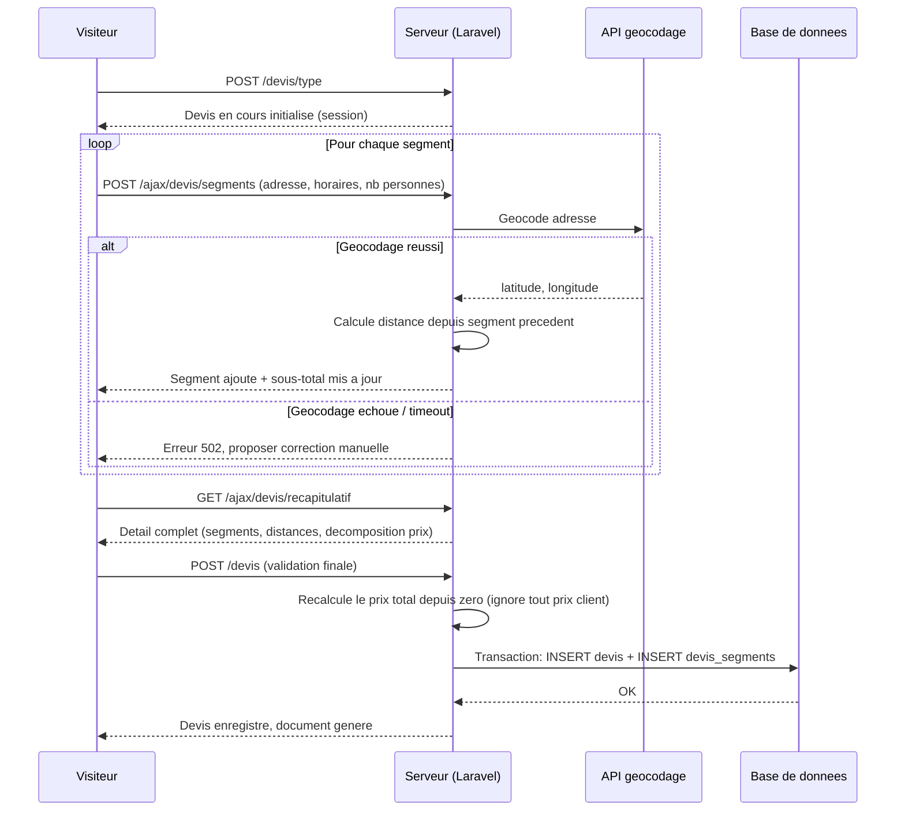

# Niveau 3 — Conception Technique : Générateur de devis à la carte
> Basé sur : docs/brainstorm/L1-fondation.md + docs/brainstorm/L2-generateur-devis.md
> Date : 2026-09-12

## 1. Contrat API

| Endpoint | Méthode | Entrée | Sortie | Codes d'erreur |
|----------|---------|--------|--------|-----------------|
| `/devis/type` | POST | type_prestation_id | Devis en cours initialisé (session) | 422 type inconnu |
| `/ajax/devis/segments` | POST (AJAX) | adresse, heure_debut, heure_fin, nb_personnes | Segment ajouté, `{distance_km, sous_total}` mis à jour | 422 validation / 502 géocodage indisponible |
| `/ajax/devis/segments/{ordre}` | DELETE (AJAX) | — | Segment retiré, recalcul renvoyé | 404 segment inexistant |
| `/ajax/devis/recapitulatif` | GET (AJAX) | — | Détail complet (segments, distances, décomposition prix) | — |
| `/devis` | POST | (confirmation finale) | Devis + segments enregistrés en base, document généré | 422 devis vide / 409 déjà soumis |

## 2. Schéma de données détaillé

### Tables concernées
| Table | Colonnes | Contraintes | Index |
|-------|----------|-------------|-------|
| `types_prestation` | id, nom, forfait_base (decimal), description | `nom` UNIQUE | — |
| `devis` | id, client_id (nullable jusqu'à l'inscription), type_prestation_id, statut (enum), prix_total (decimal), created_at | FK `client_id`→users, FK `type_prestation_id`→types_prestation | index `(client_id, statut)` |
| `devis_segments` | id, devis_id, adresse, latitude, longitude, heure_debut, heure_fin, nb_personnes, distance_km (decimal, nullable pour le 1er segment), ordre | FK `devis_id`→devis (cascade delete) | index `(devis_id, ordre)` |
| `parametres_tarifaires` | id, cle (ex: `prix_km`, `prix_heure_sup`, `supplement_weekend`), valeur (decimal) | `cle` UNIQUE | — |

## 3. Diagramme de séquence (Mermaid)

## 4. Cas limites techniques
- **Concurrence :** le devis en cours de composition vit en session utilisateur, pas de ressource partagée — aucun risque de concurrence entre visiteurs
- **Idempotence :** double clic sur "Valider ce devis" → un token de soumission unique (stocké en session, invalidé après la première validation) empêche la création de deux devis identiques
- **Transactions / rollback :** l'enregistrement du devis et de tous ses segments est encapsulé dans une transaction Laravel (`DB::transaction`) — si un segment échoue à s'insérer, tout est annulé, jamais de devis à moitié enregistré
- **Volumétrie :** pagination sur l'historique client si le nombre de devis grandit ; pas de souci de volumétrie attendu pour un usage personnel
- **Dépendance externe (géocodage) :** si l'API de géocodage est indisponible ou en timeout, le segment n'est pas perdu — le visiteur peut réessayer ou corriger l'adresse manuellement ; un compteur de rate limiting protège contre l'épuisement du quota par un usage abusif (spam d'ajout/suppression de segments)

## 5. Sécurité spécifique à cette fonctionnalité
| Risque | Vecteur | Mitigation |
|--------|---------|------------|
| Manipulation du prix côté client | Un visiteur modifie le prix affiché via les DevTools avant de valider | Le prix affiché en AJAX n'est qu'indicatif — le serveur recalcule intégralement le prix à partir des `devis_segments` stockés à la validation finale, ignore toute valeur envoyée par le client |
| Injection via les champs adresse | Champ texte libre transmis à l'API de géocodage et affiché dans le récapitulatif | Validation stricte (Form Request), échappement à l'affichage (Blade natif), requête à l'API de géocodage toujours paramétrée (jamais de concaténation d'URL) |
| Abus de l'API de géocodage tierce | Spam d'ajout/suppression de segments | Rate limiting dédié sur `/ajax/devis/segments`, distinct de celui du login |
| Devis orphelins en base (abandon en cours de composition) | Visiteur quitte sans valider | Le devis n'est écrit en base qu'à la validation finale (`POST /devis`) — rien n'est persisté avant, la composition vit uniquement en session |
