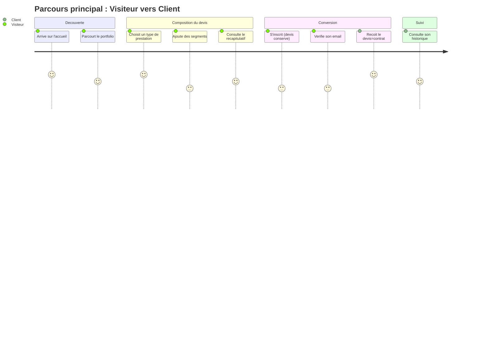

# Niveau 4 — UX / Parcours Utilisateur
> Projet : PID
> Basé sur : docs/brainstorm/L1-fondation.md + toutes les fonctionnalités niveau 2
> Date : 2026-09-12

## 1. Parcours principaux

### Parcours A : Première visite → Devis → Inscription → Client
| Étape | Écran | Action utilisateur | Fonctionnalité liée |
|-------|-------|---------------------|----------------------|
| 1 | Accueil | Découvre le site, clique "Demander un devis" ou parcourt le portfolio d'abord | Vitrine / Portfolio |
| 2 | Portfolio (optionnel) | Filtre par type de prestation, se fait une idée du style | Vitrine / Portfolio |
| 3 | Tunnel de devis — Étape 1 | Choisit un type de prestation, voit le forfait de base indicatif | Générateur de devis |
| 4 | Tunnel de devis — Étape 2 | Ajoute un premier segment (adresse, horaires, nb personnes) | Générateur de devis |
| 5 | Tunnel de devis — Étape 2 (boucle) | Ajoute d'autres segments si besoin (ex. mariage multi-lieux), voit le sous-total évoluer en direct | Générateur de devis |
| 6 | Récapitulatif du devis | Consulte le détail complet du prix avant de valider | Générateur de devis |
| 7 | Inscription | Crée son compte (le devis composé est conservé) | Auth & comptes |
| 8 | Vérification email | Clique le lien reçu par email | Auth & comptes |
| 9 | Devis validé | Le devis est enregistré, le document devis=contrat est généré | Devis = contrat |
| 10 | Espace Client | Consulte/télécharge son devis, voit son historique | Devis = contrat |

### Parcours B : Photographe — configuration et suivi de l'activité
| Étape | Écran | Action utilisateur | Fonctionnalité liée |
|-------|-------|---------------------|----------------------|
| 1 | Connexion | Se connecte avec son compte Photographe | Auth & comptes |
| 2 | Tableau de bord Photographe | Vue d'ensemble : nombre de devis en attente, derniers reçus | Devis = contrat |
| 3 | Configuration tarifaire | Définit/ajuste les types de prestation et paramètres tarifaires (prix/km, prix/heure, suppléments) | Générateur de devis |
| 4 | Vue globale des devis | Filtre par statut/date/type, ouvre un devis en détail | Devis = contrat |
| 5 | Détail d'un devis | Change le statut (en_attente → confirmé → réalisé) | Devis = contrat |
| 6 | Gestion du contenu vitrine | Ajoute des photos au portfolio, met à jour la présentation des services | Vitrine / Portfolio |

### Parcours C : Administrateur — supervision des comptes
| Étape | Écran | Action utilisateur | Fonctionnalité liée |
|-------|-------|---------------------|----------------------|
| 1 | Connexion | Se connecte avec son compte Administrateur | Auth & comptes |
| 2 | Liste des comptes | Consulte l'ensemble des comptes utilisateurs | Administration des comptes |
| 3 | Détail d'un compte | Bloque/débloque, déclenche une réinitialisation de mot de passe à la demande | Administration des comptes |
| 4 | Journal des tentatives | Consulte l'historique des tentatives de connexion échouées | Administration des comptes |

## 2. Inventaire des écrans

| Écran | Rôle | Fonctionnalités présentes |
|-------|------|----------------------------|
| Accueil | Public | Vitrine, appel à l'action devis |
| Portfolio | Public | Vitrine (filtrable par type de prestation) |
| Présentation des services | Public | Vitrine |
| Tunnel de devis (étapes) | Public → Client | Générateur de devis |
| Récapitulatif du devis | Public → Client | Générateur de devis |
| Inscription | Public | Auth & comptes |
| Connexion | Public | Auth & comptes |
| Vérification email | Public | Auth & comptes |
| Mot de passe oublié / réinitialisation | Public | Auth & comptes |
| Tableau de bord Client | Client | Devis = contrat |
| Historique des devis (Client) | Client | Devis = contrat |
| Détail d'un devis (Client, lecture seule) | Client | Devis = contrat |
| Profil utilisateur | Client / Photographe / Administrateur | Auth & comptes |
| Tableau de bord Photographe | Photographe | Devis = contrat |
| Configuration tarifaire (types de prestation, paramètres) | Photographe | Générateur de devis |
| Vue globale des devis (filtrable) | Photographe | Devis = contrat |
| Détail d'un devis (Photographe, changement de statut) | Photographe | Devis = contrat |
| Gestion du contenu vitrine (CMS photos/textes) | Photographe | Vitrine / Portfolio |
| Liste des comptes | Administrateur | Administration des comptes |
| Détail d'un compte (blocage, reset) | Administrateur | Administration des comptes |
| Journal des tentatives de connexion | Administrateur | Administration des comptes |

## 3. Diagramme de parcours (Mermaid)

## 4. Points de friction identifiés

- **Perte perçue du devis en cours lors de l'inscription obligatoire** → même si le devis est techniquement conservé (session), le visiteur peut craindre de "recommencer à zéro" ; afficher un message explicite type "ton devis est sauvegardé, connecte-toi pour le récupérer"
- **Erreurs de géocodage sur une adresse mal saisie** → ajouter une autocomplétion d'adresse (type Nominatim/Google Places) dès la saisie pour réduire les échecs et évoquer le sujet côté implémentation, pas juste en correction d'erreur après coup
- **Tunnel de devis perçu comme long pour un mariage multi-segments** → garder le sous-total visible en permanence pendant l'ajout de segments (déjà prévu côté AJAX), envisager une barre de progression
- **Confusion "devis" vs "contrat"** → nommer et expliquer clairement le statut du document (référence d'accord entre les parties, pas un contrat juridique formel) dès le récapitulatif, pour ne pas créer de fausse attente légale
- **Photographe face à un site vide de paramètres tarifaires à la première connexion** → prévoir des valeurs par défaut ou un court onboarding de configuration avant que le générateur de devis soit pleinement utilisable côté public
